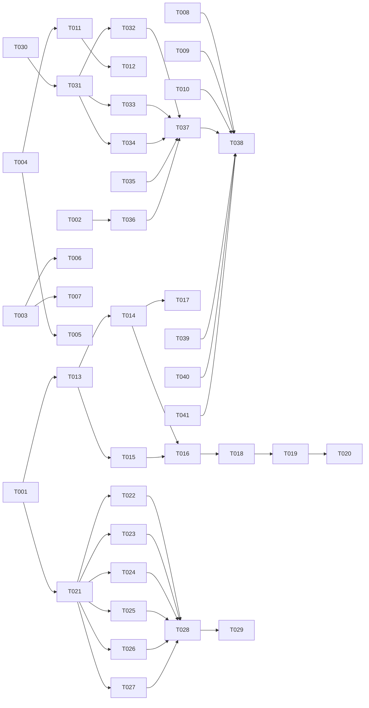

# Tasks: Developer Experience Bundle v1

**Input**: Design documents from `specs/004-devx-bundle-v1/`
**Prerequisites**: plan.md (required), spec.md (required), research.md, quickstart.md

**Organization**: Tasks grouped by component (User Story). Each component independently implementable and testable.

## Format: `[ID] [AGENT] [Story?] Description`

## Agent Tags

| Tag | Agent | Domain |
|-----|-------|--------|
| `[SETUP]` | — (orchestrator) | Project init, shared config, scaffolding, shared type definitions |
| `[BE]` | backend-specialist | CLI subcommands, core logic, subprocess management |
| `[OPS]` | devops-engineer | CI/CD, GitHub Actions, PR templates, branch cleanup |
| `[DOC]` | documentation-writer | CREDITS.md, LICENSE copy, constitution amendment, quickstart |
| `[SEC]` | security-auditor | API key existence check (no value leak), hermes subprocess safety |

## Task Statuses

| Status | Meaning |
|--------|---------|
| `- [ ]` | Pending |
| `- [→]` | In progress |
| `- [X]` | Completed |
| `- [!]` | Failed |
| `- [~]` | Blocked |

## Phase 1: Setup (Shared Infrastructure)

**Purpose**: Shared types, directory scaffolding, and config that all components depend on.

- [ ] T001 [SETUP] Create shared health-check types in `packages/cli/src/types/health.ts` — HealthCheck interface, HealthCategory union type, HermesConfig/HermesResult interfaces per plan.md data model
- [ ] T002 [SETUP] Create `vendor/` directory, add `.gitkeep` or empty LICENSE placeholder
- [ ] T003 [SETUP] Create `.github/PULL_REQUEST_TEMPLATE/` directory structure

---

## Phase 2: Foundational (Component 1 — Constitution + CI)

**Purpose**: Two-phase review governance changes that MUST be in place before speckit commands are modified.

### Constitution Amendment

- [ ] T004 [DOC] Add two-phase review principle to `.specify/memory/constitution.md` — new Principle VIII covering planning/impl branch naming, drift policy, hotfix carve-out, CI policy
- [ ] T005 [DOC] Update constitution changelog with v1.5.0 entry for Principle VIII

### PR Templates

- [ ] T006 [DOC] Create `.github/PULL_REQUEST_TEMPLATE/spec.md` — sections: feature goal, user scenarios, FRs, NFRs, edge cases, questions for AI reviewers
- [ ] T007 [DOC] Create `.github/PULL_REQUEST_TEMPLATE/impl.md` — sections: spec link, files touched, test plan checklist, breaking changes, rollback plan

### CI Configuration

- [ ] T008 [OPS] Add path-filtered CI job to `.github/workflows/ci.yml` — `specs/**` PRs trigger reduced CI (markdown lint via markdownlint-cli, link check via lychee, speckit.analyze regen)
- [ ] T009 [OPS] Add full CI job for implementation PRs — test suite, build, lint, type check, speckit.analyze re-validation
- [ ] T010 [OPS] Add GitHub Action or repo setting for auto-deleting `specs/<slug>` branches after merge

### Speckit Command Updates

- [ ] T011 [BE] Update `.claude/commands/speckit.start.md` — change default branch from `feature/<N>-<slug>` to `specs/<slug>` for planning phase
- [ ] T012 [BE] Update `.claude/commands/speckit.implement.md` — add branch switch logic: detect merged planning branch, create `<slug>` implementation branch from updated main

**Checkpoint**: Two-phase review governance in place. Constitution amended. CI split operational. Speckit commands updated.

---

## Phase 3: User Story 2 - Hermes Wrapper (Priority: P1)

**Goal**: `clai-helpers hermes` subcommand wrapping hermes binary invocation.

**Independent Test**: Run `clai-helpers hermes "test"` and verify prompt forwarding, exit code passthrough, and binary detection.

- [ ] T013 [BE] [US2] Create `packages/cli/src/cli/hermes.ts` — define citty command with args: positional prompt, --from-file, --background, --model, --provider, --toolsets, --verbose
- [ ] T014 [BE] [US2] Implement prompt source resolution — priority: --from-file > stdin (if TTY not interactive) > positional arg. Error if no prompt source.
- [ ] T015 [BE] [US2] Implement hermes binary detection — check PATH for `hermes` (or `hermes.exe` on Windows via `process.platform`). If missing, print install hint with URL and exit 127.
- [ ] T016 [BE] [US2] Implement hermes subprocess spawn — build argument array from flags (model→`--model`, provider→`--provider`, toolsets→`--toolsets`, verbose→`--verbose`), spawn with `child_process.spawn('hermes', args, { stdio: 'inherit' })` for foreground mode
- [ ] T017 [BE] [US2] Implement `--background` mode — spawn with `{ detached: true, stdio: ['ignore', logStream, logStream] }`, write to `.hermes-output-<timestamp>.log`, print PID + log path, exit 0 immediately
- [ ] T018 [BE] [US2] Implement exit code forwarding — foreground mode: wait for `close` event, set `process.exitCode` to hermes exit code
- [ ] T019 [BE] [US2] Register `hermes` subcommand in `packages/cli/src/cli.ts` — add to `subCommands` map
- [ ] T020 [BE] [US2] Write unit tests in `packages/cli/tests/unit/hermes.test.ts` — test binary detection (mock PATH), prompt resolution (mock stdin/file), flag forwarding, background spawn, exit code passthrough

**Checkpoint**: Hermes wrapper fully functional. `clai-helpers hermes "test"` works.

---

## Phase 4: User Story 3 - Doctor Overhaul (Priority: P2)

**Goal**: Comprehensive health check matrix replacing lock-integrity-only doctor.

**Independent Test**: Run `clai-helpers doctor` and verify colored table, `--json` output, `--quiet` mode, exit codes.

- [ ] T021 [BE] [US3] Create `packages/cli/src/core/health-checks.ts` — exported functions: `checkSystem()`, `checkTools()`, `checkMcpServers()`, `checkApiKeys()`, `checkClaudeStructure()`, `checkDrift()`. Each returns `HealthCheck[]`
- [ ] T022 [BE] [US3] Implement `checkSystem()` — node version (>=20 check), npm version, git version, OS (via `process.platform` + `os.release()`)
- [ ] T023 [BE] [US3] Implement `checkTools()` — gh CLI: `spawn('gh', ['auth', 'status'])` check exit code; hermes: `spawn('hermes', ['--version'])` check existence + capture version
- [ ] T024 [BE] [US3] Implement `checkMcpServers()` — for each server (context7, filesystem, github, sequential-thinking): attempt spawn with `--help` flag, 3-second timeout, mark pass/fail/unknown
- [ ] T025 [SEC] [US3] Implement `checkApiKeys()` — check `process.env` for key existence (ANTHROPIC_API_KEY, OPENAI_API_KEY, OPENROUTER_API_KEY, GH_TOKEN, ZHIPU_API_KEY, GLM_API_KEY). NEVER read or print values. Return boolean per key.
- [ ] T026 [BE] [US3] Implement `checkClaudeStructure()` — verify `.claude/commands/`, `.claude/agents/`, `.claude/skills/` exist. For each `.md` in these dirs: parse YAML frontmatter, verify `name` + `description` present. For each agent: check that referenced skills in frontmatter `skills:` array exist on disk.
- [ ] T027 [BE] [US3] Implement `checkDrift()` — invoke `clai-helpers status --strict` via `import` of status command logic (not subprocess), capture exit code and output
- [ ] T028 [BE] [US3] Overhaul `packages/cli/src/cli/doctor.ts` — replace lock-integrity-only implementation with new matrix output. Run all check functions, collect `HealthCheck[]`. Default: colored table (using consola/chalk). `--json`: JSON array. `--quiet`: filter to failures only. Exit code: 1 if any `critical: true` check fails.
- [ ] T029 [BE] [US3] Write unit tests in `packages/cli/tests/unit/doctor.test.ts` — test each check function (mocked), output formatting (--json, --quiet), exit code logic, critical vs non-critical classification

**Checkpoint**: Doctor command fully overhauled. Colored matrix output working.

---

## Phase 5: User Story 4 - AI Engineering Coach Rules Import (Priority: P3)

**Goal**: Import 45 anti-pattern rules from microsoft/AI-Engineering-Coach into our guardrails.

**Independent Test**: Verify rules appear in CLAUDE.md guardrails section, code-review-checklist skill, lint-and-validate skill. Verify CREDITS.md and LICENSE copy exist.

- [ ] T030 [DOC] [US4] Fetch and catalog all 45 rule files from `https://raw.githubusercontent.com/microsoft/AI-Engineering-Coach/main/src/core/rules/*.md` — save working copy to `specs/004-devx-bundle-v1/rules-source/` for reference during translation
- [ ] T031 [DOC] [US4] Translate all 45 rules to condensed table format: `| **Rule Name** | Why: <adapted description>. Fix: <correct pattern> |` — apply Valera tone where appropriate, preserve MIT-attributable content
- [ ] T032 [DOC] [US4] Append translated rules to CLAUDE.md "AI-Generated Code Guardrails" section — add subheading "### Imported from AI-Engineering-Coach (MIT)" with attribution link
- [ ] T033 [DOC] [US4] Augment `.claude/skills/code-review-checklist/SKILL.md` — add applicable rules (code review anti-patterns: copy-paste-blindness, verbose-output, speed-accept, etc.) to checklist
- [ ] T034 [DOC] [US4] Augment `.claude/skills/lint-and-validate/SKILL.md` — add rules with automatable checks (instruction-bloat, context-engineering-gaps, no-custom-instructions, etc.) to validation section
- [ ] T035 [DOC] [US4] Create `docs/CREDITS.md` — MIT license notice for microsoft/AI-Engineering-Coach with repo URL and date
- [ ] T036 [DOC] [US4] Create `vendor/AI-Engineering-Coach-LICENSE` — copy of MIT license from microsoft/AI-Engineering-Coach repository

**Checkpoint**: All 45 rules imported. Attribution in place. Skills augmented.

---

## Phase 6: Polish & Cross-Cutting Concerns

**Purpose**: Sync, validate, and update architecture docs.

- [ ] T037 [BE] Run `npx clai-helpers sync` to propagate all `.claude/` changes to Copilot/Gemini targets
- [ ] T038 [BE] Verify `npm run validate` passes in `packages/cli/` (tsc --noEmit)
- [ ] T039 [DOC] Update `specs/main/architecture.md` §5 CLI Package Layout — add hermes.ts to subcommand table, update doctor.ts description
- [ ] T040 [DOC] Update `specs/main/architecture.md` §6 SpecKit Integration — add `004-devx-bundle-v1` feature reference row
- [ ] T041 [DOC] Update `specs/main/requirements.md` §1.1 CLI commands — add `hermes` row, update `doctor` description

---

## Dependency Graph

### Legend

- `→` means "unlocks" (left must complete before right can start)
- `+` means "all of these" (join point — ALL listed tasks must complete)
- Tasks not listed here have no dependencies and can start immediately within their phase

### Dependencies

T001 → T013, T021
T002 → T036
T003 → T006, T007
T004 → T005, T011
T008 + T009 + T010 → T038
T011 → T012
T013 → T014, T015
T014 → T016, T017
T015 → T016
T016 → T018
T018 → T019
T019 → T020
T021 → T022, T023, T024, T025, T026, T027
T022 + T023 + T024 + T025 + T026 + T027 → T028
T028 → T029
T030 → T031
T031 → T032, T033, T034
T032 + T033 + T034 + T035 + T036 → T037
T037 → T038
T039 + T040 + T041 → T038

### Self-Validation Checklist

> - [X] Every task ID in Dependencies exists in the task list above
> - [X] No circular dependencies (A→B→A)
> - [X] No orphan task IDs referenced that don't exist
> - [X] Fan-in uses `+` only, fan-out uses `,` only
> - [X] No chained arrows on a single line

---

## Dependency Visualization

---

## Parallel Lanes

| Lane | Agent Flow | Tasks | Blocked By |
|------|-----------|-------|------------|
| 1 | [SETUP] | T001, T002, T003 | — |
| 2 | [DOC] Constitution | T004, T005, T006, T007 | T003 |
| 3 | [OPS] CI | T008, T009, T010 | — |
| 4 | [BE] Speckit updates | T011, T012 | T004 |
| 5 | [BE] Hermes | T013 → T014 → T015 → T016 → T017 → T018 → T019 → T020 | T001 |
| 6 | [BE] Doctor checks | T021 → T022, T023, T024, T025, T026, T027 → T028 → T029 | T001 |
| 7 | [DOC] Rules import | T030 → T031 → T032, T033, T034, T035, T036 | T002 |
| 8 | [DOC] Arch update | T037, T039, T040, T041 → T038 | T037 |

---

## Agent Summary

| Agent | Task Count | Can Start After |
|-------|-----------|-----------------|
| [SETUP] | 3 | immediately |
| [DOC] | 12 | T002, T003, T004 |
| [OPS] | 3 | immediately |
| [BE] | 17 | T001 |
| [SEC] | 1 | T021 |

**Critical Path**: T001 → T013 → T014 → T016 → T018 → T019 → T020 (hermes wrapper)

---

## Agent Dispatch Plan

| Agent | Subagent | Skills | Input Context | Tasks | Files |
|-------|----------|--------|---------------|-------|-------|
| `[SETUP]` | — (orchestrator) | — | plan.md §data-model | T001, T002, T003 | `packages/cli/src/types/health.ts`, `vendor/`, `.github/PULL_REQUEST_TEMPLATE/` |
| `[BE]` | backend-specialist | api-patterns, system-design-patterns | plan.md §contracts, research.md R1-R2 | T011, T012, T013–T020, T021–T029 | `packages/cli/src/cli/hermes.ts`, `packages/cli/src/cli/doctor.ts`, `packages/cli/src/core/health-checks.ts`, `packages/cli/src/cli.ts` |
| `[OPS]` | devops-engineer | deployment-procedures | plan.md §R4, spec.md FR-005 | T008, T009, T010 | `.github/workflows/ci.yml` |
| `[DOC]` | documentation-writer | documentation-templates | spec.md §US1, §US4, research.md R3 | T004, T005, T006, T007, T030–T036, T039–T041 | `.specify/memory/constitution.md`, `.github/PULL_REQUEST_TEMPLATE/*`, `CLAUDE.md`, `.claude/skills/*/SKILL.md`, `docs/CREDITS.md`, `vendor/AI-Engineering-Coach-LICENSE`, `specs/main/*.md` |
| `[SEC]` | security-auditor | vulnerability-scanner | spec.md FR-021, plan.md §data-model | T025 | `packages/cli/src/core/health-checks.ts` |

---

## Implementation Strategy

### MVP First (User Story 1 + 2 Only)

1. Complete Phase 1: Setup
2. Complete Phase 2: Two-phase review governance
3. Complete Phase 3: Hermes wrapper
4. **STOP and VALIDATE**: Test hermes wrapper independently
5. Deploy/demo if ready

### Incremental Delivery

1. Complete Setup + Constitution → governance in place
2. Add Hermes wrapper → Test independently → Deploy (MVP!)
3. Add Doctor overhaul → Test independently → Deploy
4. Add Rules import → Test + sync → Deploy
5. Polish → Full validation

### Parallel Agent Strategy

1. Orchestrator completes Setup phase directly (T001–T003)
2. Once Setup complete (sync barrier) → dispatch parallel agents:
   - Lane 2 `[DOC]`: constitution amendment + PR templates (after T003)
   - Lane 3 `[OPS]`: CI configuration (independent)
   - Lane 5 `[BE]`: hermes wrapper (after T001)
   - Lane 6 `[BE]`: doctor checks (after T001, parallel to hermes)
   - Lane 7 `[DOC]`: rules import (after T002)
3. As agents complete → unblock dependent lanes
4. Final polish lane runs after all component lanes complete
5. T038 (validate) is the final gate

### Multi-Session Strategy

1. Complete Setup + Constitution sequentially
2. Use Agent Summary to decide role context switching
3. Optionally launch parallel sessions per agent lane manually
4. Follow Dependency Graph for correct execution order

---

## Notes

- `[AGENT]` tag assigns responsibility — domain agent writes both code and unit tests
- `[SEC]` only for API key check (security-sensitive: must never leak values)
- `[OPS]` is independent of code changes — CI config can be done in parallel
- Phase 2 (constitution) is the sync barrier — speckit command updates depend on it
- Commit after each task or logical group
- Stop at any checkpoint to validate component independently
- The rules import (Phase 5) is content-only, no code. Can run entirely in parallel with Phase 3/4 after its own setup.
