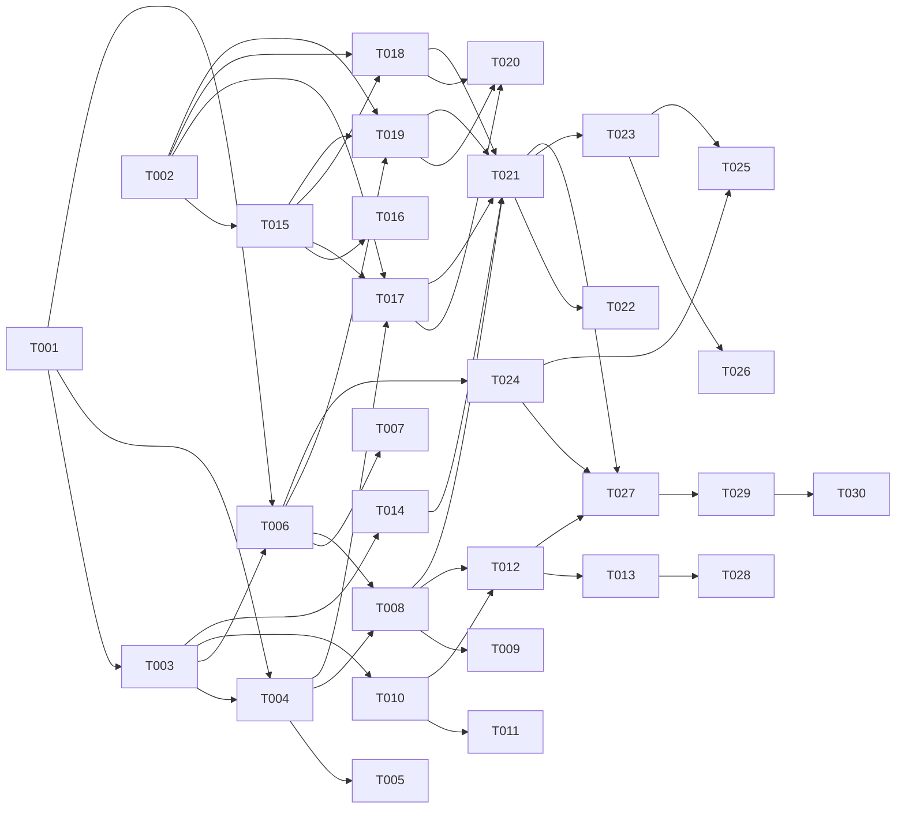

# Tasks: Fleet Sync — multi-project discovery and on-demand sync

**Input**: Design documents from `/specs/003-fleet-sync/`
**Prerequisites**: plan.md, spec.md, research.md, data-model.md, contracts/cli-commands.md, contracts/github-api-surface.md, contracts/config-schema.md, quickstart.md

**Tests**: Required (per coding standards §5 TDD-Lite — tests written immediately after each implementation task in the same phase). Mocking pattern follows existing `tests/unit/fetch.test.ts` (`globalThis.fetch` shim + `vi.mock("node:child_process")`).

**Organization**: Tasks grouped by user story for independent implementation/testing. Each task assigned to a specialist agent.

## Format: `[ID] [AGENT] [Story?] Description`

## Path Conventions

- Single-package monorepo. CLI lives at `packages/cli/`. New code under `packages/cli/src/cli/fleet/` and `packages/cli/src/core/fleet/`. Tests under `packages/cli/tests/{unit,integration}/fleet/`.

---

## Phase 1: Setup (Shared Infrastructure)

**Purpose**: Project initialization, deps install, directory scaffolding.

- [ ] T001 [SETUP] Add `@inquirer/prompts` (^7.x) and `cli-table3` (^0.6.x) to `packages/cli/package.json` `dependencies`; run `npm install`; commit `package.json` + `package-lock.json` together
- [ ] T002 [SETUP] Create directory scaffolding: `packages/cli/src/cli/fleet/`, `packages/cli/src/core/fleet/modes/`, `packages/cli/tests/unit/fleet/modes/`, `packages/cli/tests/integration/fleet/`

---

## Phase 2: Foundational (Blocking Prerequisites)

**Purpose**: Types, GitHub API client, config loader. ALL user stories depend on these.

**⚠️ CRITICAL**: No US phase begins until Phase 2 completes (sync barrier).

- [ ] T003 [BE] Define `FleetEntry`, `FleetConfig`, `DiscoveryScope`, `Selection`, `SelectionSource`, `SyncResult`, `SyncSession`, `SyncMode`, `SyncOutcome`, `RepoState`, `FleetError`, `FleetErrorCode` TypeScript types in `packages/cli/src/core/fleet/types.ts` per data-model.md (strict, no `any`, discriminated unions for `SelectionSource` and `SyncOutcome`)
- [ ] T004 [BE] Implement GitHub API wrapper in `packages/cli/src/core/fleet/github-api.ts`: raw `fetch` reusing `resolveAuth()` from `core/fetch.ts`; `Bearer` auth + `application/vnd.github+json`; export `listReposForUser`, `listReposForOrg`, `readLockfile`, `readLastCommitForPath`, `getDefaultBranch`, `getLatestRelease`, `findOpenPullRequest`, `createPullRequest` per github-api-surface.md; rate-limit retry with backoff; `Link` header pagination; throws typed `FleetError` on auth/rate/network failures
- [ ] T005 [BE] Unit tests for `github-api.ts` in `packages/cli/tests/unit/fleet/github-api.test.ts` using `globalThis.fetch` mock (existing pattern from `tests/unit/fetch.test.ts`): happy-path 200, 401 → `auth/missing`, 403 with rate-limit headers → retry-then-throw `github/rate-limited`, 403 without rate-limit headers → `auth/insufficient-scope`, 404 → `github/repo-not-found`, pagination follows `rel="next"` until exhausted, malformed JSON throws structured error
- [ ] T006 [BE] Implement fleet config loader in `packages/cli/src/core/fleet/config.ts` using existing `c12` dependency: load `~/.config/clai-helpers/fleet.{json,ts,js,yaml,yml}` (TS priority); apply defaults from data-model.md `FleetConfig`; runtime validation rejecting unknown enum values + out-of-range `discoveryConcurrency`; export `loadConfig()`, `addOrg(org)`, `removeOrg(org)` per config-schema.md "Mutation by CLI"; mutation API throws `FleetError("config/malformed")` on TS-config write attempts
- [ ] T007 [BE] Unit tests for `config.ts` in `packages/cli/tests/unit/fleet/config.test.ts`: defaults applied when file absent; malformed JSON exits with `FleetError("config/malformed")`; unknown keys logged-not-failed; `addOrg`/`removeOrg` idempotent; TS-config mutation refused with `config/malformed`; org-name validation rejects malformed names

**Checkpoint**: Foundation ready — US phases can begin in parallel where dependencies allow.

---

## Phase 3: User Story 1 — Discover what's installed where (Priority: P1) 🎯 MVP

**Goal**: `fleet list` prints a terminal table of every GitHub-hosted clai-helpers consumer in the user's configured scope, with current pinned ref, latest available, drift status, and last-sync timestamp. Read-only.

**Independent Test**: `runCli(["fleet", "list", "--json"])` against an account with two consumer repos pinned to different versions returns a JSON array of two `FleetEntry` rows with correct shape; nothing is written to disk or to GitHub.

### Implementation for User Story 1

- [ ] T008 [BE] [US1] Implement discovery orchestrator in `packages/cli/src/core/fleet/discovery.ts`: enumerate authenticated user's repos + each configured org's repos via `github-api.ts`; bounded-parallel pool of 5 (hand-rolled limiter, ~10 LOC); filter to repos whose default-branch root contains `helpers-lock.json`; parallel-fetch lockfile content + last-commit timestamp + repo state; map to `FleetEntry[]`; resolve latest clai-helpers release once per session and reuse; surface `archived`/`disabled`/`unreadable` without aborting other entries
- [ ] T009 [BE] [US1] Unit tests for `discovery.ts` in `packages/cli/tests/unit/fleet/discovery.test.ts`: scope expansion (own user + 2 orgs); helpers-lock.json filter (404 on lockfile → repo dropped); archived state surfaced as `state: "archived"`; unreadable lockfile populates `unreadableReason`; rate-limit during enumeration → partial result with affected entries marked unreadable; latest release resolved exactly once across N entries
- [ ] T010 [BE] [US1] Implement table renderer in `packages/cli/src/core/fleet/table.ts` using `cli-table3`: columns Repo / Branch / Pinned / Latest / Drift / Last sync per cli-commands.md; drift colorization via `consola` color helpers; "no projects found" empty state with scope context line ("Scope: user (X) + N orgs (...)"); honors `--no-color` flag and `NO_COLOR` env
- [ ] T011 [BE] [US1] Unit tests for `table.ts` in `packages/cli/tests/unit/fleet/table.test.ts`: golden snapshots for 0/1/5/50 rows; `--no-color` strips ANSI codes; drift coloring branches for `hasDrift: true` vs `false`; long repo name truncation; floating-ref display format `main@<sha>`
- [ ] T012 [BE] [US1] Implement `fleet list` command handler in `packages/cli/src/cli/fleet/list.ts` using `citty`: parse `--filter`/`--json`/`--no-color`/`--verbose`; auth resolution via existing `resolveAuth()`; orchestrate discovery + render; exit 0 on success, 2 on usage/auth, 3 on rate-limit beyond retry budget per cli-commands.md; structured logging via `consola.withTag("fleet")` (no `console.log`)
- [ ] T013 [E2E] [US1] Integration test in `packages/cli/tests/integration/fleet/list.test.ts`: `runCli(["fleet", "list", "--json"])` with `globalThis.fetch` mocked to return 3 repos across user + 1 org; assert JSON array shape matches `FleetEntry[]` from data-model.md; second case: `runCli(["fleet", "list", "--no-color"])` produces ANSI-free table; third case: missing auth → exit 2 with `auth/missing` message

**Checkpoint**: User Story 1 fully functional. `fleet list` ships as MVP independently.

---

## Phase 4: User Story 2 — Sync selected projects interactively (Priority: P2)

**Goal**: User views fleet, picks 1+ via terminal multi-select picker, confirms, and bumps each via the resolved sync mode (`pr` default; `push`/`patch` selectable). Sequential per FR-005, with summary at end.

**Independent Test**: With 4 mocked repos and `@inquirer/prompts.checkbox` mocked to return 2 selections, `runCli(["fleet", "sync"])` produces exactly 2 sync attempts in mocked git/fetch, summary lists 2 succeeded, exit code 0.

### Implementation for User Story 2

- [ ] T014 [BE] [US2] Implement picker wrapper in `packages/cli/src/core/fleet/picker.ts` using `@inquirer/prompts`: import only `checkbox` and `confirm` (modular); render `FleetEntry` rows with same columns as table; return `Selection { entries, source: { kind: "interactive" } }`; empty selection returns `{ entries: [] }` for clean exit per P2 acceptance #4
- [ ] T015 [BE] [US2] Implement ephemeral-clone helper in `packages/cli/src/core/fleet/ephemeral-clone.ts`: `mkdtemp(os.tmpdir(), "helpers-fleet-")` + `child_process.execFile("git", ["clone", "--depth=1", "--branch", <defaultBranch>, <httpsUrl>, <tempDir>])` (no shell, never `--force`); register cleanup function in a process-level `Set<() => Promise<void>>` plus a single SIGINT handler that drains it; idempotent cleanup; surfaces `git/clone-failed` on non-zero exit
- [ ] T016 [BE] [US2] Unit tests for `ephemeral-clone.ts` in `packages/cli/tests/unit/fleet/ephemeral-clone.test.ts`: `vi.mock("node:child_process")` and `vi.mock("node:fs/promises")` for `mkdtemp`/`rm`; assert no spawn invocation contains `--force`; cleanup invoked on success path and on failure path (try/finally); SIGINT signal triggers cleanup on every registered dir; double-cleanup is a no-op
- [ ] T017 [BE] [US2] Implement `pr-mode.ts` in `packages/cli/src/core/fleet/modes/pr-mode.ts`: ephemeral clone → run existing single-project sync pipeline (`core/pipeline.ts`) against the clone → if working tree post-sync has zero diff → return `SyncOutcome === "no-op"`; else create branch `clai-helpers-bump/<latest-ref>`, commit with typed conventional message, push branch, query existing open PR via `findOpenPullRequest`, if absent → `createPullRequest` with templated title/body per github-api-surface.md
- [ ] T018 [BE] [US2] Implement `push-mode.ts` in `packages/cli/src/core/fleet/modes/push-mode.ts`: ephemeral clone → sync pipeline → no-op short-circuit → commit → `git push origin <defaultBranch>`; surfaces push-rejected as `SyncOutcome === "skipped"` per FR-006; differentiates the underlying cause by inspecting git stderr — if it contains `protected branch` or `policy` sentinels → `reason: "git/branch-protected"`; if it contains `non-fast-forward` or `failed to push some refs` (without protection sentinel) → `reason: "git/push-rejected"`; sentinel matching is case-insensitive and tolerant of git-version wording variance
- [ ] T019 [BE] [US2] Implement `patch-mode.ts` in `packages/cli/src/core/fleet/modes/patch-mode.ts`: ephemeral clone → sync pipeline → no-op short-circuit → `git diff` → write `<patchOutputDir>/<owner>__<repo>.patch` via `fs.writeFile`; create patch dir (recursive) if missing; never mutates GitHub
- [ ] T020 [BE] [US2] Unit tests for the three modes in `packages/cli/tests/unit/fleet/modes/{pr-mode,push-mode,patch-mode}.test.ts` (one file each): spawn-mocked git ops; mocked `globalThis.fetch` for GitHub API in pr-mode; assert happy-path SyncOutcome `"succeeded"`; no-op short-circuit on clean diff; pr-mode idempotent when branch already has open PR (returns `succeeded` with existing `prUrl` referenced — see FR-006 idempotent semantic); push-mode branch-protected → `"skipped"` with `reason: "git/branch-protected"`; push-mode non-fast-forward (without protection sentinel) → `"skipped"` with `reason: "git/push-rejected"` (separate test case asserts the two error codes are emitted from their respective stderr fixtures); patch-mode writes to expected path with expected content
- [ ] T021 [BE] [US2] Implement `fleet sync` command handler in `packages/cli/src/cli/fleet/sync.ts` using `citty`: resolve mode (`--mode` flag > `defaultSyncMode` from config > hardcoded `"pr"`); discover; if `process.stdout.isTTY` and no selection flag → invoke picker (T014); show plan to user; confirm prompt skipped on `--yes`/`--dry-run`; sequential mode dispatch; build `SyncSession` accumulating `SyncResult[]`; emit summary (succeeded/no-op/failed/skipped/duration); derive exit code via `exitCode(session)` per data-model.md
- [ ] T022 [E2E] [US2] Integration test in `packages/cli/tests/integration/fleet/sync.test.ts`: 4 mocked `FleetEntry` discovered; `vi.mock("@inquirer/prompts")` returns selection of 2; `vi.mock("node:child_process")` simulates git clone+commit+push success; mocked `fetch` returns successful PR creation; assert exactly 2 sequential sync attempts (not 4, not parallel); summary shows succeeded=2; exit code 0; no-op short-circuit case: 3rd entry's diff is clean → `outcome: "no-op"` not failed

**Checkpoint**: Both User Stories 1 and 2 work independently. Interactive multi-select sync is functional end-to-end.

---

## Phase 5: User Story 3 — Non-interactive sync for automation (Priority: P3)

**Goal**: CI / scripts can run `fleet sync` with explicit selection flags without prompts. `fleet add-org`/`fleet remove-org` mutate config without manual editing.

**Independent Test**: `runCli(["fleet", "sync", "--all", "--mode", "patch", "--yes"])` against 5 mocked repos produces 5 patch files, exits with code matching success/failure mix per `exitCode()`.

### Implementation for User Story 3

- [ ] T023 [BE] [US3] Extend `packages/cli/src/cli/fleet/sync.ts` (created in T021) with non-interactive selection paths: `--all` (selects all `state === "active"`), `--repo <owner>/<repo>` (citty repeatable arg), `--filter <glob>`; mutual-exclusion validation — if ≥2 selection flags present → exit 2 with clear error naming the conflict; non-TTY without selection flag → exit 2 with hint to pass `--all`/`--repo`/`--filter`; `--repo` arg pointing to a non-listed repo exits 2 with `github/repo-not-found`
- [ ] T024 [BE] [US3] Implement `fleet add-org` in `packages/cli/src/cli/fleet/add-org.ts` and `fleet remove-org` in `packages/cli/src/cli/fleet/remove-org.ts` using `citty`: load config via T006 API; mutate `scope.orgs` (deduped, sorted); persist as JSON only; idempotent (already-present add → exit 0 with note; not-present remove → exit 0 with note); refuse on TS-config with exit 2 + `config/malformed`; org-name validation rejects malformed inputs with exit 2
- [ ] T025 [BE] [US3] Unit tests in `packages/cli/tests/unit/fleet/non-interactive.test.ts`: `--all` selects only entries with `state === "active"` (archived excluded); `--filter "myorg/*"` matches subset of 5 repos; `--repo nonexistent/foo` → exit 2 with `github/repo-not-found`; combining `--all --filter` → exit 2 with mutual-exclusion message; `add-org`/`remove-org` mutate the JSON file in-place preserving other fields; TS-config mutation rejected
- [ ] T026 [E2E] [US3] Integration test in `packages/cli/tests/integration/fleet/sync-non-interactive.test.ts`: `runCli(["fleet", "sync", "--all", "--mode", "patch", "--yes"])` with 5 mocked entries (3 succeed → write `.patch`, 2 fail → record failure); assert exit code 1 (any failure → 1); assert 3 patch files exist at `--patch-output` location; assert summary lists all 5 outcomes with reasons

**Checkpoint**: All three user stories shipping. Feature complete for v1 scope.

---

## Phase 6: Polish & Cross-Cutting Concerns

**Purpose**: Subcommand registration, perf benchmark, docs.

- [ ] T027 [BE] Register `fleet` subcommand tree in `packages/cli/src/cli.ts` via `citty` `subCommands` field: top-level `helpers fleet` invokes `fleet list` as default per cli-commands.md; `helpers fleet list/sync/add-org/remove-org` route to T012/T021/T024 handlers; ensure `runCli()` export is exercised by integration tests
- [ ] T028 [PERF] Add benchmark in `packages/cli/tests/integration/fleet/bench.test.ts` (vitest benchmark): mock GitHub API for 20 repos; assert `fleet list` end-to-end ≤5s wall-clock per SC-001; commit baseline JSON to `.perf/baseline-fleet-list.json` for `/perf-check` regression detection (FR-PERF: SC-001 enforcement)
- [ ] T029 [DOC] Update `packages/cli/README.md` with fleet section: prerequisites (auth resolution chain), `fleet list/sync/add-org/remove-org` synopsis, examples for all 3 modes, common errors table mirroring quickstart.md §"Common errors"; cross-link to `specs/003-fleet-sync/quickstart.md` for deeper dev docs
- [ ] T030 [DOC] Capture fleet-sync gotchas surfaced during implementation into `knowledge/patterns/<slug>.md` via `/learn` command (per Constitution Principle VIII): candidates include ephemeral-clone cleanup races, rate-limit boundary edge cases, branch-protection PR vs push asymmetry, lockfile schema drift handling

---

## Dependency Graph

### Legend

- `→` means "unlocks"
- `+` means "all of these must complete first"
- Tasks not listed here have no dependencies and can start immediately within their phase

### Dependencies

```
T001 → T003, T004, T006
T002 → T015, T017, T018, T019
T003 → T004, T006, T010, T014
T004 → T005, T008, T017
T006 → T007, T008, T019, T024
T008 → T009, T012, T021
T010 → T011, T012
T012 → T013, T027
T014 → T021
T015 → T016, T017, T018, T019
T017 + T018 + T019 → T020
T017 → T021
T018 → T021
T019 → T021
T021 → T022, T023, T027
T023 → T026
T024 → T027
T023 + T024 → T025
T013 → T028
T027 → T029
T029 → T030
```

### Self-Validation Checklist

- [x] Every task ID in Dependencies exists in the task list (T001–T030 all present)
- [x] No circular dependencies (verified by manual trace; T021's dep tree never loops back to T021)
- [x] No orphan task IDs referenced
- [x] Fan-in uses `+` only (`T017 + T018 + T019 → T020`, `T023 + T024 → T025`)
- [x] Fan-out uses `,` only (no chained arrows on a single line)

---

## Dependency Visualization



---

## Parallel Lanes

| Lane | Agent Flow | Tasks | Blocked By |
|------|-----------|-------|------------|
| 1 | [SETUP] | T001, T002 | — |
| 2 | [BE] foundational | T003 → T004 → T005, T003 → T006 → T007 | T001 |
| 3 | [BE] discovery + list (US1) | T008 → T009, T010 → T011, T008+T010 → T012 | T004, T006 |
| 4 | [E2E] US1 | T013 | T012 |
| 5 | [BE] picker + clone + modes (US2) | T014, T015 → T016, T017+T018+T019 → T020, […] → T021 → T022 | T002, T003, T004, T006 |
| 6 | [E2E] US2 | T022 | T021 |
| 7 | [BE] non-interactive (US3) | T023, T024, T023+T024 → T025 | T021, T006 |
| 8 | [E2E] US3 | T026 | T023 |
| 9 | [BE] polish | T027 | T012, T021, T024 |
| 10 | [PERF] | T028 | T013 |
| 11 | [DOC] | T029 → T030 | T027 |

---

## Agent Summary

| Agent | Task Count | Can Start After |
|-------|-----------|-----------------|
| [SETUP] | 2 | immediately |
| [BE] | 22 | T001 (most), T002 (clone-related) |
| [E2E] | 3 | per-story implementation done |
| [PERF] | 1 | T013 |
| [DOC] | 2 | T027 |

**Total**: 30 tasks.

**Critical Path** (longest dependency chain, 8 nodes):
`T001 → T003 → T004 → T017 → T021 → T027 → T029 → T030`

---

## Implementation Strategy

### MVP First (User Story 1 only)

1. Phase 1: Setup (T001, T002 — parallel)
2. Phase 2: Foundational (T003 → T004/T006 → T005/T007 — types first, then API + config in parallel)
3. Phase 3: User Story 1 (T008/T010 → T012 → T013)
4. **STOP and VALIDATE**: `runCli(["fleet", "list"])` works against real GitHub auth (smoke test)
5. Demo MVP: list-only mode is shippable. Sync can come later.

### Incremental Delivery

1. MVP (P1) → demo "see your fleet"
2. Add P2 (interactive sync) → demo "pick and sync"
3. Add P3 (non-interactive flags + add-org/remove-org) → demo "automate it"
4. Polish + docs → release as `feat(cli): fleet sync` (minor bump)

### Parallel Agent Strategy (Claude Code orchestration)

1. Orchestrator handles Phase 1 directly (deps + dirs).
2. After Phase 1 (sync barrier), dispatch:
   - Lane 2 `[BE]` foundational: types, API client, config (one or two `backend-specialist` agents)
3. After Phase 2 (sync barrier), dispatch in parallel:
   - Lane 3+4 `[BE]+[E2E]` for US1 (one BE agent + one E2E agent)
   - Lane 5+6 `[BE]+[E2E]` for US2 (one BE agent + one E2E agent) — can run in parallel with US1 since US2 doesn't depend on US1's output
4. After US2 completes (T021 done), Lane 7+8 for US3.
5. Polish lane (T027 → T028, T029 → T030) runs after all stories complete.

### Multi-Session Strategy (Gemini / Copilot, single-threaded)

1. Sequential phases per agent role.
2. Coding standards apply per task (TDD-Lite — write test immediately after the implementation file in same phase).
3. Commit after each task or logical group; never skip the validate/test gates.

---

## Notes

- Every `[BE]` task includes its unit tests (per coding standards §5: domain agent owns unit tests for its code).
- `[E2E]` tasks live in `tests/integration/fleet/` and cover cross-boundary flows (CLI handler ↔ core/fleet ↔ mocked git/fetch).
- No `[DB]` / `[FE]` / `[OPS]` / `[SEC]` / `[PENTEST]` / `[MOBILE]` / `[UIUX]` / `[GAME]` / `[SEO]` / `[REFACTOR]` / `[DEBUG]` tags appear — feature has no DB, no UI, no security review (read-only/PR-driven), no legacy code.
- `[PERF]` (T028) enforces SC-001 (5s for 20 repos). `[DOC]` (T029, T030) enforces requirements §3.7 + Principle VIII feedback loop.
- After all tasks: `/speckit.analyze` (Constitution Principle VI gate 1) → `/speckit.review` ≥2 (gate 2, run from Codex/Antigravity/Gemini/Copilot) → `/speckit.implement`.
- Stop conditions still apply during implementation — any `[BE]` task touching >3 files mid-execution should pause and present a plan first.
