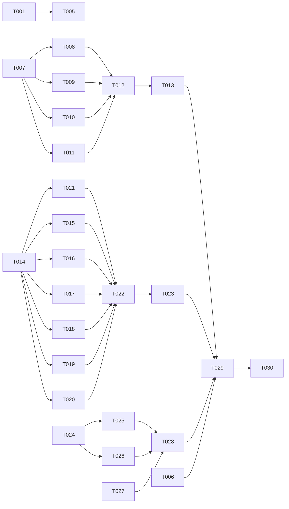

---

description: "Task list for feature 004-devx-bundle-v1: Developer Experience Bundle v1 — two-phase review flow, hermes wrapper, doctor overhaul, AI Engineering Coach rules import"
---

# Tasks: Developer Experience Bundle v1

**Input**: Design documents from `/specs/004-devx-bundle-v1/`
**Prerequisites**: spec.md (required)

**Organization**: Tasks grouped by user story / component. Each task assigned to a specialist agent.

## Format: `[ID] [AGENT] [Story?] Description`

- **[AGENT]**: Specialist agent responsible (see Agent Tags below)
- **[Story]**: User story this task belongs to (US1–US4)
- Exact file paths in descriptions
- Parallelism derived from Dependency Graph — tasks with no dependencies can run in parallel

## Agent Tags

| Tag | Agent | Domain |
|-----|-------|--------|
| `[SETUP]` | — (orchestrator) | Project init, shared config, scaffolding, command structures |
| `[BE]` | backend-specialist | CLI commands, services, utility logic + unit tests |
| `[OPS]` | devops-engineer | CI/CD, GitHub workflows, branch automation |
| `[DOC]` | documentation-writer | Documentation, rules translation, attribution |
| `[SEC]` | security-auditor | Security review (conditional) |

## Task Statuses

| Status | Meaning |
|--------|---------|
| `- [ ]` | Pending |
| `- [→]` | In progress |
| `- [X]` | Completed |
| `- [!]` | Failed |
| `- [~]` | Blocked (cascade from a failed dependency) |

## Path Conventions

- **Monorepo**: `packages/cli/src/` for CLI source, `packages/cli/src/__tests__/` for tests
- **Config**: `.github/`, `.claude/` at repo root
- **Docs**: `docs/`, `vendor/` at repo root

---

## Phase 0: Foundation — Two-Phase Review Flow (US1, P1)

**Purpose**: Establish the governance backbone — constitution amendment, PR templates, CI workflow changes, and speckit command updates to support the planning-PR → implementation-PR pattern.

**User Story**: US1 — Two-Phase Review for SpecKit Features

- [X] T001 [SETUP] [US1] Create constitution amendment for Principle VIII (Two-Phase Review Flow)
  - Add new principle defining the `specs/<slug>` planning branch → `<slug>` implementation branch pattern
  - Include hotfix carve-out (<50 LOC, prod incident with ticket reference)
  - Document spec patch drift policy during implementation
  - **Files**: `CONSTITUTION.md` (or equivalent governance doc)
  - **Acceptance**: Principle VIII is present with two-phase flow definition, hotfix carve-out, and drift policy
  - **Dependencies**: none

- [X] T002 [OPS] [US1] Create spec PR template
  - Create `.github/PULL_REQUEST_TEMPLATE/spec.md` with sections: feature slug, spec artifacts checklist, AI review gate checklist, merge criteria
  - Template should reference Principle VIII and auto-label as `spec-review`
  - **Files**: `.github/PULL_REQUEST_TEMPLATE/spec.md`
  - **Acceptance**: Template exists with defined sections, references Principle IX
  - **Dependencies**: none

- [X] T003 [OPS] [US1] Create implementation PR template
  - Create `.github/PULL_REQUEST_TEMPLATE/impl.md` with sections: feature slug, linked planning PR, implementation checklist, test results, spec drift note
  - Template should reference the merged spec PR and auto-label as `implementation`
  - **Files**: `.github/PULL_REQUEST_TEMPLATE/impl.md`
  - **Acceptance**: Template exists with defined sections, links to planning PR
  - **Dependencies**: none

- [X] T004 [OPS] [US1] Update CI workflow for two-phase PR paths
  - Add path-filtered job for `specs/*` branches: markdown lint, link check, analyze regen + verdict only
  - Ensure `<slug>` branches run full suite: test, build, lint, type check, analyze re-validation
  - Use `paths: ['specs/<slug>/**']` filters for reduced CI trigger
  - **Files**: `.github/workflows/ci.yml` (or equivalent)
  - **Acceptance**: `specs/*` PRs trigger reduced CI, implementation PRs trigger full CI
  - **Dependencies**: none

- [X] T005 [SETUP] [US1] Update `/speckit.start` command for two-phase branch naming
  - Modify speckit.start to create `specs/<slug>` planning branch (not `feature/<N>-<slug>`)
  - Detect existing stale `specs/<slug>` branches and warn with reuse/abort option
  - Error if no initial commit exists
  - **Files**: `.claude/commands/speckit/start.md` (or equivalent command file)
  - **Acceptance**: `/speckit.start` creates `specs/<slug>` branch, detects stale branches, errors on no-initial-commit
  - **Dependencies**: T001 (constitution must define the convention)

- [X] T006 [OPS] [US1] Add GitHub Action for auto-cleanup of `specs/*` branches
  - Create workflow that deletes `specs/<slug>` branches after PR merge
  - Trigger on `pull_request.closed` with `merged == true` and branch name matching `specs/*`
  - **Files**: `.github/workflows/cleanup-specs-branches.yml`
  - **Acceptance**: `specs/*` branches auto-deleted after merge
  - **Dependencies**: none

**Checkpoint**: Two-phase review flow fully operational — spec PRs get lightweight review, implementation PRs get full CI

---

## Phase 1: Hermes Wrapper (US2, P1)

**Purpose**: Build the `clai-helpers hermes` subcommand wrapping `hermes -z` invocations with prompt input handling, passthrough flags, background mode, and binary detection.

**User Story**: US2 — Hermes CLI Wrapper

- [X] T007 [BE] [US2] Create hermes command skeleton
  - Create `packages/cli/src/cli/hermes.ts` with citty command definition
  - Define args: `<prompt>` (optional positional)
  - Define flags: `--from-file`, `--background`, `--model`, `--provider`, `--toolsets`, `--verbose`
  - Default model: `glm/glm-5.1`, env override: `HERMES_DEFAULT_MODEL`
  - Default provider: `custom`
  - **Files**: `packages/cli/src/cli/hermes.ts`
  - **Acceptance**: Command file exists with all flags defined, help text renders correctly
  - **Dependencies**: none

- [X] T008 [BE] [US2] Implement prompt input handling
  - Resolve prompt from: (1) positional arg, (2) `--from-file <path>` (read file), (3) stdin pipe
  - Priority: arg > --from-file > stdin
  - Error if no prompt source available and not background mode
  - **Files**: `packages/cli/src/cli/hermes.ts` (extend)
  - **Acceptance**: All three input modes work; error on no input; file-not-found handled
  - **Dependencies**: T007

- [X] T009 [BE] [US2] Implement `--background` mode
  - Spawn hermes detached, redirect stdout+stderr to `.hermes-output-<timestamp>.log` in CWD
  - Print PID + log path to stdout, exit 0 immediately
  - Detect early failure (process exits within 2 seconds) and surface error
  - **Files**: `packages/cli/src/cli/hermes.ts` (extend)
  - **Acceptance**: Background spawn prints PID + log path; early failure detected; process detaches
  - **Dependencies**: T007

- [X] T010 [BE] [US2] Implement `--model/--provider/--toolsets/--verbose` passthrough
  - Forward flags to hermes binary as CLI args
  - Model default: `glm/glm-5.1`, env override via `HERMES_DEFAULT_MODEL`
  - Provider default: `custom`
  - **Files**: `packages/cli/src/cli/hermes.ts` (extend)
  - **Acceptance**: All flags forwarded; defaults and env overrides work
  - **Dependencies**: T007

- [X] T011 [BE] [US2] Implement hermes binary detection + install hint
  - Check for `hermes` (or `hermes.exe` on Windows) on PATH
  - If missing: print install hint message, exit 127
  - If found: proceed with invocation
  - **Files**: `packages/cli/src/cli/hermes.ts` (extend)
  - **Acceptance**: Missing binary exits 127 with hint; present binary proceeds
  - **Dependencies**: T007

- [X] T012 [BE] [US2] Register hermes subcommand in cli.ts
  - Import and register `hermes` command in main CLI entry point
  - Verify `clai-helpers hermes --help` works
  - **Files**: `packages/cli/src/cli/cli.ts` (or main entry)
  - **Acceptance**: `clai-helpers hermes --help` shows command help; subcommand is invokable
  - **Dependencies**: T007, T008, T009, T010, T011

- [X] T013 [BE] [US2] Write tests for hermes wrapper
  - Unit tests for prompt resolution (arg, file, stdin)
  - Unit tests for binary detection (mock PATH)
  - Unit tests for flag passthrough (arg construction)
  - Integration test for --background spawn (mock child_process)
  - **Files**: `packages/cli/src/__tests__/hermes.test.ts`
  - **Acceptance**: Tests cover all acceptance scenarios from US2; all pass
  - **Dependencies**: T012

**Checkpoint**: `clai-helpers hermes` fully functional — prompt forwarding, background mode, flag passthrough, error handling all working

---

## Phase 2: Doctor Health Check Overhaul (US3, P2)

**Purpose**: Rewrite `clai-helpers doctor` from a lock-integrity-only check to a comprehensive health matrix covering system, CLI tools, MCP servers, API keys, structural validity, and drift.

**User Story**: US3 — Doctor Health Check Overhaul

- [X] T014 [BE] [US3] Create check-runner abstraction
  - Define `HealthCheck` type: `{ name: string; category: 'system'|'tools'|'mcp'|'keys'|'structure'|'drift'; status: 'pass'|'warn'|'fail'|'unknown'; detail: string; critical: boolean }`
  - Define `CheckRunner` interface: `() => Promise<HealthCheck>`
  - Create runner registry with category grouping
  - **Files**: `packages/cli/src/cli/doctor/types.ts`, `packages/cli/src/cli/doctor/runner.ts`
  - **Acceptance**: Types and runner abstraction exist; can register and execute check runners by category
  - **Dependencies**: none

- [X] T015 [BE] [US3] Implement system checks
  - Node.js version (>=20.x), npm version, git version, OS info
  - Critical: node version >= 20.x
  - **Files**: `packages/cli/src/cli/doctor/checks/system.ts`
  - **Acceptance**: Returns pass/fail for node >=20.x; reports npm, git, OS versions
  - **Dependencies**: T014

- [X] T016 [BE] [US3] Implement CLI tool checks
  - `gh` CLI presence + `gh auth status` (authenticated or not)
  - `hermes` binary presence + version extraction
  - Both non-critical (warn on missing)
  - **Files**: `packages/cli/src/cli/doctor/checks/tools.ts`
  - **Acceptance**: Reports gh auth status, hermes presence + version; warns on missing
  - **Dependencies**: T014

- [X] T017 [BE] [US3] Implement MCP server reachability checks
  - Check context7, filesystem MCP, github MCP, sequential-thinking reachability
  - Attempt basic `tools/list` call via stdio protocol
  - Mark "unknown" if server binary not configured or not on PATH (not "fail")
  - **Files**: `packages/cli/src/cli/doctor/checks/mcp.ts`
  - **Acceptance**: Reports reachability per MCP server; unknown status for unconfigured servers
  - **Dependencies**: T014

- [X] T018 [BE] [US3] Implement API key existence checks
  - Check existence (NOT values) of: ANTHROPIC_API_KEY, OPENAI_API_KEY, OPENROUTER_API_KEY, GH_TOKEN, ZHIPU_API_KEY, GLM_API_KEY
  - For ZHIPU/GLM: check BOTH; warn if only one present; fail critical only if BOTH are missing
  - Non-critical for all other keys (warn on missing)
  - **Files**: `packages/cli/src/cli/doctor/checks/keys.ts`
  - **Acceptance**: Reports key presence/absence; never reads or prints key values
  - **Dependencies**: T014

- [X] T019 [BE] [US3] Implement `.claude/` structural validity checks
  - Verify `commands/`, `agents/`, `skills/` directories exist
  - Verify each `.md` file has valid frontmatter with `name` + `description`
  - Warn on orphan skill references from agents
  - **Files**: `packages/cli/src/cli/doctor/checks/structure.ts`
  - **Acceptance**: Reports directory existence, frontmatter validity, orphan references
  - **Dependencies**: T014

- [X] T020 [BE] [US3] Integrate drift check
  - Invoke `clai-helpers status --strict` internally
  - Surface result as a drift category check
  - Critical check (fail affects exit code)
  - **Files**: `packages/cli/src/cli/doctor/checks/drift.ts`
  - **Acceptance**: Drift status surfaced; fail marked critical
  - **Dependencies**: T014

- [X] T021 [BE] [US3] Implement output formatters
  - Table formatter (default): colored status matrix using consola
  - `--json` formatter: machine-readable JSON output parseable by `jq`
  - `--quiet` formatter: failures only
  - **Files**: `packages/cli/src/cli/doctor/formatters.ts`
  - **Acceptance**: All three output formats work; table has color; JSON is valid; quiet shows failures only
  - **Dependencies**: T014

- [X] T022 [BE] [US3] Rewrite doctor.ts to use new checks
  - Replace existing doctor implementation with new check-runner pipeline
  - Register all check runners (T015–T020)
  - Apply selected formatter (T021)
  - Exit 0 if all critical checks pass, 1 if any critical check fails
  - **Files**: `packages/cli/src/cli/doctor.ts` (or `packages/cli/src/cli/commands/doctor.ts`)
  - **Acceptance**: `clai-helpers doctor` runs full check suite, formats output, correct exit code
  - **Dependencies**: T021, T015, T016, T017, T018, T019, T020

- [X] T023 [BE] [US3] Write tests for doctor overhaul
  - Unit tests for each check runner (mock exec/spawn)
  - Unit tests for each output formatter
  - Integration test for full doctor pipeline
  - Edge case: no `.claude/` directory (structural checks report missing, others run)
  - **Files**: `packages/cli/src/__tests__/doctor.test.ts`, `packages/cli/src/__tests__/doctor/`
  - **Acceptance**: Tests cover all check categories, formatters, edge cases; all pass
  - **Dependencies**: T022

**Checkpoint**: `clai-helpers doctor` fully overhauled — comprehensive health matrix with colored output, JSON mode, quiet mode, correct exit codes

---

## Phase 3: AI Engineering Coach Rules Import (US4, P3)

**Purpose**: Import 45 anti-pattern rules from microsoft/AI-Engineering-Coach into project guardrails, augmenting CLAUDE.md, code-review-checklist skill, and lint-and-validate skill with proper attribution.

**User Story**: US4 — AI Engineering Coach Rules Import

- [X] T024 [DOC] [US4] Fetch and translate 45 rules from AI-Engineering-Coach
  - Fetch rules from `microsoft/AI-Engineering-Coach` repo (`src/core/rules/*.md`)
  - Translate each rule to our format: anti-pattern name, why-it-bites description, correct-pattern example
  - Adapt tone to match project voice (not verbatim copy)
  - If a rule conflicts with existing guardrail, existing guardrail takes precedence; note as "adapted"
  - **Files**: Working notes → will be integrated in T025, T026
  - **Acceptance**: 45 rules translated to project format; conflicts identified and resolved
  - **Dependencies**: none

- [X] T025 [DOC] [US4] Augment CLAUDE.md AI-Generated Code Guardrails section
  - Append translated rules to existing guardrails section
  - Maintain existing guardrail precedence for conflicts
  - Each rule has: anti-pattern name, why-it-bites, correct-pattern
  - **Files**: `CLAUDE.md`
  - **Acceptance**: All 45 rules represented; existing guardrails unchanged; format consistent
  - **Dependencies**: T024

- [X] T026 [DOC] [US4] Augment code-review-checklist and lint-and-validate skills
  - Add applicable rules to `.claude/skills/code-review-checklist/SKILL.md`
  - Add automatable rules to `.claude/skills/lint-and-validate/SKILL.md`
  - Ensure each rule appears in at least one of: CLAUDE.md guardrails, code-review-checklist, or lint-and-validate
  - **Files**: `.claude/skills/code-review-checklist/SKILL.md`, `.claude/skills/lint-and-validate/SKILL.md`
  - **Acceptance**: Rules augment both skills; coverage complete (each rule in at least one target)
  - **Dependencies**: T024

- [X] T027 [DOC] [US4] Create attribution and license files
  - Create `docs/CREDITS.md` with MIT license notice referencing `microsoft/AI-Engineering-Coach`
  - Note any "adapted" rules where conflicts were resolved
  - Copy MIT license to `vendor/AI-Engineering-Coach-LICENSE`
  - **Files**: `docs/CREDITS.md`, `vendor/AI-Engineering-Coach-LICENSE`
  - **Acceptance**: CREDITS.md has MIT notice and source reference; license file copy exists
  - **Dependencies**: none

- [X] T028 [BE] [US4] Run `npx clai-helpers sync`
  - Execute sync to propagate augmented content to Copilot/Gemini targets
  - Verify no drift after sync via `clai-helpers status --strict`
  - **Files**: Generated targets (`.github/prompts/`, `.github/instructions/`, `.gemini/`, etc.)
  - **Acceptance**: Sync completes; `clai-helpers status --strict` reports no drift
  - **Dependencies**: T025, T026, T027

**Checkpoint**: All 45 rules imported, attributed, synced — guardrails enriched across all targets

---

## Phase 4: Integration

**Purpose**: End-to-end validation and documentation update across all components.

- [X] T029 [SETUP] End-to-end smoke test of all components
  - Test full two-phase review flow: `/speckit.start` → spec PR → merge → `/speckit.implement` → impl PR
  - Test `clai-helpers hermes` with arg, file, stdin, background modes
  - Test `clai-helpers doctor` with table, JSON, quiet output
  - Test `clai-helpers status --strict` shows no drift after sync
  - Verify no regressions in existing commands
  - **Files**: None (validation only)
  - **Acceptance**: All components pass smoke tests; no regressions
  - **Dependencies**: T013, T023, T028, T006

- [X] T030 [DOC] Update README with new commands
  - Document `clai-helpers hermes` subcommand with usage examples
  - Document `clai-helpers doctor` overhaul with `--json` and `--quiet` flags
  - Document two-phase review flow in contributing guide section
  - Note AI-Engineering-Coach attribution
  - **Files**: `README.md`, `CONTRIBUTING.md` (if exists)
  - **Acceptance**: README documents all new commands and features; examples provided
  - **Dependencies**: T029

**Checkpoint**: Feature complete — all components integrated, documented, validated

---

## Dependency Graph

### Legend

- `→` means "unlocks" (left must complete before right can start)
- `+` means "all of these" (join point — ALL listed tasks must complete)
- Tasks not listed here have no dependencies and can start immediately within their phase

### Format Rules (STRICT)

```
# VALID formats (one per line):
T001 → T002, T003              # single unlock
T001 → T002, T003              # fan-out (one unlocks many)
T002 + T003 → T004             # fan-in (many unlock one)

# INVALID (do NOT produce):
T001 → T002 → T003             # chaining — use two lines
T001, T002 → T003, T004        # multi-to-multi — decompose
```

### Dependencies

```
# Phase 0: Foundation
T001 → T005                    # constitution before speckit.start update

# Phase 1: Hermes Wrapper
T007 → T008, T009, T010, T011  # skeleton before all implementations
T007 + T008 + T009 + T010 + T011 → T012  # all impl before registration
T012 → T013                    # registration before tests

# Phase 2: Doctor Overhaul
T014 → T015, T016, T017, T018, T019, T020  # abstraction before all checks
T014 → T021                    # abstraction before formatters
T021 + T015 + T016 + T017 + T018 + T019 + T020 → T022  # all checks + formatters before rewrite
T022 → T023                    # rewrite before tests

# Phase 3: Rules Import
T024 → T025, T026              # translation before augmentation
T025 + T026 + T027 → T028     # all content + license before sync

# Phase 4: Integration
T013 + T023 + T028 + T006 → T029  # all phases complete before smoke test
T029 → T030                    # smoke test before docs
```

### Self-Validation Checklist

> - [X] Every task ID in Dependencies exists in the task list above
> - [X] No circular dependencies (A→B→A)
> - [X] No orphan task IDs referenced that don't exist
> - [X] Fan-in uses `+` only, fan-out uses `,` only
> - [X] No chained arrows on a single line

---

## Dependency Visualization

> Auto-generated from Dependencies section above. For visual rendering in GitHub/VS Code only — NOT for parsing by the orchestrator.



---

## Parallel Lanes

| Lane | Agent Flow | Tasks | Blocked By |
|------|-----------|-------|------------|
| A | [SETUP] + [OPS] | T001, T002, T003, T004, T006 → T005 | — |
| B | [BE] | T007 → T008, T009, T010, T011 → T012 → T013 | T005 (for Phase 1 start) |
| C | [BE] | T014 → T015, T016, T017, T018, T019, T020, T021 → T022 → T023 | — |
| D | [DOC] + [BE] | T024, T027 → T025, T026 → T028 | — |
| E | [SETUP] + [DOC] | T029 → T030 | All phases complete |

---

## Agent Summary

| Agent | Task Count | Can Start After |
|-------|-----------|-----------------|
| [SETUP] | 3 (T001, T005, T029) | immediately (T001), T001 (T005), all phases (T029) |
| [OPS] | 3 (T002, T003, T004, T006) | immediately |
| [BE] | 18 (T007–T013, T014–T023, T028) | immediately (T014, T007), varies for rest |
| [DOC] | 4 (T024–T027, T030) | immediately (T024, T027), T029 (T030) |

**Critical Path**: T007 → T008/T009/T010/T011 → T012 → T013 → T029 → T030

---

## Agent Dispatch Plan

> For each agent that has tasks, provide the context needed to spawn a subagent. The orchestrator uses this table to dispatch without re-reading plan.md.

| Agent | Subagent | Skills | Input Context | Tasks | Files |
|-------|----------|--------|---------------|-------|-------|
| `[SETUP]` | — (orchestrator) | — | spec.md §US1, constitution.md | T001, T005, T029 | `.specify/memory/constitution.md`, `.claude/commands/speckit.start.md` |
| `[OPS]` | `devops-engineer` | `deployment-procedures` | spec.md §FR-005 to FR-008, CI config | T002, T003, T004, T006 | `.github/PULL_REQUEST_TEMPLATE/`, `.github/workflows/` |
| `[BE]` | `backend-specialist` | `api-patterns`, `system-design-patterns` | spec.md §US2, §US3, plan.md tech stack (citty, consola, vitest) | T007–T013, T014–T023, T028 | `packages/cli/src/cli/`, `packages/cli/src/__tests__/` |
| `[DOC]` | `documentation-writer` | `documentation-templates` | spec.md §US4, microsoft/AI-Engineering-Coach repo | T024–T027, T030 | `CLAUDE.md`, `.claude/skills/`, `docs/`, `vendor/`, `README.md` |

---

## Implementation Strategy

### MVP First (User Stories 1 + 2)

1. Complete Phase 0: Foundation (Lane A)
2. Complete Phase 1: Hermes Wrapper (Lane B) — can start T007 immediately, T005 after T001
3. Complete Phase 2: Doctor Overhaul (Lane C) — fully independent, can run in parallel with Phase 1
4. **STOP and VALIDATE**: Test US1 and US2 independently
5. Phase 3: Rules Import (Lane D) — can start immediately, independent of B and C
6. Phase 4: Integration — after all phases

### Incremental Delivery

1. Phase 0 → Two-phase review flow operational
2. Phase 1 → Hermes wrapper functional (MVP!)
3. Phase 2 → Doctor overhaul complete
4. Phase 3 → Rules imported, guardrails enriched
5. Phase 4 → Full integration validated, documented

### Parallel Agent Strategy

1. Orchestrator completes T001 (constitution) directly
2. Once T001 complete → T005 unlocks; Lane B can start T007
3. In parallel:
   - **Lane A**: [OPS] handles T002, T003, T004, T006
   - **Lane B**: [BE] handles T007 → T008–T011 (parallel) → T012 → T013
   - **Lane C**: [BE] handles T014 → T015–T021 (parallel) → T022 → T023
   - **Lane D**: [DOC] handles T024, T027 → T025, T026 → T028
4. As all lanes complete → T029 (integration) → T030 (docs)
5. Lanes C and D are fully independent of Lane B — maximum parallelism

---

## Notes

- `[AGENT]` tag assigns responsibility — domain agent writes both code and unit tests
- Phases are sync barriers — all tasks in a phase must complete/fail/block before dependent phases
- Each user story is independently completable and testable
- Commit after each task or logical group
- Stop at any checkpoint to validate story independently
- T029 (smoke test) is the final gate before the feature is considered complete
- Lane C (doctor) and Lane D (rules) have zero cross-dependencies with Lane B (hermes) — safe to parallelize
- The existing `doctor` implementation is fully replaced; old lock-integrity behavior subsumed under T020 (drift check)
- AI-Engineering-Coach import is a one-time manual process; document for repeatability in T024 working notes
