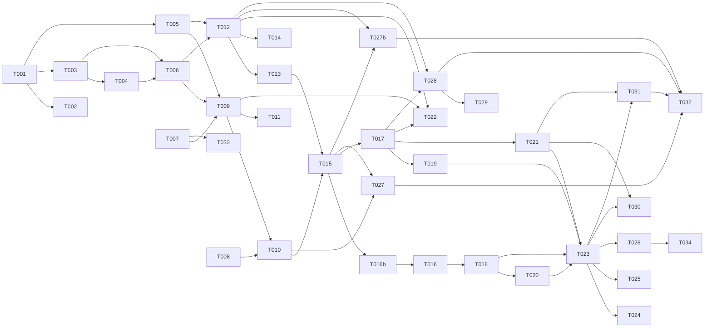

# Tasks: Agent Task Board + Shared Memory Service

**Input**: Design documents from `specs/005-agents-board-and-memory/`
**Prerequisites**: plan.md (required), spec.md (required), research.md, data-model.md, contracts/

**Organization**: Tasks grouped by implementation wave. Waves correspond to priority tiers (P1 → MVP, P2 → enrichment, P3 → operator features). Each task is assigned to a specialist agent.

## Format: `[ID] [AGENT] [Story?] Description`

## Agent Tags

| Tag | Agent | Domain |
|-----|-------|--------|
| `[SETUP]` | — (orchestrator) | Project scaffolding, shared config, package init |
| `[DB]` | database-architect | SQLite schema, migrations, indexes, virtual tables |
| `[BE]` | backend-specialist | MCP tools, services, server logic, retrieval, embedding |
| `[FE]` | frontend-specialist | Dashboard HTML/CSS/JS, SSE client, kanban board |
| `[OPS]` | devops-engineer | CLI commands, config, lifecycle, export/import |
| `[E2E]` | test-engineer | Cross-boundary integration tests |

## Task Statuses

| Status | Meaning |
|--------|---------|
| `- [ ]` | Pending |
| `- [→]` | In progress |
| `- [X]` | Completed |
| `- [!]` | Failed |
| `- [~]` | Blocked |

---

## Wave 0: Foundation (Shared Infrastructure)

**Purpose**: Package scaffolding, database schema, project detection — everything that blocks all other work.

- [ ] T001 [SETUP] Create `packages/underboard/` package structure: `package.json` (name: `underboard`, version: `0.1.0`), `tsconfig.json` (strict, Node 20 target, composite), `vitest.config.ts`. Add `bin` field pointing to `dist/cli.js`. Files: `packages/underboard/package.json`, `packages/underboard/tsconfig.json`, `packages/underboard/vitest.config.ts`
- [ ] T002 [SETUP] Create entry points: `src/index.ts` (service start), `src/cli/index.ts` (Commander CLI skeleton with start/stop/status/export/import/model/wipe subcommands). Files: `packages/underboard/src/index.ts`, `packages/underboard/src/cli/index.ts`
- [ ] T003 [DB] Implement SQLite database module: `src/storage/database.ts` — connection factory, WAL mode enable, `_migrations` table, migration runner (reads SQL files from `src/storage/migrations/` in order, applies within transaction). Files: `packages/underboard/src/storage/database.ts`
- [ ] T004 [DB] Create initial migration `001_initial_schema.sql`: `projects` (with `stable_key TEXT UNIQUE`), `tasks`, `memory_entries`, `activity_log`, `events`, `_config` tables with all indexes, CHECK constraints, and FKs per data-model.md. FTS5 virtual table `memory_fts` with insert/delete triggers. sqlite-vec virtual table `memory_vectors` (using INTEGER PRIMARY KEY rowid matching `memory_entries` rowid, with fallback comment for JS cosine path). Include seed INSERTs into `_config` for defaults: `archive_mode='manual'`, `archive_after_days='30'`, `stalled_mode='off'`, `stalled_after_hours='24'`, `lexical_weight='0.4'`, `semantic_weight='0.6'`. Files: `packages/underboard/src/storage/migrations/001_initial_schema.sql`
- [ ] T005 [BE] Implement project detector: `src/project/detector.ts` — walk up from CWD to find `.git/` dir or `.under-project` marker, canonicalize path (realpath). If Git is present, read `git remote get-url origin` and compute its SHA-256 hash as `stable_key`. First 16 hex chars of the root path hash = project ID. Fallback `stable_key` = project ID hash when Git is absent. Export `detectProject(cwd: string): { id: string; stableKey: string; displayName: string; rootPath: string }`. Files: `packages/underboard/src/project/detector.ts`
- [ ] T006 [BE] Implement store modules (thin CRUD wrappers over SQLite): `src/storage/project-store.ts`, `src/storage/task-store.ts`, `src/storage/memory-store.ts`, `src/storage/event-store.ts`. Each exports typed functions (no ORM — direct prepared statements). Include: (a) dedup logic in memory-store with provenance list cap of 20 (first 5 + last 10 kept, mid-discarded, increment `truncated_count`); (b) auto-pruning in event-store to keep only the last 10,000 events (`DELETE FROM events WHERE id < (SELECT MAX(id) - 10000 FROM events)`) executed on every event insert. Files: `packages/underboard/src/storage/project-store.ts`, `packages/underboard/src/storage/task-store.ts`, `packages/underboard/src/storage/memory-store.ts`, `packages/underboard/src/storage/event-store.ts`

**Checkpoint**: Foundation ready. DB schema deployed, project detection working, stores can CRUD.

---

## Wave 1: Core Memory Subsystem (P1 — US1)

**Purpose**: Semantic memory write + recall — the keystone capability.

**User Story 1**: Persistent Shared Memory Across Sessions

**Independent Test**: Write 3 facts from session A → start session B → query by natural language → facts returned in top 5.

- [ ] T007 [BE] Implement embedding service: `src/embedding/embedding-service.ts` — ONNX Runtime node wrapper, load `paraphrase-multilingual-MiniLM-L12-v2` from `~/.underboard/models/`, expose `embed(text: string): Float32Array` (384-dim). Status tracking: `loading | ready | failed`. `src/embedding/model-downloader.ts` — auto-download model on first run to `~/.underboard/models/`, with progress callback. Fallback flag: if ONNX fails to load, service stays in `failed` state, retrieval degrades to lexical-only. Files: `packages/underboard/src/embedding/embedding-service.ts`, `packages/underboard/src/embedding/model-downloader.ts`
- [ ] T008 [BE] Implement retrieval modules: `src/retrieval/lexical.ts` (FTS5 BM25 query builder, normalize scores to 0-1), `src/retrieval/semantic.ts` (sqlite-vec cosine query joining entries on rowid, fallback to JS cosine if extension unavailable), `src/retrieval/hybrid-retrieval.ts` (weighted fusion: `0.4 * lexical + 0.6 * semantic`, configurable weights). Files: `packages/underboard/src/retrieval/lexical.ts`, `packages/underboard/src/retrieval/semantic.ts`, `packages/underboard/src/retrieval/hybrid-retrieval.ts`
- [ ] T009 [BE] Implement `memory_write` tool: `src/tools/memory/write.ts` — validate content size (warn 64KB, reject 1MB), compute content_hash, check dedup. Execute DB operations (insert/update memory entry, FTS trigger sync, and sqlite-vec vector insertion using `rowid` mapping) wrapped inside a single atomic SQLite transaction (`db.transaction()`) to guarantee consistency on crash. Return `{ id, created, provenance }`. Emit `memory_added` event. Files: `packages/underboard/src/tools/memory/write.ts`
- [ ] T010 [BE] Implement `memory_recall` tool: `src/tools/memory/recall.ts` — hybrid retrieval scoped to project_id. Return top-K results with combined score, similarity, and `embedding_status` flag. Files: `packages/underboard/src/tools/memory/recall.ts`
- [ ] T011 [BE] Implement memory utilities: `src/tools/memory/list-recent.ts` (returns `truncated: boolean` and `full_length: number`), `src/tools/memory/get.ts` (returns full record by ID), and `src/tools/memory/delete.ts` (scoped to `project_id`, rate-limited to 100/min per agent, deletes from entries, fts, vectors). Files: `packages/underboard/src/tools/memory/list-recent.ts`, `packages/underboard/src/tools/memory/get.ts`, `packages/underboard/src/tools/memory/delete.ts`

**Checkpoint**: Memory subsystem complete. Can write, recall (semantic + lexical), list, delete. Embedding model auto-downloads on first use.

---

## Wave 2: Core Task Board Subsystem (P1 — US2)

**Purpose**: Task CRUD + status management — the operator's pane of glass.

**User Story 2**: Visible Task Board for Concurrent Agent Activity

**Independent Test**: Two agents create tasks in different projects → dashboard shows both in correct columns → status update reflected in real time.

- [ ] T012 [BE] Implement task tools: `src/tools/tasks/create.ts` (validate title, status in closed set, optional deps), `src/tools/tasks/update.ts` (validate status, update fields, CAS concurrency check if `if_match` provided, bump updated_at), `src/tools/tasks/list.ts` (filter by status/assignee/project/archived/search, paginated — `search` param does case-insensitive LIKE on title, per FR-020), `src/tools/tasks/list-assigned.ts` (project-scoped). Files: `packages/underboard/src/tools/tasks/create.ts`, `packages/underboard/src/tools/tasks/update.ts`, `packages/underboard/src/tools/tasks/list.ts`, `packages/underboard/src/tools/tasks/list-assigned.ts`
- [ ] T013 [BE] Implement `task_archive` tool: `src/tools/tasks/archive.ts` — set archived=true, emit event. Implement configurable archive modes in task-store: `manual` (only explicit archive), `after_days` (auto-flag done tasks older than N days — evaluated at query time in task_list, not a background sweeper), `done_collapse` (done = effectively archived, hidden from default view). Mode read from `_config` table. Archive evaluation is computed on read (same pattern as stalled detection in T014). Files: `packages/underboard/src/tools/tasks/archive.ts`
- [ ] T014 [BE] Implement stalled-task detection: add `stalled_mode` and `stalled_after_hours` to `_config`. In task list queries, when `stalled_mode = visual_after_hours`, compute stalled flag for `in_progress` tasks with `updated_at` older than threshold. Add `stalled: boolean` field to task response (computed, not stored). Never auto-transition status. Files: `packages/underboard/src/storage/task-store.ts` (modify)

**Checkpoint**: Task board backend complete. Agents can create, update, list, archive tasks. Stalled detection computed on read.

---

## Wave 3: MCP Server + Transport (P1)

**Purpose**: Wire everything into an MCP-compliant server that agents can connect to.

- [ ] T015 [BE] Implement MCP server: `src/server/mcp-server.ts` — create MCP server instance with @modelcontextprotocol/sdk, register Wave 0-2 tools only (memory_write, memory_recall, memory_list_recent, memory_get, memory_delete, task_create, task_update, task_list, task_list_assigned, task_archive). Add CWD injection middleware (extracts from incoming `clientInfo.cwd` initialization parameter or `X-Agent-CWD` custom request header). Export a `registerTool()` function. Files: `packages/underboard/src/server/mcp-server.ts`
- [ ] T016 [BE] Implement HTTP server + SSE transport: `src/server/http-server.ts` — Node built-in http server. Binds exclusively to local loopback interface `127.0.0.1`. Add middleware to (a) enforce Bearer token authentication from `Authorization` headers (reading token file), and (b) validate `Host` and `Origin` headers to prevent DNS rebinding and cross-site exfiltration. Endpoints: `GET /` (dashboard static), `GET /mcp/sse` (MCP SSE transport), `GET /events` (dashboard SSE stream with `Last-Event-ID` reconnect), `GET /health` (JSON health status), `POST /api/tasks` (operator task create), `PATCH /api/tasks/:id` (operator task update), `DELETE /api/tasks/:id` (operator task delete). Files: `packages/underboard/src/server/http-server.ts`
- [ ] T016b [OPS] Implement Bearer token generator: `src/server/auth.ts` — on startup, check if `~/.underboard/token` exists. If not, generate a 32-byte secure random hexadecimal string and write to `~/.underboard/token`. Set POSIX strict `0600` owner permissions, falling back gracefully to standard User ACL permissions on Windows without throwing errors. Files: `packages/underboard/src/server/auth.ts`
- [ ] T017 [BE] Implement event bus with backpressure: `src/events/event-bus.ts` — in-process EventEmitter-based pub/sub. On event: (1) persist to `events` table, (2) push to connected SSE clients. Track client socket queue length; if a backgrounded or suspended browser client's buffer exceeds 1MB, terminate connection with snapshot replay warning to protect memory. Files: `packages/underboard/src/events/event-bus.ts`

**Checkpoint**: MCP server running. Agents can connect via SSE. Health endpoint reporting. Events flowing to SSE clients.

---

## Wave 4: Web Dashboard (P1 — US2)

**Purpose**: Kanban board + memory feed for the human operator.

- [ ] T018 [FE] Create dashboard HTML shell: `dashboard/index.html` — single-page layout with: header (service name + health indicator), main area (kanban board with 5 columns), sidebar (recent memory feed), bottom panel (activity log, shown when task selected). Include `styles.css` with CSS custom properties, flexbox layout, dark/light theme support, responsive design. Integrate keyboard navigation (arrow keys to navigate cards, Enter to open modals) and ARIA roles for kanban elements. Load DOMPurify script cleanly in header. Files: `packages/underboard/dashboard/index.html`, `packages/underboard/dashboard/styles.css`
- [ ] T019 [FE] Implement SSE client: `dashboard/lib/sse-client.js` — EventSource wrapper with auto-reconnect, `Last-Event-ID` tracking, delta replay on reconnect, exponential backoff. On delta error or snapshot event, parse standard `{ tasks, memory_recent, last_event_id }` wire format and trigger full re-hydration. Files: `packages/underboard/dashboard/lib/sse-client.js`
- [ ] T020 [FE] Implement API client: `dashboard/lib/api.js` — fetch wrapper for REST endpoints (GET /health, GET/POST/PATCH/DELETE /api/tasks, GET /api/memory/recent), automatically injecting bearer token read from connection parameters. Files: `packages/underboard/dashboard/lib/api.js`
- [ ] T021 [FE] Implement board component: `dashboard/components/board.js` — renders kanban columns (backlog, in_progress, blocked, review, done) with task cards showing title, assignee, project, updated_at, stalled indicator. All agent-written text MUST be sanitized via DOMPurify before writing to DOM to prevent stored XSS. Filter bar: project select, assignee input, status toggle, text search. Files: `packages/underboard/dashboard/components/board.js`
- [ ] T022 [FE] Implement memory feed component: `dashboard/components/memory-feed.js` — sidebar showing recent memory entries with content snippet, agent name, project, timestamp. All entries sanitized via DOMPurify. Auto-updates on SSE `memory_added` event. Files: `packages/underboard/dashboard/components/memory-feed.js`
- [ ] T023 [FE] Implement main app: `dashboard/app.js` — wire up SSE client, API client, board, memory feed. Handle initial state load, SSE event routing. Setup periodic timer `setInterval` (once per minute) to trigger local re-render of card time-based indicators (stalled/auto-archive), preventing UI staleness when SSE events are quiet. Files: `packages/underboard/dashboard/app.js`

**Checkpoint**: Dashboard functional. Real-time kanban board with memory feed. Operator can view and interact with tasks.

---

## Wave 5: CLI + Service Lifecycle (P1)

**Purpose**: User-facing CLI to manage the service.

- [ ] T024 [OPS] Implement CLI commands: `src/cli/index.ts` — `start` (spawn HTTP+MCP server as background process, write PID file to `~/.underboard/underboard.pid`), `stop` (read PID, SIGTERM), `status` (GET /health, display formatted output), `model fetch` (manually downloads embedding model to enable offline-ready installation), `memory wipe --confirm` (permanent bulk delete of all memory entries), `export <path>` (dump all tasks + memory to JSON archive), `import <path>` (read archive, reconcile by matching `stable_key` remote URL, fall back to path hash), `tasks delete <id>` (DELETE /api/tasks/:id — permanent, operator-only, per FR-015). Files: `packages/underboard/src/cli/index.ts`
- [ ] T025 [BE] Implement health endpoint: expand `src/server/http-server.ts` `/health` to return `{ uptime, total_tasks, total_memory_entries, embedding_model_status, db_path, db_size_bytes, clients }` (to debug connection CWD/Name detection mismatches). Files: `packages/underboard/src/server/http-server.ts` (modify)
- [ ] T026 [BE] Implement config loader: `src/cli/config.ts` — read `~/.underboard/config.json` using `c12` (consistent with existing `packages/cli/`), merge with defaults, validate schema. Config drives: port, db_path, archive_mode, archive_after_days, stalled_mode, stalled_after_hours, retrieval weights. Files: `packages/underboard/src/cli/config.ts`

**Checkpoint**: Full MVP. Service can be started/stopped via CLI. Health reporting. Export/import working.

---

## Wave 6: Cross-Project Recall + Activity Log (P2 — US3, US4)

**User Story 3**: Explicit Cross-Project Memory Recall (P2)
**User Story 4**: Agent Activity Log Stream in Dashboard (P2)

- [ ] T027 [BE] Implement `memory_recall_cross_project` tool: `src/tools/memory/recall-cross.ts` — hybrid retrieval without project filter, add `project_id` and `project_name` to each result. `memory_delete_cross_project` tool: `src/tools/memory/delete-cross.ts` — deletes across projects, with a 10-call bulk delete limit. Register tools. Files: `packages/underboard/src/tools/memory/recall-cross.ts`, `packages/underboard/src/tools/memory/delete-cross.ts`
- [ ] T027b [BE] Implement `task_list_assigned_cross_project` tool: `src/tools/tasks/list-assigned-cross.ts` — retrieves assigned tasks cross-project. Register tool. Files: `packages/underboard/src/tools/tasks/list-assigned-cross.ts`
- [ ] T028 [BE] Implement activity log tools: `src/tools/tasks/activity-log.ts` — `activity_log_start` (mark task as logging-enabled), `activity_log_emit` (write to activity_log table, emit event), `activity_log_get` (query by task_id, paginated). Files: `packages/underboard/src/tools/tasks/activity-log.ts`
- [ ] T029 [FE] Implement activity log panel with DOMPurify: `dashboard/components/activity-log.js` — shown when a task is selected. Sanitizes content snippets and logs before rendering. Live-streams via SSE. Files: `packages/underboard/dashboard/components/activity-log.js`

**Checkpoint**: P2 features complete. Cross-project recall and activity logging working in dashboard.

---

## Wave 7: Operator Features (P3 — US5)

**User Story 5**: Operator-Driven Task Creation and Assignment (P3)

- [ ] T030 [FE] Implement operator task creation UI: add "New Task" button to dashboard board header. Modal form with title (required), description, assignee, status dropdown. POST to `/api/tasks`. On success: task card appears in correct column. Files: `packages/underboard/dashboard/components/board.js` (modify)
- [ ] T031 [FE] Implement operator task edit/archive/delete: click task card → detail modal with editable fields. DOMPurify sanitize text. Archive button. Delete button. Files: `packages/underboard/dashboard/components/board.js` (modify)

**Checkpoint**: P3 features complete. Operator can create, edit, archive, delete tasks from dashboard.

---

## Wave 8: Polish + Integration Tests

- [ ] T032 [E2E] Integration tests: MCP tool contract tests (write → recall → verify top-K), cross-project isolation, SSE reconnect (delta replay vs snapshot), token authorization, DOMPurify stored XSS prevention, export/import roundtrip (remote stable_key reconciliation). Files: `packages/underboard/tests/integration/`
- [ ] T033 [BE] Embedding backfill worker: `src/embedding/backfill.ts` — background loop. Syncs database changes atomically. Files: `packages/underboard/src/embedding/backfill.ts`
- [ ] T034 [OPS] Validate quickstart.md: follow all steps from `quickstart.md` on a clean machine, verify every command succeeds, update doc if needed. Files: `specs/005-agents-board-and-memory/quickstart.md`

---

## Dependency Graph

### Dependencies

```
T001 → T002, T003, T005
T003 → T004, T006
T004 → T006
T006 → T009, T012
T007 → T009
T008 → T010
T009 → T010, T011
T010 → T015
T012 → T013, T014
T013 → T015
T005 → T009, T012
T015 → T016b, T017
T016b → T016
T016 → T018
T017 → T019, T021
T018 → T020, T023
T019 → T023
T020 → T023
T021 → T023
T009 + T012 + T017 → T022
T023 → T024, T025, T026
T010 + T015 → T027
T012 + T015 → T027b
T012 + T017 → T028
T028 → T029
T021 + T023 → T030, T031
T027 + T027b + T028 + T031 → T032
T007 → T033
T026 → T034
```

### Self-Validation Checklist

- [x] Every task ID in Dependencies exists in the task list above
- [x] No circular dependencies
- [x] No orphan task IDs referenced that don't exist
- [x] Fan-in uses `+` only, fan-out uses `,` only
- [x] No chained arrows on a single line

---

## Dependency Visualization



---

## Parallel Lanes

| Lane | Agent Flow | Tasks | Blocked By |
|------|-----------|-------|------------|
| 1 | [SETUP] | T001 → T002 | — |
| 2 | [DB] | T003 → T004 → T006 | T001 |
| 3 | [BE] memory | T007 + T008 → T009 → T010 → T011 → T015 | T001, T003, T005 |
| 4 | [BE] tasks | T012 → T013, T014 → T015 | T001, T003, T005 |
| 5 | [BE] server | T015 → T016b → T016, T017 | T010, T013 |
| 6 | [FE] | T018 + T019 + T020 + T021 → T022, T023 | T016, T017 |
| 7 | [OPS] | T024, T025, T026 | T023 |
| 8 | [BE] P2 | T027, T027b, T028 | T010, T012, T015, T017 |
| 9 | [FE] P2/P3 | T029, T030, T031 | T028, T021, T023 |
| 10 | [E2E] | T032, T033, T034 | T027, T027b, T028, T031, T026 |

---

## Agent Summary

| Agent | Task Count | Can Start After |
|-------|-----------|-----------------|
| [SETUP] | 2 | immediately |
| [DB] | 3 | T001 |
| [BE] | 18 | T001 (Wave 0-3), T010/T015 (Wave 6), T026 (Wave 8) |
| [FE] | 7 | T016/T017 (Wave 4), T028 (Wave 6), T021/T023 (Wave 7) |
| [OPS] | 4 | T023 (Wave 5) / T015 (Wave 3) |
| [E2E] | 3 | T027 + T027b + T028 + T031 (Wave 8) |

**Critical Path**: T001 → T003 → T004 → T006 → T009 → T010 → T015 → T016b → T016 → T017 → T021 → T023 → T024

**Total tasks**: 37

---

## Agent Dispatch Plan

| Agent | Subagent | Skills | Input Context | Tasks | Files |
|-------|----------|--------|---------------|-------|-------|
| [SETUP] | — (orchestrator) | — | plan.md §Project Structure, quickstart.md §Setup | T001, T002 | `package.json`, `tsconfig.json`, `vitest.config.ts`, `src/index.ts`, `src/cli/index.ts` |
| [DB] | database-architect | database-design | data-model.md (full), plan.md §Storage | T003, T004, T006 | `src/storage/database.ts`, `src/storage/migrations/`, `src/storage/*-store.ts` |
| [BE] | backend-specialist | api-patterns, system-design-patterns, nodejs-best-practices | contracts/, data-model.md, research.md, plan.md §Tech Stack | T005, T007, T008, T009, T010, T011, T012, T013, T014, T015, T016, T017, T025, T026, T027, T027b, T028, T033 | `src/project/`, `src/embedding/`, `src/retrieval/`, `src/tools/`, `src/server/`, `src/events/`, `src/cli/config.ts` |
| [FE] | frontend-specialist | frontend-design | contracts/task-tools.md §Event Types, plan.md §Dashboard | T018, T019, T020, T021, T022, T023, T029, T030, T031 | `dashboard/` |
| [OPS] | devops-engineer | deployment-procedures | quickstart.md, plan.md §CLI | T016b, T024 | `src/server/auth.ts`, `src/cli/index.ts` (modify) |
| [E2E] | test-engineer | testing-patterns, tdd-workflow | contracts/, quickstart.md §Test, data-model.md | T032, T033, T034 | `tests/integration/`, `src/embedding/backfill.ts` |

---

## Implementation Strategy

### MVP Scope (Wave 0–5, P1)

37 tasks total. **MVP = Waves 0–5 (T001–T026 + T016b)** = 27 tasks covering User Stories 1 and 2.

1. Wave 0: Setup + DB + project detection (T001–T006)
2. Wave 1: Memory subsystem — write, recall, list, delete (T007–T011)
3. Wave 2: Task board backend (T012–T014)
4. Wave 3: MCP server + transport + token auth (T015–T017 + T016b)
5. Wave 4: Dashboard frontend + sanitization (T018–T023)
6. Wave 5: CLI + lifecycle + fetches (T024–T026)
7. **STOP and VALIDATE**: Test US1 + US2 independently per spec acceptance scenarios

### Parallel Agent Strategy

1. Orchestrator does T001–T002 directly (setup)
2. Wave 0 sync barrier: T003 + T004 + T005 + T006 can run in parallel after T001
3. Wave 1 + Wave 2 can partially overlap: memory (T007→T009) || tasks (T012) after T005+T006
4. T015 requires both T010 (memory recall) and T013 (task archive) — sync point
5. Dashboard (T018–T023) starts after T016+T017 (server ready)
6. CLI (T024–T026) starts after T023 (app wired up)

### Suggested Next Command

`/speckit.analyze` — run consistency check on all generated artifacts before implementation.
