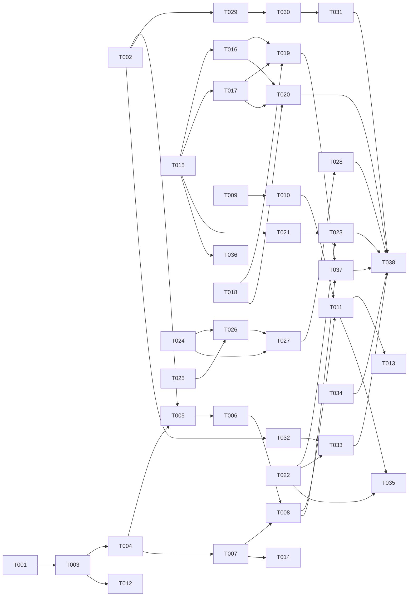

# Tasks: Ecosystem Parity — Packaging, Enforcement & Quality Gates

**Input**: Design documents from `/specs/006-ecosystem-parity/`
**Prerequisites**: plan.md, spec.md, research.md, data-model.md, contracts/, quickstart.md

**Tests**: Spec demands scripted verification suites (SC-002 guard suite, eval gate self-test, golden fixtures per Principle II) — test tasks are IN scope.

**Organization**: Grouped by user story (US1–US7, priority order P1→P3). Phases are sync barriers.

## Format: `[ID] [AGENT] [Story?] Description`

## Agent Tags

| Tag | Agent | Domain here |
|-----|-------|-------------|
| `[SETUP]` | — (orchestrator) | Config authoring, registrations, empirical probes, release prep |
| `[BE]` | backend-specialist | CLI TypeScript (core/packs, migrate, presets), Node hooks, eval runner + unit tests |
| `[SEC]` | security-auditor | Guard rule curation, permission preset allow/deny lists |
| `[OPS]` | devops-engineer | CI workflows |
| `[E2E]` | test-engineer | Cross-boundary integration suites, measurement tasks, quality gate |
| `[DOC]` | documentation-writer | README (EN/RU), CLI docs |

No `[DB]`/`[FE]` — no database, no UI in this feature.

## Task Statuses

`- [ ]` pending · `- [→]` in progress · `- [X]` done · `- [!]` failed · `- [~]` blocked

## Path Conventions

Monorepo per plan.md: CLI code `packages/cli/src/`, tests `packages/cli/tests/`, template content `.claude/` + `presets/`, generated `packs/` + `.claude-plugin/`, repo scripts `scripts/`, CI `.github/workflows/`.

---

## Phase 1: Setup

**Purpose**: Types + ground-truth verification everything else builds on

- [ ] T001 [SETUP] Extend config types with `packs` section + per-target `skillsNative` flag in `packages/cli/src/types/config.ts`, mirroring `contracts/packs-config.schema.json`
- [ ] T002 [SETUP] Empirical verification spike V1–V4 (research.md): exact `marketplace.json`/`plugin.json` field set, native skills dir per target (Codex, Gemini CLI, Cursor), statusline stdin JSON schema, plugin-root path var on Windows. Record evidence in `docs/target-capabilities.md` (draft) and update research.md ⚠️ markers

---

## Phase 2: Foundational (Blocking Prerequisites)

**Purpose**: Pack pipeline core — US1/US5 cannot start without it; US2–US4/US6–US7 don't need it (parallel from here)

**⚠️ CRITICAL barrier only for pack-dependent stories (US1, US5)**

- [ ] T003 [BE] Pack domain types + config loading in `packages/cli/src/core/packs/types.ts` (Pack, PacksConfig, CapabilityMatrix; c12 load path extension)
- [ ] T004 [BE] Pack validator in `packages/cli/src/core/packs/validate.ts` — invariants I1–I5 from data-model.md §1 (existence, full coverage, single ownership, cross-ref resolution within pack ∪ deps, DAG) + unit tests `packages/cli/tests/unit/packs/validate.test.ts`
- [ ] T005 [BE] Pack assembler in `packages/cli/src/core/packs/assemble.ts` — content copy from `.claude/` + `presets/`, `plugin.json` per pack, `marketplace.json` projection (contracts/marketplace-manifest.schema.json, pack-manifest.schema.json); byte-idempotent; unit tests `packages/cli/tests/unit/packs/assemble.test.ts`
- [ ] T006 [BE] Wire assembly into `helpers regen` (`packages/cli/src/cli/regen.ts`) and confirm `status --strict` drift coverage of `packs/` + `.claude-plugin/marketplace.json` (FR-012; extend `packages/cli/src/core/drift.ts` only if generated-tree registry misses them)

**Checkpoint**: `regen` produces validated pack trees; drift gate covers them

---

## Phase 3: User Story 1 — Install curated packs from a plugin marketplace (P1) 🎯 MVP

**Goal**: 8 domain packs installable via `/plugin`; legacy consumers migrate CLI-assisted

**Independent Test**: fresh consumer repo → add marketplace → install one pack → only that pack active; legacy repo → `helpers migrate` → no duplicates (quickstart.md §1–2)

- [ ] T007 [SETUP] [US1] Author 8-pack membership mapping in `helpers.config.ts#packs` per research.md R2 (devx-core, spec-pipeline, backend, frontend, testing, security, ops, extras) — must pass validator I1–I5 (full catalog coverage: 27 agents / ~43 skills / 75 commands)
- [ ] T008 [BE] [US1] Golden fixtures for generated pack output + marketplace.json in `packages/cli/tests/fixtures/golden/packs/` (Principle II corollary — every generated artifact class gets goldens)
- [ ] T009 [BE] [US1] `helpers migrate` detect/classify stage in `packages/cli/src/cli/migrate.ts` — hash-compare vs upstream manifest (reuse `core/hash.ts`, `core/manifest.ts`), classes: identical / slot-modified / consumer-authored (contracts/cli-commands.md)
- [ ] T010 [BE] [US1] `helpers migrate` propose/confirm/apply + re-runnability — pack-set cover proposal, @inquirer confirm (no `--yes` flag), identical-dedupe, slot-content extraction report, consumer-authored untouchable, `--dry-run`
- [ ] T011 [E2E] [US1] Integration suite `packages/cli/tests/integration/migrate.test.ts`: single-pack isolation (other packs absent), dependency fail-loud, migrate scenarios incl. slot preservation + idempotent re-run (acceptance 1.1–1.4)
- [ ] T012 [BE] [US1] Doctor check `packages/cli/src/cli/doctor/checks/packs.ts` — installed packs' `dependsOn` satisfied, hint `/plugin install <dep>@underundre` on miss
- [ ] T013 [E2E] [US1] Measurement: SC-001 (zero→working pack <5 min, scripted walkthrough of quickstart §1) and SC-003 (single-pack context footprint ≥50% below full template — count shipped files/bytes per install mode, record in `specs/006-ecosystem-parity/reviews/measurements.md`)
- [ ] T014 [DOC] [US1] README.md + README.ru.md: marketplace install as primary Claude Code channel, CLI as canonical fallback for other targets (spec assumption); document fallback message for non-plugin tools (edge case)

**Checkpoint**: US1 fully demonstrable per quickstart §1–2

---

## Phase 4: User Story 2 — Standing Orders enforced by harness (P1) 🎯 MVP

**Goal**: destructive commands ask-gated, secret reads denied, post-edit lint feedback — deterministic, cross-platform

**Independent Test**: scripted violation suite — 100% blocked with readable reasons (quickstart §3)

- [ ] T015 [SEC] [US2] Curate guard rule set per data-model.md §3: destructive patterns (`rm -rf`, `rd /s`, `git push --force|-f`, `git reset --hard`, `DROP TABLE|DATABASE`), bypass flags (`--force|--yes|-y|--no-verify`), secret globs (`.env`, `.env.*`, `**/.ssh/**`, `*.pem`, `id_rsa*`, `*.key`) + allowlist suffixes (`.example|.sample|.template`); map each rule → Standing Order # + reason text
- [ ] T016 [BE] [US2] Implement `.claude/hooks/guard-destructive.mjs` — PreToolUse(Bash), quote-stripping tokenizer, `permissionDecision: "ask"` + reason (contracts/guard-hook-io.md); fail-open on crash
- [ ] T017 [BE] [US2] Implement `.claude/hooks/guard-secrets.mjs` — PreToolUse(Read|Grep|Glob|Bash), path normalization (pathe-style), `permissionDecision: "deny"` + reason; **fail-closed** on parse error
- [ ] T018 [BE] [US2] Implement `.claude/hooks/post-edit-feedback.mjs` — PostToolUse(Edit|Write), detect `package.json#scripts.format|lint`, run on edited file, `additionalContext` ≤2000 chars, 30s self-timeout, silent no-op without tooling (FR-007)
- [ ] T019 [SETUP] [US2] Register hooks in `.claude/settings.json` (per contracts/guard-hook-io.md registration block) + carry hooks/registration in devx-core pack via T007 mapping `hooks` field
- [ ] T020 [E2E] [US2] Scripted violation suite `packages/cli/tests/integration/guards.test.ts` — stdin-feed all violation classes + benign lookalikes (quoted strings, `.env.example`): 100% block with non-empty reason, 0 false positives (SC-002, acceptance 2.1–2.4)

**Checkpoint**: MVP complete (US1+US2) — both P1 stories independently verified

---

## Phase 5: User Story 3 — Permission presets (P2)

**Goal**: allow-list for routine ops, deny-list for secrets/destructive, applied via CLI merge

**Independent Test**: scripted routine session before/after — prompts drop ≥70%, deny-list ops denied promptless (quickstart §4)

- [ ] T021 [SEC] [US3] Author `presets/permissions.json` — allow: read-only/idempotent routine ops (npm test/validate/build, git status/diff/log, tsc --noEmit); deny: secret reads + destructive Bash prefixes; MUST NOT contradict T015 guard rules (data-model.md §4 invariant)
- [ ] T022 [BE] [US3] `helpers presets apply` in `packages/cli/src/cli/presets.ts` — union+dedupe merge into consumer `.claude/settings.json`, consumer entries never removed, idempotent, `--dry-run` diff, staged write via `core/staging.ts`/`core/journal.ts` + unit tests
- [ ] T023 [E2E] [US3] Integration test `packages/cli/tests/integration/presets.test.ts`: merge idempotence, consumer-entry preservation, deny precedence; scripted prompt-count comparison recorded in measurements.md (SC-006)

---

## Phase 6: User Story 4 — Skill evals as CI gate (P2)

**Goal**: trigger evals gate every new/changed skill; top-10 backfilled; flake-tolerant

**Independent Test**: broken skill description on branch → CI fails naming it; revert → green (quickstart §5)

- [ ] T024 [BE] [US4] Eval runner `scripts/skill-evals.mjs` — build catalog from all skill frontmatter (name+description), per case N=3 votes via Haiku-class model, pass ≥2/3, 2/3 = flake-warning, modes `--changed|--all|--skill <name>`; key via env `ANTHROPIC_API_KEY` only (never logged — Standing Order #4); schema per contracts/skill-eval.schema.json
- [ ] T025 [SETUP] [US4] Compute top-10 most-used skills deterministically (reference count: agent frontmatter `skills:` + CLAUDE.md Intent Routing rows); record list + method in `docs/skill-eval-backfill.md`
- [ ] T026 [BE] [US4] Backfill `evals.json` for the top-10 skills in `.claude/skills/<name>/evals.json` — ≥1 representative case each (RU/EN mix per repo convention), all passing locally via T024 runner
- [ ] T027 [OPS] [US4] CI workflow `.github/workflows/skill-evals.yml` — PR trigger on `.claude/skills/**` paths running `--changed`, weekly cron running `--all`, `ANTHROPIC_API_KEY` from repo secrets, fail naming regressed skill (acceptance 4.2)
- [ ] T028 [E2E] [US4] Gate self-test: branch with deliberately broken skill description → eval job fails; revert → passes; flake policy distinguishes 2/3 from 0–1/3 (acceptance 4.3); document run in measurements.md (SC-004)

---

## Phase 7: User Story 5 — Native SKILL.md delivery (P3)

**Goal**: native targets get byte-identical skills; conversion only where unavoidable; matrix codified

**Independent Test**: regen → native targets byte-identical to source, drift check covers both paths (quickstart §6)

- [ ] T029 [SETUP] [US5] Finalize `docs/target-capabilities.md` from T002 probe evidence — per target: `skillsNative`, `verifiedOn`, `evidence` (data-model.md §6); set `skillsNative` flags in `helpers.config.ts`
- [ ] T030 [BE] [US5] Add identity skill pipelines for verified-native targets in `helpers.config.ts` + validator invariant "skillsNative ⇒ no non-identity transformer matches `.claude/skills/**`" in `core/packs/validate.ts` (or pipeline-level check if cleaner)
- [ ] T031 [BE] [US5] Golden fixtures: byte-identical skill delivery per native target + unchanged legacy conversion outputs in `packages/cli/tests/fixtures/golden/` (acceptance 5.1–5.3; SC-005 baseline note from research R6 recorded in measurements.md)

---

## Phase 8: User Story 6 — Statusline preset (P3)

**Goal**: model | branch | context-usage statusline installable in one command

**Independent Test**: `presets apply --only statusline` → next session renders vitals (quickstart §7)

- [ ] T032 [BE] [US6] Implement `presets/statusline.mjs` — stdin JSON (schema verified in T002) → `<model> | <git branch> | ctx N%`; git-fallback for branch; degrade gracefully on absent fields
- [ ] T033 [BE] [US6] Wire statusline into `helpers presets apply` (`--only statusline`, copy script to consumer `.claude/statusline.mjs`, set `statusLine` key only-if-absent, explicit confirm to overwrite) + test in presets integration suite

---

## Phase 9: User Story 7 — Dialog archival scaffold (P3)

**Goal**: two-layer archive dirs + index complete and documented (capture hooks = feature 007)

**Independent Test**: tracked/ignored split correct; INDEX.md row format usable (quickstart §8)

- [ ] T034 [SETUP] [US7] Finalize `.ai/dialogs/`: verify/add `.gitignore` rule for `raw/` (keep `log/` + `INDEX.md` tracked), INDEX.md entry-template row (`date | tool | branch | theme | outcome | link`), README cross-link; confirm CLAUDE.md Session Logging rule present (FR-015, SC-007)

---

## Phase 10: Polish & Cross-Cutting

- [ ] T035 [DOC] Update `packages/cli/README.md` (migrate, presets, doctor packs check) + walk quickstart.md top-to-bottom as validation pass
- [ ] T036 [BE] Stretch: port legacy bash hooks (`intent-hint.sh`, `agent-skills-reminder.sh`, `session-checkpoint.sh`) to `.mjs` for Windows-consumer parity (edge case; advisory hooks, not guards — droppable without blocking release)
- [ ] T037 [E2E] Full quality gate: `npm run validate` + `npm test` + `npm run build` (packages/cli), `helpers regen` + `git diff --exit-code` (upstream drift incl. new artifact classes — FR-012 final check)
- [ ] T038 [SETUP] Release prep: `/bump` (MINOR — new CLI features, Principle IV) — **requires explicit user confirmation**, then user-approved publish flow

---

## Dependency Graph

### Legend

- `→` = unlocks; `+` = all-of (fan-in). Unlisted tasks start immediately within their phase.

### Dependencies

T001 → T003
T002 → T005
T002 → T029
T002 → T032
T003 → T004
T003 → T012
T004 → T005
T004 → T007
T005 → T006
T006 → T008
T007 → T008
T007 → T014
T009 → T010
T008 + T010 → T011
T011 → T013
T015 → T016
T015 → T017
T015 → T021
T016 + T017 + T018 → T019
T016 + T017 + T018 → T020
T021 + T022 → T023
T024 → T026
T025 → T026
T024 + T026 → T027
T027 → T028
T029 → T030
T030 → T031
T022 + T032 → T033
T011 + T022 → T035
T015 → T036
T020 + T023 + T028 + T031 + T033 + T034 + T037 → T038
T008 + T019 → T037

### Self-Validation Checklist

- [x] Every task ID in Dependencies exists in the task list (T001–T038)
- [x] No circular dependencies
- [x] No orphan task IDs
- [x] Fan-in uses `+` only, fan-out via separate lines / `,` only
- [x] No chained arrows on a single line

---

## Dependency Visualization

---

## Parallel Lanes

| Lane | Agent Flow | Tasks | Blocked By |
|------|-----------|-------|------------|
| 1 | [SETUP] probes/config | T001, T002 | — |
| 2 | [BE] pack pipeline | T003 → T004 → T005 → T006 → T008 | T001 (T005 also T002) |
| 3 | [SETUP]+[DOC] mapping/docs | T007 → T014 | T004 |
| 4 | [BE]+[E2E] migrate | T009 → T010 → T011 → T013 | — (T011 needs T008) |
| 5 | [SEC]+[BE]+[E2E] guards | T015 → T016, T017, T018 → T019, T020 | — |
| 6 | [SEC]+[BE]+[E2E] presets | T021, T022 → T023 | T015 (for T021) |
| 7 | [BE]+[SETUP]+[OPS]+[E2E] evals | T024, T025 → T026 → T027 → T028 | — |
| 8 | [SETUP]+[BE] native skills | T029 → T030 → T031 | T002 |
| 9 | [BE] statusline | T032 → T033 | T002 (T033 needs T022) |
| 10 | [SETUP] dialogs | T034 | — |
| 11 | [E2E]+[SETUP]+[DOC] polish | T035, T036, T037 → T038 | lanes 2–10 |

Lanes 4 (start), 5, 7, 10 run **fully parallel** with the pack pipeline from day one.

---

## Agent Summary

| Agent | Task Count | Can Start After |
|-------|-----------|-----------------|
| [SETUP] | 8 (T001, T002, T007, T019, T025, T029, T034, T038) | immediately |
| [BE] | 19 (T003–T006, T008–T010, T012, T016–T018, T022, T024, T026, T030–T033, T036) | T001 |
| [SEC] | 2 (T015, T021) | immediately |
| [OPS] | 1 (T027) | T024 + T026 |
| [E2E] | 6 (T011, T013, T020, T023, T028, T037) | per-lane fan-ins |
| [DOC] | 2 (T014, T035) | T007 |

**Critical Path**: T001 → T003 → T004 → T005 → T006 → T008 → T011 → T013 (US1 measured) ‖ converging with T037 → T038

---

## Agent Dispatch Plan

| Agent | Subagent | Skills | Input Context | Tasks | Files |
|-------|----------|--------|---------------|-------|-------|
| `[SETUP]` | — (orchestrator) | plan-writing | plan.md §structure, research.md R1–R2, V1–V4 | T001, T002, T007, T019, T025, T029, T034, T038 | `helpers.config.ts`, `packages/cli/src/types/config.ts`, `.claude/settings.json`, `docs/` |
| `[BE]` | `backend-specialist` | api-patterns, system-design-patterns, nodejs-best-practices, typescript-expert | contracts/ (all), data-model.md §1–6, research.md R3–R9 | T003–T006, T008–T010, T012, T016–T018, T022, T024, T026, T030–T033, T036 | `packages/cli/src/core/packs/`, `packages/cli/src/cli/{migrate,presets}.ts`, `.claude/hooks/*.mjs`, `presets/`, `scripts/skill-evals.mjs` |
| `[SEC]` | `security-auditor` | vulnerability-scanner, red-team-tactics | data-model.md §3–4, CLAUDE.md Standing Orders, contracts/guard-hook-io.md | T015, T021 | guard rule tables, `presets/permissions.json` |
| `[OPS]` | `devops-engineer` | deployment-procedures, server-management | contracts/skill-eval.schema.json $comment, research.md R5 | T027 | `.github/workflows/skill-evals.yml` |
| `[E2E]` | `test-engineer` | testing-patterns, tdd-workflow | quickstart.md, spec.md §Success Criteria, contracts/guard-hook-io.md §test contract | T011, T013, T020, T023, T028, T037 | `packages/cli/tests/integration/`, `specs/006-ecosystem-parity/reviews/measurements.md` |
| `[DOC]` | `documentation-writer` | documentation-templates | research.md R1–R2, quickstart.md, spec.md §Assumptions | T014, T035 | `README.md`, `README.ru.md`, `packages/cli/README.md` |

---

## Implementation Strategy

### MVP First (US1 + US2 — both P1)

1. Phase 1 Setup (T001–T002) — the probe task T002 de-risks everything marketplace-shaped
2. Phase 2 Foundational (T003–T006) ‖ guard lane T015–T018 in parallel
3. Phase 3 US1 + Phase 4 US2 → **STOP and VALIDATE** via quickstart §1–3
4. MVP shippable: packs installable + Standing Orders enforced

### Incremental Delivery

Each subsequent story (US3 → US4 → US5 → US6 → US7) is independently testable and deliverable; none depends on another story's completion — only on shared foundational lanes.

### Parallel Agent Strategy (Claude Code)

1. Orchestrator runs T001/T002; dispatch [SEC] T015 + [BE] T009 + [BE] T024 + [SETUP] T025/T034 immediately (no deps)
2. After T004: [SETUP] T007 mapping; after T005/T006: goldens + integration
3. Guard, preset, eval, statusline lanes converge only at T037/T038

### Notes

- Verify after every code change: `npm run validate` in `packages/cli/` (CLAUDE.md verification rule)
- WRAP atomicity: each task <500 LOC; refactor XOR feature
- T038 (`/bump` + publish) requires explicit user confirmation — Standing Orders #1/#8
- `.specify` common.ps1 path-doubling bug for `specs/<slug>` branches: workaround `$env:SPECIFY_FEATURE = '006-ecosystem-parity'` for all speckit scripts during this feature
