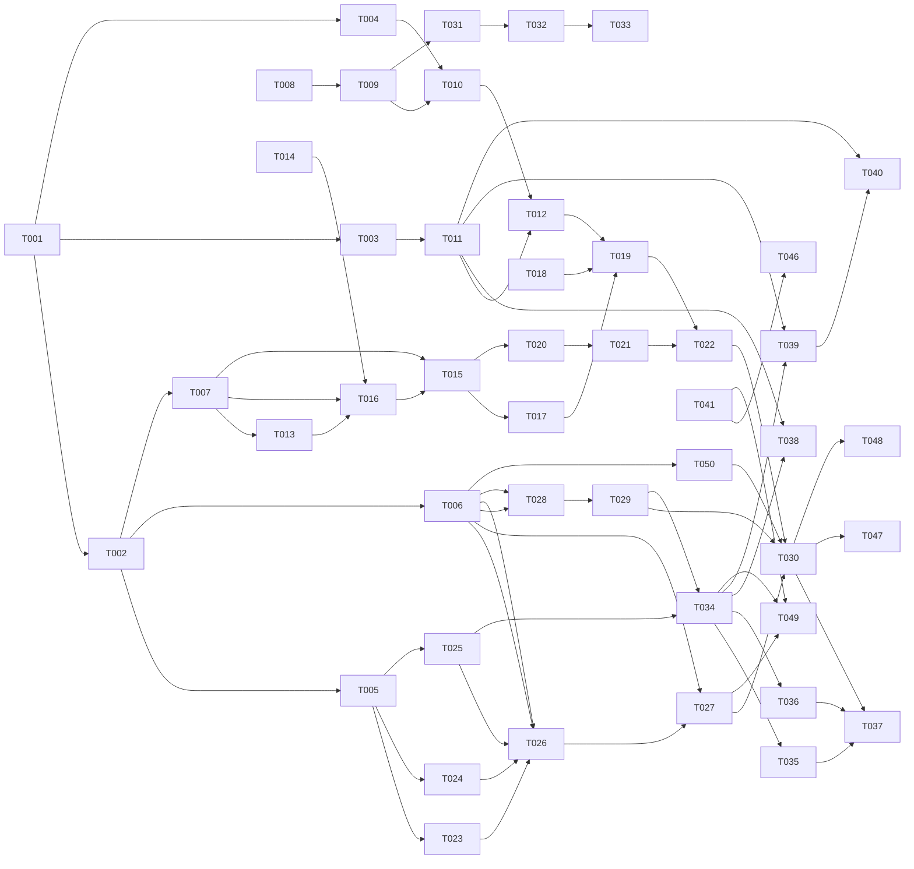

# Tasks: 007-dialog-capture

**Input**: Design documents from `/specs/007-dialog-capture/` (spec.md, plan.md, research.md, data-model.md, contracts/, quickstart.md)
**Prerequisites**: plan.md ✅, spec.md ✅, data-model.md ✅, contracts/ ✅, research.md ✅, quickstart.md ✅

**Implementation prerequisite gate (added post-external-review F4)**:

- **Phases 1–5 + Phase 7 + Phase 8 (US1, US2, US3, US5, US6)**: implementable **immediately** — only require the existing repo (`packages/cli`, `packages/underboard` SQLite layer, `.claude/hooks/`). No Honcho dependency.
- **Phase 6 (US4)**: REQUIRES **`specs/008-memory-backend-honcho/` implementation merged** — specifically:
  - Honcho v3 client live at `packages/underboard/src/memory-backend/honcho-client.ts` (or wherever 008 places it)
  - HonchoBackend class registered in BackendFactory
  - Honcho Docker stack running locally (Postgres 16 + pgvector + Redis 7 + TEI)
  - Verified by: `grep -ri honcho packages/underboard/src` returns ≥1 hit (currently **0 hits** per external-review claude.md F4)
  - Verification V8 (Honcho `sessions:search` endpoint probe) MUST complete before T028 starts
- If 008 has not merged when 007 implementation begins: ship 007 in two cuts — (1) Phases 1–5 + 7 + 8 as "007a capture-only", (2) Phase 6 as "007b ingest/recall" after 008 lands. Do NOT block US1–US3 + US5–US6 on US4.

**Tests**: Test tasks included — spec has explicit SC-002 (redaction coverage), SC-001 (capture timing), SC-004 (recall), SC-008 (outage recovery); TDD-Lite where the contract is the spec.

**Organization**: Tasks grouped by user story (US1 = raw capture MVP; US2 = normalization + redaction; US3 = INDEX; US4 = underboard ingest + recall; US5 = retention; US6 = recovery). Phase 9 holds polish/cross-cutting (backfill/renormalize/doctor, docs, CI, security, perf, full E2E).

## Format: `[ID] [AGENT] [Story?] Description`

- **[AGENT]**: SETUP / DB / BE / DOC / E2E / OPS / SEC / PERF
- **[Story]**: US1–US6 for story-phase tasks; omitted for setup/foundational/polish
- File paths absolute or repo-relative; all under `packages/cli/`, `packages/underboard/`, `.claude/hooks/`, `presets/redaction/`, `helpers.config.ts`

## Agent Tags

| Tag | Agent | Domain |
|-----|-------|--------|
| `[SETUP]` | — (orchestrator) | Deps, config, dirs, hook registration |
| `[DB]` | database-architect | SQLite migration for dialog spool tables |
| `[BE]` | backend-specialist | TypeScript modules: watcher, normalizer, redaction engine, spools, worker, Honcho client, CLI commands, tools extensions |
| `[DOC]` | documentation-writer | External-scanner contract, CLAUDE.md / README updates |
| `[E2E]` | test-engineer | Integration + golden-fixture + cross-boundary tests |
| `[OPS]` | devops-engineer | CI workflows for golden + pipeline integration |
| `[SEC]` | security-auditor | Redaction coverage audit + threat model |
| `[PERF]` | performance-optimizer | Hook latency, normalizer throughput, worker drain |

---

## Phase 1: Setup (Shared Infrastructure)

**Purpose**: Single new runtime dep, directory scaffold, config schema, hook registration.

- [ ] T001 [SETUP] Add `chokidar` to `packages/cli/package.json` dependencies (single new runtime dep per research.md). Run `npm install` to update lockfile.
- [ ] T002 [SETUP] Create directory structure: `packages/cli/src/dialog-capture/{redaction/}`, `packages/cli/src/cli/dialog.ts` (empty stub), `packages/underboard/src/dialog-ingest/`, `presets/redaction/`, `packages/cli/tests/{unit,integration}/dialog-capture/`, `packages/cli/tests/fixtures/golden/redaction/{seeds,legit}/`.
- [ ] T003 [SETUP] Extend `helpers.config.ts` with `dialogs` section per [contracts/capture-hook.md](../contracts/capture-hook.md) §"Capture config schema". Validate keys at load via `c12`; fail-loud on invalid values (no `process.env.X || fallback` per AGENTS.md anti-pattern #1).
- [ ] T004 [SETUP] Register `.claude/hooks/dialog-capture.mjs` for the `Stop` event in `.claude/settings.json` per [contracts/capture-hook.md](../contracts/capture-hook.md) §"Hook registration" (matcher: "", timeout: 5).

---

## Phase 2: Foundational (Blocking Prerequisites)

**Purpose**: Migration + Honcho client + catalog loader — used by multiple user stories.

- [ ] T005 [DB] Write migration `packages/underboard/src/storage/migrations/0011-dialog-spools.sql` per [data-model.md](../data-model.md) §"SQLite schema" — 3 tables (`dialog_quarantine_spool`, `dialog_outage_spool`, `dialog_tombstones`) + indexes; idempotent (`CREATE TABLE IF NOT EXISTS`).
- [ ] T006 [BE] Implement Honcho v3 client `packages/underboard/src/dialog-ingest/honcho-client.ts` per [contracts/ingestion-pipeline.md](../contracts/ingestion-pipeline.md) §"Honcho v3 client" — workspace auto-create, Session CRUD, Message POST (streaming), DELETE for tombstone propagation, session-search, health probe. Pinned to v3.0.9 per 008/FR-011.
- [ ] T007 [BE] Implement redaction catalog loader `packages/cli/src/dialog-capture/redaction/catalog-loader.ts` per [contracts/normalized-record.md](../contracts/normalizedized-record.md) §"Redaction catalog format" — parse YAML via `js-yaml`, compile allowlist path-globs + pattern-context matchers, stamp `catalog_version`.

**Checkpoint**: Foundation ready — code can land against stable storage + Honcho API + redaction schema.

---

## Phase 3: User Story 1 — Automatic raw-layer capture (Priority: P1) 🎯 MVP

**Goal**: CC session ends → raw transcript copied to `.ai/dialogs/raw/` automatically, no user action, no UI block.
**Independent Test**: [quickstart.md scenario 1](../quickstart.md#scenario-1--us1-clean-session-end-capture-p1) — run CC session, end cleanly, verify raw file appears within 5 min.

### Implementation for User Story 1

- [ ] T008 [BE] [US1] Implement file-watch wrapper `packages/cli/src/dialog-capture/watcher.ts` per [contracts/capture-hook.md](../contracts/capture-hook.md) §"Concurrent session handling + cross-process watcher singleton (F5 fix)" — chokidar watcher per `session_uuid` **gated by cross-process pidfile singleton** at `~/.underboard/dialog-watch/<session_id>.pid` (post-external-review F5: in-process Map is broken across detached spawns — independent findings claude.md F5 + gemini.md F1). Subsequent Stop hooks ping the existing watcher via `.ping` file to reset inactivity timer (no re-spawn). 5-min inactivity timer (configurable). Crash-recovery orphan promotion from `raw/.partial/` after `partial-promotion-age-minutes`. Stale-pidfile reclaim via PID-liveness check. Fail-soft per FR-014.
- [ ] T009 [BE] [US1] Implement raw transcript copier `packages/cli/src/dialog-capture/capture.ts` — atomic write-temp + rename; path-traversal guard (validate `transcript_path` is inside `~/.claude/projects/`); `is_partial` flag; size + line_count metadata for the normalizer.
- [ ] T010 [BE] [US1] Author `.claude/hooks/dialog-capture.mjs` thin wrapper per [contracts/capture-hook.md](../contracts/capture-hook.md) §"Hook body" — <50 LOC, reads stdin JSON, spawns `helpers dialog-internal-capture-event` detached + unref, exits 0 within 100 ms. No stdout (silent capture).
- [ ] T011 [BE] [US1] Implement `helpers dialog-internal-capture-event` subcommand in `packages/cli/src/cli/dialog.ts` (Commander registration) — reads stdin JSON event, spawns watcher (T008) for the session. Establishes `cli/dialog.ts` with stubs for `backfill`, `renormalize`, `purge`, `doctor` (filled by T034/T038/T039/T040).
- [ ] T012 [E2E] [US1] Integration tests in `packages/cli/tests/integration/dialog-capture/capture.spec.ts`: (a) clean session-end produces raw file within `(inactivity-timeout-minutes + 5s)` of last CC activity (scenario 1 main, SC-001 post-drift budget); (b) two concurrent sessions → distinct files, no collision (scenario 1 concurrent variant); (c) simulated CC crash → `.partial/` orphan → next-session-start promotion (scenario edge 5); (d) **`dialog-capture: off` master switch (FR-010)** — set flag, run session, verify zero artifacts (no raw, no normalized, no INDEX row) and `dialog-doctor` reports "capture disabled" (analyze M2); (e) **forward-only default (FR-018)** — on fresh install with no prior captures, verify no historical CC sessions are auto-ingested; only forward sessions land in `raw/` (analyze L3). Mock CC transcript file via fixture.

**Checkpoint**: US1 fully functional and testable independently — raw transcripts land automatically.

---

## Phase 4: User Story 2 — Normalization + Redaction (Priority: P1)

**Goal**: Raw JSONL → tracked plain-text markdown with stable schema + secret redaction; deterministic.
**Independent Test**: [quickstart.md scenario 2](../quickstart.md#scenario-2--us2-redaction-on-planted-secrets-p1) — plant AWS key + JWT + SSH + PII; verify all redacted.

### Implementation for User Story 2

- [ ] T013 [BE] [US2] Author default redaction catalogs `presets/redaction/catalog_cloud.yml` + `catalog_pii.yml` + `allowlist.yml` per [contracts/normalized-record.md](../contracts/normalized-record.md) §"`catalog_cloud.yml`" + §"`catalog_pii.yml`" — cloud provider patterns (AWS, GCP, Azure), JWT, SSH private blocks, credit card (Luhn-validated), phone, email; allowlist for `tests/**`, EXAMPLE suffixes, RFC 2606 domains.
- [ ] T014 [DOC] [US2] Document external-scanner contract in `presets/redaction/external-scanner-contract.md` — TruffleHog / Semgrep / gitleaks integration spec (input file on argv, JSONL findings on stdout, exit-code semantics per [contracts/normalized-record.md](../contracts/normalized-record.md) §"External scanner hook").
- [ ] T015 [BE] [US2] Implement normalizer `packages/cli/src/dialog-capture/normalizer.ts` per [contracts/normalized-record.md](../contracts/normalized-record.md) §"Normalized record file schema" — defensive JSONL parse (V2; count `schema_warnings`), markdown emit (frontmatter + body + redaction log), streaming (no buffering), determinism (no `Date.now()` / random IDs), content_hash (sha256 of body), truncation at `dialog-normalized-max-bytes` with raw pointer.
- [ ] T016 [BE] [US2] Implement redaction engine `packages/cli/src/dialog-capture/redaction/engine.ts` per [contracts/normalized-record.md](../contracts/normalized-record.md) §"Redaction engine API" — pure function, actions `redact` / `hash` / `allow`, allowlist precedence, optional external-scanner subprocess; idempotent.
- [ ] T017 [BE] [US2] Wire redaction engine into normalizer — call `redact()` per message block before emission; append redaction log + `redaction_catalog_version` stamp to frontmatter; increment `redaction_count`.
- [ ] T018 [BE] [US2] Author golden test fixtures `packages/cli/tests/fixtures/golden/redaction/{seeds,legit}/*.jsonl` + `.expected.md`: `seeds/aws-access-key.jsonl`, `seeds/jwt-in-tool-result.jsonl`, `seeds/ssh-private-block.jsonl`, `seeds/pii-corpus.jsonl`, `legit/test-fixtures.jsonl`, `legit/mock-tokens.jsonl`.
- [ ] T019 [E2E] [US2] Tests in `packages/cli/tests/{unit,integration}/dialog-capture/`: (a) golden-fixture redaction — all planted secrets replaced with `[REDACTED:<rule_id>]` (scenario 2 main, SC-002); (b) determinism — two normalize runs produce byte-identical output; (c) cross-tool readability — markdown parses in any viewer; (d) FP-baseline probe on a real CC corpus sample with manual classification (scenario 2 FP probe); (e) schema-drift probe — unknown block types increment `schema_warnings`, don't crash (edge 1).

**Checkpoint**: US1 + US2 together deliver raw + normalized + redacted records end-to-end.

---

## Phase 5: User Story 3 — INDEX auto-population (Priority: P2)

**Goal**: After capture + normalize, INDEX.md gains one atomic idempotent row per session.
**Independent Test**: [quickstart.md scenario 3](../quickstart.md#scenario-3--us3-index-atomicity-under-crash-p2) — 5 sessions → 5 rows; killed normalizer leaves INDEX in old or new state.

### Implementation for User Story 3

- [ ] T020 [BE] [US3] Implement INDEX updater `packages/cli/src/dialog-capture/index-updater.ts` per [data-model.md](../data-model.md) §"4. INDEX Row" — atomic write-temp + rename; idempotency key `(date, file_link)`; preserve hand-edited `notes` columns; auto-set `flags: redacted:<count>`, `truncated`, `recovered:<date>`.
- [ ] T021 [BE] [US3] Wire INDEX updater into capture pipeline (after normalize succeeds, before quarantine spool enqueue).
- [ ] T022 [E2E] [US3] Tests: (a) 5 sessions → 5 INDEX rows, no dups (scenario 3); (b) crash-injection — kill normalizer mid-INDEX-write → INDEX is old-or-new state, never half-written (scenario 3); (c) hand-edited notes column preserved across auto-updates.

**Checkpoint**: Full capture pipeline (raw → normalized → INDEX) delivers all three tracked/gitignored artifacts.

---

## Phase 6: User Story 4 — Semantic recall via dedicated `dialog_*` tools (Priority: P2)

**⚠️ PHASE GATE (added post-external-review F4)**: This phase REQUIRES `specs/008-memory-backend-honcho/` to be implemented + merged (Honcho client live in `packages/underboard/src/`). Verify with `grep -ri honcho packages/underboard/src` (≥1 hit). V8 (sessions:search probe) MUST also be complete. If 008 is not merged, skip this phase and ship 007a (US1+US2+US3+US5+US6 = capture pipeline) first.

**Goal**: Normalized records ingested into Honcho Sessions; `memory_recall` returns dialogs in top-5 by paraphrase.
**Independent Test**: [quickstart.md scenario 4](../quickstart.md#scenario-4--us4-semantic-recall-across-dialogs-p2) — seed 10 records, recall paraphrased theme, verify top-5 + cross-project isolation.

### Implementation for User Story 4

- [ ] T023 [BE] [US4] Implement quarantine spool manager `packages/underboard/src/dialog-ingest/quarantine-spool.ts` per [contracts/ingestion-pipeline.md](../contracts/ingestion-pipeline.md) §"SQLite schema" — `enqueue(session_uuid, normalized_file, content_hash, project_id, delay_days)`, `graduate(now)` returns eligible rows, `purge(id, reason)`. Transactional.
- [ ] T024 [BE] [US4] Implement outage spool manager `packages/underboard/src/dialog-ingest/outage-spool.ts` — `enqueue` from graduated quarantine rows, `drainPending(limit)` with backoff (`next_retry_at`), `markIngested(id, honcho_session_id)`, `markTombstoned(id)`.
- [ ] T025 [BE] [US4] Implement tombstones manager `packages/underboard/src/dialog-ingest/tombstones.ts` — `insert(content_hash, session_uuid, reason)`, `isTombstoned(content_hash) → boolean`. UNIQUE on `content_hash`.
- [ ] T026 [BE] [US4] Implement ingestor `packages/underboard/src/dialog-ingest/ingest.ts` per [contracts/ingestion-pipeline.md](../contracts/ingestion-pipeline.md) §"Worker algorithm" step 3 — parse normalized `.md`, check tombstone (skip if tombstoned), check Honcho for existing session by `metadata.cc_session_uuid` (idempotent), POST Honcho Session + stream Messages, update outage row with `honcho_session_id`.
- [ ] T027 [BE] [US4] Implement event-driven worker `packages/underboard/src/dialog-ingest/worker.ts` per FR-020 — three triggers: `underboard-recovered` (Honcho health transition), `capture-completed` (from CLI capture pipeline), `safety-net-tick` (5-min cron). Worker runs the [contracts/ingestion-pipeline.md](../contracts/ingestion-pipeline.md) §"Worker algorithm" sequence on each event.
- [ ] T028 [BE] [US4] Author new MCP tool `dialog_recall` in **`packages/underboard/src/tools/dialog/recall.ts`** (new directory, separate from existing `tools/memory/` per external-review F1+F7). Input `{query, project_id?, limit?}`; routes to `honcho-client.sessionSearch(workspace_id, query)` per FR-023. Output: `DialogRecallResult[]` per FR-024. Project-scoped by default (FR-015). Register in tool registry. The existing `tools/memory/recall.ts` (`memory_recall`) MUST remain untouched (008/FR-001 frozen). **Verification V8 (sessions:search endpoint shape) MUST complete before this task starts.**
- [ ] T029 [BE] [US4] Author new MCP tool `dialog_delete` in **`packages/underboard/src/tools/dialog/delete.ts`** (F1+F7 file-path fix). Input `{session_uuid} | {content_hash}` per FR-025. Behavior: look up Honcho Session by metadata → complete in-flight ingest if any → DELETE Session (cascade per V7) → insert tombstone via T025 → update outage spool row. Register in tool registry. The existing `tools/memory/delete.ts` (`memory_delete`) MUST remain untouched.
- [ ] T050 [BE] [US4] Author new MCP tool `dialog_recall_cross_project` in **`packages/underboard/src/tools/dialog/recall-cross.ts`** per FR-026 (added post-external-review F1). Enumerates project workspaces, merges `DialogRecallResult[]` by `relevance_score` descending, each result carries `project_id`. Register in tool registry.
- [ ] T030 [E2E] [US4] Tests: (a) 10 records → quarantine → graduation → ingest → `dialog_recall` top-5 ≥80% on paraphrased themes (scenario 4 main, SC-004); (a2) **F1 contract boundary** — `memory_recall` returns 0 dialog-type results after 007 is live (005/008 schema frozen); (b) kill-the-container — outage spool reconciles within 60 s of Honcho recovery (scenario 4 + SC-008); (c) tombstone prevents re-ingest resurrection after `dialog_delete` (scenario 4 acceptance 6, FR-025); (d) cross-project isolation — project A dialogs absent from project B default `dialog_recall`; only `dialog_recall_cross_project` (T050) reaches across; (e) **`dialog-ingest: off` full opt-out (FR-006b)** — set flag, capture 5 sessions, verify `dialog_quarantine_spool` and `dialog_outage_spool` tables empty + zero Honcho Sessions (analyze M1); (f) **partial-ingest tombstone cleanup (M5)** — call `dialog_delete` mid-ingest (some Messages posted, then delete), verify worker completes in-flight ingest, then DELETEs Session with cascade (V7), tombstone by content_hash blocks re-ingest.

**Checkpoint**: Past dialogs are semantically recallable; full closed-loop (005 → 006 → 007 → 008 integration).

---

## Phase 7: User Story 5 — Retention (Priority: P3)

**Goal**: `.ai/dialogs/raw/` size bounded; pruned raw files recoverable from CC's own log.
**Independent Test**: [quickstart.md scenario 5](../quickstart.md#scenario-5--us5-retention-pruning-p3) — keep-N=3 + 5 sessions → raw has 3, INDEX has 5.

### Implementation for User Story 5

- [ ] T031 [BE] [US5] Implement retention pruner `packages/cli/src/dialog-capture/retention.ts` per FR-009 — `keep-N-sessions-per-project` + `size-cap-MB`; oldest-first pruning; archive to `archive-path` if configured, else delete (safe per V6 — CC's own log retains); never prune normalized `.md` (tracked, audit-relevant) or INDEX rows.
- [ ] T032 [BE] [US5] Wire pruner into capture pipeline (runs after each capture; also after `dialog-backfill` per FR-019 retention-immediate rule).
- [ ] T033 [E2E] [US5] Tests: (a) `keep-N=3` + 5 sessions → raw has 3 most recent, INDEX has 5 rows (scenario 5); (b) `size-cap-mb: 1` overflow → oldest-first pruning brings raw under cap within one capture cycle (scenario 5 size variant); (c) pruned file recoverable from CC's own log path.

**Checkpoint**: `raw/` disk usage bounded; long-term operation safe.

---

## Phase 8: User Story 6 — Redaction-miss recovery (Priority: P3)

**Goal**: Single command purges a session from raw + normalized + INDEX + spool + Honcho; tombstones to prevent resurrection.
**Independent Test**: [quickstart.md scenario 6](../quickstart.md#scenario-6--us6-redaction-miss-recovery-p3) — plant a deliberate catalog miss, recover, verify tombstone + rewrite.

### Implementation for User Story 6

- [ ] T034 [BE] [US6] Implement `helpers dialog-purge` in `packages/cli/src/cli/dialog.ts` + `packages/cli/src/dialog-capture/recovery.ts` per [contracts/cli-commands.md](../contracts/cli-commands.md) §"`helpers dialog-purge`" — three modes: `--session <uuid>` (full purge), `--pattern <regex>` (batch with interactive confirm), `--rule-id <id>` (redaction-miss recovery with sticky tombstone). Atomic per-session.
- [ ] T035 [BE] [US6] Implement sticky-recovery semantics: when `--rule-id` mode rewrites a normalized file with stricter redaction, tombstone the OLD `content_hash` (so re-normalization can't resurrect the leaked version) and leave the NEW `content_hash` eligible for ingest (corrected version flows through).
- [ ] T036 [BE] [US6] Implement interactive confirmation for `--pattern` batch purge per AGENTS.md Standing Order #3 — NO `--yes` / `-y` / `--force` bypass flags. Prompt: list candidates, `inspect` to view context, explicit `y` to confirm. Refuse batch without confirmation; exit 2 on bypass attempt.
- [ ] T037 [E2E] [US6] Tests: (a) post-ingestion recovery — plant miss, ingest, recover → Honcho Session DELETE'd, tombstone inserted, normalized rewritten (scenario 6 post-ingest); (b) quarantine-window recovery — same miss but `delay-days: 7` → spool purged, no Honcho footprint ever (scenario 6 quarantine); (c) sticky across renormalize — old hash tombstoned, new hash eligible.

**Checkpoint**: Redaction misses have a recovery path; archive is trustworthy.

---

## Phase 9: Polish & Cross-Cutting Concerns

**Purpose**: Operational commands, docs, CI gates, security/perf validation, full E2E.

- [ ] T038 [BE] Implement `helpers dialog-backfill` in `packages/cli/src/cli/dialog.ts` + `packages/cli/src/dialog-capture/backfill.ts` per [contracts/cli-commands.md](../contracts/cli-commands.md) §"`helpers dialog-backfill`" — `--from/--to/--limit/--dry-run/--json` flags; reads CC log catalog, runs full capture pipeline per session; idempotent via content_hash + session_uuid; retention applies immediately.
- [ ] T039 [BE] Implement `helpers dialog-renormalize` per [contracts/cli-commands.md](../contracts/cli-commands.md) §"`helpers dialog-renormalize`" — `--catalog-version/--from/--to/--dry-run/--json`; re-normalizes matching records; only rewrites files whose content_hash changed; respects tombstones; re-enqueues new-hash records into quarantine (subject to window).
- [ ] T040 [BE] Implement `helpers dialog-doctor` per [contracts/cli-commands.md](../contracts/cli-commands.md) §"`helpers dialog-doctor`" — read-only health check (underboard /health + hook registration + config + dirs + catalogs + recent capture/worker logs); exit 0/1/2.
- [ ] T041 [BE] Extend underboard `/health` endpoint with `dialog_ingest` section per [contracts/ingestion-pipeline.md](../contracts/ingestion-pipeline.md) §"Health endpoint extension" — `quarantine_pending`, `outage_pending`, `tombstones_total`, `last_worker_tick`, `last_graduation`, `last_successful_ingest`, `stalled_records`.
- [ ] T042 [DOC] Update `CLAUDE.md` "Session Logging (Advisory)" rule (added by 006/US7 Phase 1) to cross-reference automated CC capture (now active via 007); retain advisory layer for non-CC tools unchanged per FR-016.
- [ ] T043 [DOC] Update `README.md` + `README.ru.md` + `packages/cli/README.md` with `helpers dialog-*` command family section (backfill, renormalize, purge, doctor) + `.ai/dialogs/` archive overview + cross-link to spec 007.
- [ ] T044 [OPS] CI workflow `.github/workflows/dialog-redaction-goldens.yml` — run golden-fixture redaction tests on PRs touching `presets/redaction/` or `packages/cli/src/dialog-capture/redaction/` or `normalizer.ts`. Block on diff vs `.expected.md`.
- [ ] T045 [OPS] CI workflow `.github/workflows/dialog-pipeline.yml` — capture + ingest integration test (mocked Honcho via `msw` or test container) on PRs touching `packages/cli/src/dialog-capture/` or `packages/underboard/src/dialog-ingest/`.
- [ ] T046 [SEC] Security review: (a) redaction coverage audit — run catalog against a corpus of known secret formats (SC-002 readiness); (b) secret-leak threat model for the pipeline — raw file permissions, archive-path traversal, external-scanner subprocess boundary; (c) path-traversal guards in raw copier (T009) and backfill (T038); (d) validate `dialog-purge --pattern` cannot be abused to bypass redaction (must not be a global "show me everything" oracle).
- [ ] T047 [E2E] Full end-to-end test: real CC transcript from this repo's own sessions → raw → normalized → INDEX → ingest → `memory_recall` returns dialog in top-5 ([quickstart.md scenario 4](../quickstart.md#scenario-4--us4-semantic-recall-across-dialogs-p2) with live Honcho stack, not mocked).
- [ ] T048 [PERF] Performance validation: (a) hook return <100 ms wall-clock from CC invocation (SC-001 budget); (b) normalizer <5 s for typical 1 MB JSONL, <30 s for outlier 50 MB; (c) worker drains 100 graduated records <60 s of underboard-reachable time (SC-008 bound); (d) INDEX atomic write <100 ms. Capture results in `packages/cli/tests/integration/dialog-capture/perf.spec.ts`.
- [ ] T049 [E2E] Consolidated fail-soft validation (FR-014, M3+L4 from analyze). Inject failures at each pipeline stage and verify CC session is never blocked + each failure is logged: (a) hook spawn error (`.claude/hooks/dialog-capture.mjs` exit 1) — CC session continues, capture deferred to safety-net tick; (b) chokidar watcher throw — watcher exits cleanly, log entry, next Stop hook re-spawns; (c) normalizer throw on a malformed JSONL — raw file retained, INDEX row not added, log entry, CC session unaffected; (d) INDEX write fail (chmod read-only `.ai/dialogs/`) — raw + normalized retained, INDEX row missing, log entry; (e) spool enqueue fail (underboard DB locked) — capture completes, ingest deferred, log entry; (f) Honcho unreachable mid-ingest — record transitions to outage spool, backoff kicks in, SC-008 reconciliation on recovery. Each scenario asserts: (1) CC session UI was never blocked (no hook timeout, no session-aborting exception); (2) `~/.underboard/logs/dialog-*.log` records the failure with sufficient detail for diagnosis; (3) no artifact corruption (partial writes rolled back atomically). Results in `packages/cli/tests/integration/dialog-capture/fail-soft.spec.ts` + `packages/underboard/tests/integration/dialog-ingest/fail-soft.spec.ts`.

---

## Dependency Graph

### Legend

- `→` means "unlocks" (left must complete before right can start)
- `+` means "all of these" (join point)
- Tasks not listed have no dependencies and start immediately within their phase

### Dependencies

```
T001 → T002, T003, T004
T002 → T005, T006, T007
T003 → T011, T038, T039, T040
T004 → T010

# Foundational unlocks
T005 → T023, T024, T025
T006 → T026, T027, T028, T029, T050
T007 → T013, T016

# US1 internal
T008 → T009
T009 → T010
T010 + T011 → T012

# US2 internal
T013 + T014 → T016
T007 + T016 → T015
T015 → T017
T017 + T018 → T019

# US3 internal
T015 → T020
T020 → T021
T021 → T022

# US4 internal
T023 + T024 + T025 + T006 → T026
T026 → T027
T006 → T028, T050
T028 → T029
T027 + T029 + T050 → T030

# US5 internal
T009 → T031
T031 → T032
T032 → T033

# US6 internal
T025 + T029 → T034
T034 → T035
T034 → T036
T035 + T036 → T037

# Cross-US
T012 → T019
T019 → T022
T022 → T030
T030 → T037

# Polish
T011 → T038, T039
T034 → T038, T039
T039 → T040                         # M7 fix — doctor authored after all other cli/dialog.ts commands stabilize
T041 → T046
T030 → T047
T030 → T048
T041 + T027 + T034 → T049           # fail-soft E2E needs health endpoint + worker + purge pipeline all in place
```

### Self-Validation Checklist

- [x] Every task ID in Dependencies exists in the task list (T001–T050)
- [x] No circular dependencies (verified: graph is a DAG)
- [x] No orphan task IDs referenced that don't exist
- [x] Fan-in uses `+` only, fan-out uses `,` only
- [x] No chained arrows on a single line

---

## Dependency Visualization



---

## Parallel Lanes

| Lane | Agent Flow | Tasks | Blocked By |
|------|-----------|-------|------------|
| 1 | [SETUP] | T001 → T002 → T003, T004 | — |
| 2 | [DB] | T005 | T002 |
| 3 | [BE] capture-side (`packages/cli/src/dialog-capture/`) | T007, T008, T009, T013, T015, T016, T017, T018, T020, T021, T031, T032 | T002, T003, T007 |
| 4 | [BE] ingest-side (`packages/underboard/src/dialog-ingest/`) | T006, T023, T024, T025, T026, T027 | T002, T005, T006 |
| 5 | [BE] dialog-tools-side (`packages/underboard/src/tools/dialog/` — NEW directory per F1+F7 fix) | T028, T029, T050 | T006 (and T028 → T029 sequential within file boundary) |
| 6 | [BE] cli-side (`packages/cli/src/cli/dialog.ts`) | T011, T034, T038, T039, T040 | T003, T011 (sequential file writes) |
| 7 | [BE] hook-side (`.claude/hooks/dialog-capture.mjs`) | T010 | T004, T009 |
| 8 | [E2E] | T012, T019, T022, T030, T033, T037, T047, T049 | US-internal deps; T049 post-T041 |
| 9 | [DOC] | T014, T042, T043 | — (parallel to everything) |
| 10 | [OPS] | T044, T045 | T019, T030 |
| 11 | [SEC] | T046 | T041 |
| 12 | [PERF] | T048 | T030 |

---

## Agent Summary

| Agent | Task Count | Can Start After |
|-------|-----------|-----------------|
| [SETUP] | 4 (T001–T004) | immediately |
| [DB] | 1 (T005) | T002 |
| [BE] | 32 (T006, T007, T008, T009, T011, T013, T015, T016, T017, T018, T020, T021, T023–T029, T031, T032, T034–T041, T050) | T002, T003 (and per-task deps) |
| [DOC] | 3 (T014, T042, T043) | immediately (T014) / post-US2 / post-US6 |
| [E2E] | 8 (T012, T019, T022, T030, T033, T037, T047, T049) | per-US deps; T049 post-T041 |
| [OPS] | 2 (T044, T045) | T019, T030 |
| [SEC] | 1 (T046) | T041 |
| [PERF] | 1 (T048) | T030 |

**Critical Path** (longest dependency chain): T001 → T002 → T007 → T016 → T015 → T017 → T019 → T022 → T030 → T037 → T047 (11 tasks deep). This bounds the minimum implementation time.

---

## Agent Dispatch Plan

> For each agent with tasks, the orchestrator uses this table to dispatch subagents (Claude Code) or switch role context (Gemini/Copilot) without re-reading plan.md.

| Agent | Subagent | Skills | Input Context | Tasks | Files |
|-------|----------|--------|---------------|-------|-------|
| `[SETUP]` | — (orchestrator) | — | plan.md §"Project Structure", contracts/capture-hook.md §"Capture config schema" | T001, T002, T003, T004 | `packages/cli/package.json`, `helpers.config.ts`, `.claude/settings.json`, new dirs |
| `[DB]` | `database-architect` | `database-design` | data-model.md §"SQLite schema", contracts/ingestion-pipeline.md §"SQLite schema" | T005 | `packages/underboard/src/storage/migrations/0011-dialog-spools.sql` |
| `[BE]` capture-side | `backend-specialist` | `api-patterns`, `system-design-patterns`, `nodejs-best-practices`, `typescript-expert` | contracts/{capture-hook,normalized-record}.md, data-model.md §entities 1–6, research.md V1–V3 | T007, T008, T009, T013, T015, T016, T017, T018, T020, T021, T031, T032 | `packages/cli/src/dialog-capture/{watcher,capture,normalizer,index-updater,retention,backfill,renormalize,recovery}.ts`, `redaction/{engine,catalog-loader,types}.ts`, `presets/redaction/catalog_*.yml`, `tests/fixtures/golden/redaction/` |
| `[BE]` ingest-side | `backend-specialist` | `api-patterns`, `system-design-patterns`, `nodejs-best-practices`, `typescript-expert` | contracts/ingestion-pipeline.md, data-model.md §entities 7–13, research.md V3–V4 | T006, T023, T024, T025, T026, T027 | `packages/underboard/src/dialog-ingest/{honcho-client,quarantine-spool,outage-spool,tombstones,ingest,worker}.ts` |
| `[BE]` dialog-tools-side | `backend-specialist` | `api-patterns`, `system-design-patterns`, `nodejs-best-practices` | contracts/ingestion-pipeline.md §"`memory_delete` integration" (now `dialog_delete`), FR-023/FR-024/FR-025/FR-026 (new), external-review claude.md F1+F7 | T028, T029, T050 | **NEW** `packages/underboard/src/tools/dialog/{recall,delete,recall-cross}.ts` (NOT `tools/memory.ts` which doesn't exist) |
| `[BE]` cli-side | `backend-specialist` | `nodejs-best-practices`, `typescript-expert` | contracts/{cli-commands,capture-hook}.md | T011, T034, T038, T039, T040 | `packages/cli/src/cli/dialog.ts`, `packages/cli/src/dialog-capture/{backfill,renormalize,recovery,doctor}.ts` |
| `[BE]` hook-side | `backend-specialist` | `nodejs-best-practices` | contracts/capture-hook.md §"Hook body", §"Hook registration" | T010 | `.claude/hooks/dialog-capture.mjs` |
| `[DOC]` | `documentation-writer` | `documentation-templates` | contracts/normalized-record.md §"External scanner hook", CLAUDE.md current state, README.md current state | T014, T042, T043 | `presets/redaction/external-scanner-contract.md`, `CLAUDE.md`, `README.md`, `README.ru.md`, `packages/cli/README.md` |
| `[E2E]` | `test-engineer` | `testing-patterns`, `webapp-testing`, `tdd-workflow` | quickstart.md (all scenarios), contracts/*, external-review claude.md F1 (contract boundary tests) | T012, T019, T022, T030, T033, T037, T047, T049 | `packages/cli/tests/{unit,integration}/dialog-capture/`, `packages/underboard/tests/{unit,integration}/dialog-ingest/`, `packages/cli/tests/fixtures/golden/redaction/` |
| `[OPS]` | `devops-engineer` | `deployment-procedures` | plan.md §"Project Structure", existing `.github/workflows/` patterns | T044, T045 | `.github/workflows/dialog-redaction-goldens.yml`, `.github/workflows/dialog-pipeline.yml` |
| `[SEC]` | `security-auditor` | `vulnerability-scanner`, `red-team-tactics` | spec.md §US2/US6, SC-002, contracts/normalized-record.md §"Redaction log entries", AGENTS.md Standing Orders #3/#6/#7 | T046 | project-wide audit (no file creation); report in `specs/007-dialog-capture/reviews/security.md` |
| `[PERF]` | `performance-optimizer` | `performance-profiling` | plan.md §"Performance Goals", SC-001 (revised post-C1), SC-008 | T048 | `packages/cli/tests/integration/dialog-capture/perf.spec.ts` |
| `[E2E]` (T049) | `test-engineer` | `testing-patterns`, `webapp-testing` | spec.md FR-014, analyze.md M3+L4, contracts/{capture-hook,ingestion-pipeline}.md §"Fail-soft guarantees"/"Failure modes table" | T049 | `packages/cli/tests/integration/dialog-capture/fail-soft.spec.ts`, `packages/underboard/tests/integration/dialog-ingest/fail-soft.spec.ts` |

---

## Implementation Strategy

### MVP First (User Story 1 Only)

1. Complete Phase 1 (Setup) + Phase 2 (Foundational).
2. Complete Phase 3 (US1): raw capture works end-to-end.
3. **STOP and VALIDATE**: run `helpers dialog-doctor` + quickstart scenario 1.
4. At this point the user has automatic raw-layer archival — audit trail + cross-tool reading via the raw JSONL (limited, since other tools can't parse CC JSONL natively).

### Incremental Delivery

1. Setup + Foundational → foundation ready.
2. US1 → raw capture (MVP).
3. US2 → raw + normalized + redacted records (cross-tool readable).
4. US3 → raw + normalized + INDEX (searchable catalog).
5. US4 → + underboard ingest + semantic recall (full leverage).
6. US5 → + retention (operationally safe long-term).
7. US6 → + recovery (trustworthy archive).
8. Polish → + backfill/renormalize/doctor + CI + security/perf validation.

### Parallel Agent Strategy (Claude Code)

1. Orchestrator completes Setup phase directly (T001–T004).
2. Once Setup completes (sync barrier):
   - Lane 2 [DB]: T005 (migration).
   - Lane 3 [BE] capture-side: T007 (catalog loader) → T013/T016.
   - Lane 4 [BE] ingest-side: T006 (Honcho client) → T023–T026.
   - Lane 9 [DOC]: T014 (external-scanner contract), T042, T043 (docs).
3. After US1 (T012) green → US2 lanes activate (T015 normalizer parallel to T016 engine).
4. After US2 (T019) green → US3 + US4 lanes can run in parallel (US3 is light; US4 is the bulk).
5. US5 + US6 after US4.
6. Polish phase parallel: OPS + DOC independent; SEC after T041; PERF after T030.

### Multi-Session Strategy (Gemini / Copilot)

1. Run Setup + Foundational sequentially in one session.
2. Use Agent Summary to plan role-context switches (BE sessions dominate).
3. Each US phase = one focused session (US1, US2, US3, US4, US5, US6).
4. Polish phase = one session for OPS + DOC + SEC + PERF + E2E.

---

## Notes

- `[AGENT]` tag assigns responsibility — domain agent writes both code and unit tests
- `[E2E]` only for cross-boundary tests — unit tests stay with the domain agent
- `[SEC]` is justified — spec has SC-002 (redaction coverage) and US2/US6 (redaction + recovery) which ARE security requirements
- `[PERF]` is justified — spec has explicit perf targets (SC-001 `(inactivity-timeout-minutes + 5s)` capture, SC-008 60s ingest, normalizer stream budget)
- `[DOC]` is justified — README + CLAUDE.md updates are user-facing documentation
- **T049 (consolidated fail-soft E2E)** added post-analyze (M3+L4) — covers FR-014 fail-soft end-to-end; depends on T041 (health endpoint) + T027 (worker) + T034 (purge) all in place
- Phases are sync barriers — all tasks in a phase complete/fail/block before next phase
- Each user story should be independently completable and testable per spec
- Commit after each task or logical group (per AGENTS.md commit conventions)
- Stop at any checkpoint to validate story independently via `quickstart.md`
- **Constitution Principle VI gate**: `/speckit.implement` requires `reviews/analyze.md` PASS + ≥2 external reviewer PASS before any task execution. This task list is the planning artifact; gate is enforced separately.
- **Constitution Principle VII**: snapshot tag `tasks/007-dialog-capture/v1` — blocked by repo's unresolved submodule conflicts on `main` (same blocker as plan/spec snapshots). Tag applied after merge-conflict resolution + clean commit.
