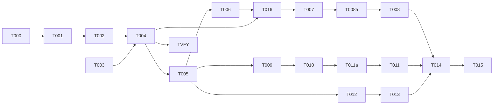

# Tasks: Configurable Endpoints and API Keys for Underboard

**Input**: Design documents from `/specs/009-configurable-endpoints/`
**Prerequisites**: plan.md (required), spec.md (required for user stories), research.md, data-model.md, contracts/config.md

## Format: `[ID] [AGENT] [Story?] Description`

- **[AGENT]**: Specialist agent responsible for the task (see Agent Tags below)
- **[Story]**: Which user story this task belongs to (e.g., US1, US2, US3)
- Include exact file paths in descriptions
- Parallelism is derived from the Dependency Graph — tasks with no dependencies can run in parallel

## Agent Tags

| Tag | Agent | Domain |
|-----|-------|--------|
| `[SETUP]` | — (orchestrator) | Project init, shared config, scaffolding, shared dependency installs |
| `[BE]` | backend-specialist | API routes, services, middleware, server logic + unit tests |
| `[OPS]` | devops-engineer | Docker, CI/CD, infra, deploy configs |

## Task Statuses

| Status | Meaning |
|--------|---------|
| `- [ ]` | Pending |
| `- [→]` | In progress |
| `- [X]` | Completed |
| `- [!]` | Failed |
| `- [~]` | Blocked (cascade from a failed dependency) |

## Phase 1: Setup (Shared Infrastructure)

**Purpose**: Project initialization, implementation branch creation (per Constitution Principle IX Two-Phase Review Flow), and config schema definition

- [X] T000 [SETUP] Create implementation branch `009-configurable-endpoints` from `main` (NOT from `specs/009-configurable-endpoints`). This branch holds all code changes per Principle IX. Planning branch `specs/009-configurable-endpoints` retains spec-only artifacts.
- [X] T001 [SETUP] Read `packages/underboard/src/cli/config.ts` and `packages/underboard/src/cli/index.ts`, confirm `UnderboardConfig` interface location and current shape, document the existing fields in a research.md appendendum for traceability.
- [X] T002 [SETUP] Define the new configuration interfaces (`honcho`, `embedding`, `llm` shapes) in `packages/underboard/src/cli/config.ts`.

---

## Phase 2: Foundational (Blocking Prerequisites)

**Purpose**: Core infrastructure for precedence-based configuration merging

- [X] T003 [BE] Implement helper `expandHome(path)` for expanding homedir tilde path (`~`) and a config redaction utility to replace `honcho.token` and `llm.api_key` with `***` in `packages/underboard/src/cli/config.ts`.
- [X] T004 [BE] Rewrite config loading function (`loadConfig`) in `packages/underboard/src/cli/config.ts` to merge CLI options, environment variables (and `.env` files via c12's dotenv resolution), config.json, and default settings field-by-field. Numeric CLI/env options (`--port`, `--honcho-timeout`) MUST be parsed via `Number()` with `Number.isFinite` guard before merge (reject non-numeric strings with a clear error).
- [X] T005 [BE] Add CLI option definitions for Honcho, embedding, LLM, and DB path to `underboard start` in `packages/underboard/src/cli/index.ts`.
- [X] T-VERIFY-ENV [BE] **Empirically verify `.env` loading paths (FR-008, F6 fix)**. Write two `.env` files: `~/.underboard/.env` (with `HONCHO_TOKEN=from-home`) and `./cwd/.env` (with `HONCHO_TOKEN=from-cwd`). Boot the server, log `process.env.HONCHO_TOKEN`. Assert: (1) home value loads via the explicit `dotenv.config()` call, (2) cwd value overrides home via c12. This task gates SC-002.

**Checkpoint**: Configuration precedence and resolution logic ready + empirically verified.

---

## Phase 3: User Story 1 - Custom Honcho backend configuration (Priority: P1)

**Goal**: Configure Honcho endpoint, token, and timeout with graceful timeout fallbacks

**Independent Test**: Start the server with `HONCHO_ENDPOINT=http://127.0.0.1:8080` (or CLI option `--honcho-endpoint http://127.0.0.1:8080`) and verify that it attempts to connect to port 8080 and handles timeouts gracefully.

- [X] T006 [BE] [US1] Update `packages/underboard/src/memory-backend/backend-factory.ts` to instantiate `HonchoClient` with the resolved endpoint, token, and timeout.
- [X] T007 [BE] [US1] Verify existing BM25 fallback in `packages/underboard/src/memory-backend/honcho.ts` (HonchoBackend.recall already catches and falls back to `this.local.recall` per F14). Wire `honcho.timeout_ms` config into `HonchoClient.fetchWithTimeout`. Do NOT add fallback logic to `honcho-client.ts` (wrong layer — client throws, backend degrades). Re-scope: "verify + wire config," not "implement."
- [X] T008 [BE] [US1] Write unit and integration tests in `packages/underboard/tests/` to verify Honcho custom backend endpoint, token, and timeout resolution and graceful fallback behavior (both recall and write paths).
- [X] T008a [BE] [US1] Update `memory_write` tool response to include `synced: boolean` flag. On Honcho timeout, set `synced: false` and persist locally + enqueue for sync. Implement rate-limited degradation warnings (max 1 per 5 min per op type after first).

**Checkpoint**: US1 fully functional and verified.

> **Dependency note (F8):** Cross-project memory tools (`recall-cross`, `delete-cross`) exist in `src/tools/memory/` but are NOT registered in `mcp-server.ts`. Their registration is 008 scope (008/FR-006). 009 configures Honcho but does not register these tools. End-to-end cross-project recall testing requires 008's tool registration to complete first. Do NOT claim cross-project coverage in 009 docs or tests.

---

## Phase 4: User Story 2 - Embedding model selection (Priority: P1)

**Goal**: Load custom embedding model name and path, and handle missing model path gracefully

**Independent Test**: Start the server pointing to a custom embedding model file using `--embedding-model-path` and verify it loads, or boot without it and verify semantic features are disabled with a `stderr` warning.

- [X] T009 [BE] [US2] Refactor `packages/underboard/src/embedding/embedding-service.ts` (FR-013): convert `initializeEmbedding()` from no-arg singleton to accept `{ model_path?: string; model_name: string }`. Replace module-level consts (`MODEL_DIR`/`MODEL_NAME`/`MODEL_PATH`) with a config snapshot. Update `http-server.ts:277` call site to pass resolved embedding config. `embed()`/`getEmbeddingStatus()` read from the snapshot. Expose embedding status as `active` | `disabled` | `failed`.
- [X] T016 [BE] **Wire config into server (FR-012, F1 fix)** — Update `startServer` in `packages/underboard/src/server/http-server.ts` to accept resolved `UnderboardConfig`. Update `createMcpServer` in `packages/underboard/src/server/mcp-server.ts` to call `createBackend(db, config)` and dispatch `memory_recall`/`memory_write` through the returned `MemoryBackend` instead of direct `memoryRecall(db,…)`/`memoryWrite(db,…)` calls. **Without this task, all of T006-T007 config work is inert.** Blocked-by: T004, T006.
- [X] T010 [BE] [US2] In `packages/underboard/src/embedding/embedding-service.ts`, handle three internal states:
  - `model_path` unset → internal status `"disabled"`, warn to `stderr`.
  - `model_path` set but file missing or load error → internal status `"failed"`, error to `stderr`.
  - `model_path` set and loads successfully → internal status `"active"` (maps to response `"ready"`).
  In `disabled`/`failed` states, embedding-dependent features are inactive; `memory_recall` response returns `embedding_status: "lexical_only"` (existing union, backward compat). Server starts normally.
- [X] T011 [BE] [US2] Write unit and integration tests to verify embedding model custom path loading, fallback on missing path (`disabled`), error on missing file (`failed`), and CLI argument precedence.
- [X] T011a [BE] [US2] Verify `memory_recall` tool response already includes `embedding_status` field (existing `"ready" | "lexical_only"` union, per FR-010). No schema change needed — just confirm the field propagates correctly when embedding subsystem is in `disabled` or `failed` internal state (both map to `"lexical_only"` response).

**Checkpoint**: US2 fully functional and verified.

---

## Phase 5: User Story 3 - LLM configuration for dialectic synthesis (Priority: P2)

**Goal**: Configure external LLM endpoint, API key, and model name for deep recall

**Independent Test**: Configure an OpenAI-compatible endpoint and model name, execute a deep recall query, and verify it routes to the configured endpoint with the correct API key header.

- [X] T012 [BE] [US3] Update LLM/dialectic recall tools to parse LLM endpoint, API key, and model from resolved configuration.
- [X] T013 [BE] [US3] Add validation and error logging for LLM calls (e.g. error on missing API key when dialectic recall is invoked).

**Checkpoint**: US3 fully functional and verified.

---

## Phase 6: Polish & Cross-Cutting Concerns

**Purpose**: Documentation updates, validation, and final checks

- [X] T014 [OPS] Document configuration options and examples in `packages/underboard/README.md`.
- [X] T015 [OPS] Validate that `underboard start` boots successfully under STDIO mode and prints configuration details to `stderr` with sensitive values redacted.

---

## Dependency Graph

### Legend

- `→` means "unlocks" (left must complete before right can start)
- `+` means "all of these" (join point — ALL listed tasks must complete)

### Dependencies

T000 → T001
T001 → T002
T002 → T004
T003 → T004
T004 → T005
T004 → T-VERIFY-ENV
T005 → T006, T009, T012
T004 → T016
T006 → T016
T016 → T007
T006 → T007
T007 → T008
T007 → T008a
T008 → T014
T008a → T008
T009 → T010
T010 → T011
T010 → T011a
T011a → T011
T012 → T013
T008 + T011 + T013 → T014
T014 → T015

---

## Dependency Visualization

---

## Parallel Lanes

| Lane | Agent Flow | Tasks | Blocked By |
|------|-----------|-------|------------|
| 1 | [SETUP] | T000, T001, T002 | — |
| 2 | [BE] | T003 → T004 → T005 | T002 |
| 3 | [BE] | T006 → T016 → T007 → T008a → T008 | T005 |
| 4 | [BE] | T009 → T010 → T011a → T011 | T005 |
| 5 | [BE] | T012 → T013 | T005 |
| 6 | [OPS] | T014 → T015 | T008 + T011 + T013 |

---

## Agent Summary

| Agent | Task Count | Can Start After |
|-------|-----------|-----------------|
| [SETUP] | 3 | immediately (T000 first) |
| [BE] | 14 | T002 |
| [OPS] | 2 | T008 + T011 + T013 |

**Critical Path**: T000 → T001 → T002 → T004 → T005 → T006 → T016 → T007 → T008a → T008 → T014 → T015

---

## Agent Dispatch Plan

| Agent | Subagent | Skills | Input Context | Tasks | Files |
|-------|----------|--------|---------------|-------|-------|
| `[SETUP]` | — (orchestrator) | — | plan.md §Summary, constitution.md §Principle IX | T000, T001, T002 | `packages/underboard/src/cli/config.ts` |
| `[BE]` | `backend-specialist` | `api-patterns`, `system-design-patterns` | contracts/config.md, plan.md §Technical Context, data-model.md | T003, T004, T005, T006, T007, T008, T008a, T009, T010, T011, T011a, T012, T013, T016 | `packages/underboard/src/` |
| `[OPS]` | `devops-engineer` | `deployment-procedures` | quickstart.md | T014, T015 | `packages/underboard/README.md` |

---

## Implementation Strategy

### MVP First (User Stories 1 & 2)

1. Complete Phase 1: Setup.
2. Complete Phase 2: Foundational (precedence loading).
3. Complete Phase 3: User Story 1 (Honcho config & Timeout).
4. Complete Phase 4: User Story 2 (ONNX Embedding config).
5. **STOP and VALIDATE**: Verify Honcho timeout fallbacks and embedding model loading paths.
6. Complete Phase 5: User Story 3 (LLM deep recall config).
7. Complete Polish phase.
