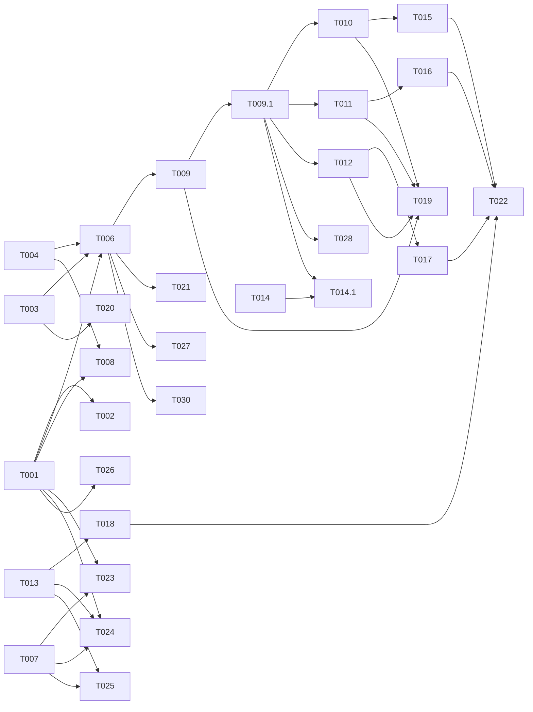

---

description: "Task list for 011-instructions-updates — instruction-set single-source architecture"
---

# Tasks: 011-instructions-updates — Instruction-Set Single-Source Architecture

**Input**: Design documents from `/specs/011-instructions-updates/`
**Prerequisites**: [plan.md](plan.md) (required), [spec.md](spec.md) (required for user stories), [research.md](research.md), [data-model.md](data-model.md), contracts/

**Tests**: Tests are OPTIONAL per template guidance — include them because the spec requires transformer reliability (edge cases: missing reference, depth limit, etc.).

**Organization**: Tasks grouped by work-stream. Content (persona/coding Foundation split), Pipeline (transformer code), Tests, Verification.

**Scoping note**: Multiple user stories (US1, US2, US5, US6, US7) all depend on the same Foundation/Reference content — they cannot be implemented independently. The Foundation content work is shared infrastructure, not story-private. Tasks are organized by file domain (content → pipeline → test) rather than by story, since stories converge on the same files.

## Agent Tags

| Tag | Agent | Domain |
|-----|-------|--------|
| `[CONTENT]` | documentation-writer | .md instruction files (.github/instructions/, CLAUDE.md) |
| `[PIPELINE]` | backend-specialist | TypeScript transformer code (packages/cli/src/transformers/, helpers.config.ts) |
| `[TEST]` | test-engineer | Unit tests, integration test golden files (packages/cli/tests/) |
| `[VERIFY]` | — (orchestrator) | Validation, budget checks, CI-equivalent verification |

## Task Statuses

| Status | Meaning |
|--------|---------|
| `- [ ]` | Pending |
| `- [→]` | In progress |
| `- [X]` | Completed |
| `- [!]` | Failed |
| `- [~]` | Blocked (cascade from a failed dependency) |

---

## Phase 1: Foundation Content — Persona Split + Optimization Modules

**Purpose**: Persona Foundation (≤90 lines/≤8 KB) + Reference + §4.6–§4.9 optimization modules + concise ethical principle.

**Refer to**: [contracts/persona-foundation-contract.md](contracts/persona-foundation-contract.md) for precise split boundaries. [research.md §2.1](research.md) for overflow mitigation.

- [ ] T001 [CONTENT] [US1+US2] Edit `.github/instructions/persona/copilot-instructions.md` → Persona Foundation (≤90 lines). Condense §1+§2+§4.1+§4.3+§4.5+§7, add concise ethical principle (FR-008), trim to budget. Move §3, §4.2, §4.4, §5, §6, §8 to Reference.

- [ ] T002 [CONTENT] [US2] Create `.github/instructions/persona/c‍opilot-instructions-ref.md` → Persona Reference. Contains full text of §3, §4.2, §4.4, §5, §6, §8 (unchanged semantics). Header: "on-demand companion". No REF-resolver annotation needed. Target file MUST NOT carry the `.instructions.md` suffix to prevent C‍opilot auto-load (SC-015).

- [ ] T003 [CONTENT] [US7] Add §4.6 (XY-problem), §4.7 (Speed/Quality/OpSec), §4.8 (Actionable output), §4.9 (No-Code First) to persona Foundation. Adopted from `optimization.md` with light editorial cleanup, no semantic change (FR-019). Verify no overlap with existing §4.1–§4.5 (FR-020). Align values hierarchy under §1 safety as a sub-principle (FR-014).

---

## Phase 1: Foundation Content — Coding Split

**Purpose**: Coding Foundation (≤30 lines/≤3 KB, 5 bullets) + Reference.

**Refer to**: [contracts/coding-foundation-contract.md](contracts/coding-foundation-contract.md) for precise split.

- [ ] T004 [CONTENT] [US6] Edit `.github/instructions/coding/copilot-instructions.md` → Coding Foundation (≤30 lines). Replace current full text (447 lines) with 5 bullets: §2 Standing Orders, §3 Stop Conditions, §4 Universal Principles, §5 Plumber's Loop, §14 Anti-Patterns gist. Each bullet = one-line rule summary + "See coding Reference §N" pointer.

- [ ] T005 [CONTENT] [US6] Create `.github/instructions/coding/c‍opilot-instructions-ref.md` → Coding Reference. Contains full §1–§16 text, including FULL text of §2/§3/§4/§5/§14 (Reference is the complete norm, Foundation is added-value distillation). Header: "on-demand companion". Target file MUST NOT carry the `.instructions.md` suffix to prevent C‍opilot auto-load (SC-015).

---

## Phase 1: Foundation Content — CLAUDE.md Composition

**Purpose**: Formalize CLAUDE.md as persona-Foundation + coding-Foundation + bespoke sections.

**Refer to**: [contracts/composition-contract.md](contracts/composition-contract.md) for section map.

- [ ] T006 [CONTENT] [US5] Edit `CLAUDE.md`. Replace inline persona prose (Valera identity, critical thinking) with `<!-- HELPERS:REF ".github/instructions/persona/copilot-instructions.md" -->`. Replace inline coding prose (standing orders, stop conditions, critical thinking) with `<!-- HELPERS:REF ".github/instructions/coding/copilot-instructions.md" -->`. Preserve ALL bespoke sections (MCP Priority, Agent Routing, Intent Routing, Quick Ref, Project Ref, Ultrathink, Context Mgmt) verbatim. Order: header → persona REF → coding REF → bespoke sections.

---

## Phase 1: Foundation Content — PVE Module (Independent)

- [ ] T007 [CONTENT] [US3+US4] Curate PVE module FROM `.github/instructions/persona/security/{copilot-instructions,pve}.md` → `.github/instructions/pve/copilot-instructions.md`. Distil values hierarchy (Level 1-4 from `copilot-instructions.md`) + 4-step proportionality reasoning engine + output protocol (from `pve.md`). The two `MAD-*.md` files are out of scope. Adhere to FR-009 (no bypass in default output) and FR-010 (PVE opt-in only via separate transpile target). Target: ~60–80 lines of curated instruction.

---

## Phase 1: Content Verification

- [ ] T029 [VERIFY] [US2] Verify that Reference files do NOT carry `.instructions.md` suffix: assert file structure contains exactly `.github/instructions/persona/copilot-instructions-ref.md` and `.github/instructions/coding/copilot-instructions-ref.md` (SC-015).
  
- [ ] T008 [VERIFY] [US1+US2+US5+US6+US7] Validate Foundation budgets:
  - `wc -l .github/instructions/persona/copilot-instructions.md` ≤ 90 lines (SC-004)
  - `wc -c .github/instructions/persona/copilot-instructions.md` ≤ 8192 bytes (SC-004)
  - `wc -l .github/instructions/coding/copilot-instructions.md` ≤ 30 lines (SC-011)
  - `wc -c .github/instructions/coding/copilot-instructions.md` ≤ 3072 bytes (SC-011)
  - Confirm CLAUDE.md has no duplicate persona/coding prose (SC-010): grep the CLAUDE.md body for known phrases from §2/§4.5/standing-orders/etc — 0 matches outside REF markers.

---

## Phase 2: Pipeline Engineering

**Purpose**: Reference-resolver utility + transformer updates + Codex pipeline + PVE target registration.

**Refer to**: [research.md §1](research.md) for `<!-- HELPERS:REF -->` syntax and resolver design. [research.md §3](research.md) for transformer impact analysis.

- [ ] T009 [PIPELINE] [US5] Create `packages/cli/src/transformers/reference-resolver.ts`. Shared utility: exports `resolveReferences(content, context)`. Marker regex: `/<!-- HELPERS:REF "([^"]+)" -->/g`. Reads target file (path relative to repo root), strips AUTO-GENERATED header, inlines body. Bounded depth=1 (recursion guard). In the context object, trace visited absolute paths in `context.visited: Set<string>` to throw instantly if a circular loop cycle is detected. Missing file → throw. Test via T014.

- [ ] T009.1 [PIPELINE] [US5] Implement command-plane flatness lint checker. During command generation (using the `identity` transformer or a custom task wrapper), check every `.claude/commands/` input file for matching `REF_MARKER_RE`. Throw a build-blocking error if a marker is found (FR-022, SC-014).

- [ ] T010 [PIPELINE] [US5] Update `packages/cli/src/transformers/claude-to-copilot-root-instructions.ts`. After source read, call `resolveReferences()` on content before output. Generates `.github/copilot-instructions.md` with Foundations inlined. Runs after setting up empty `visited` set in context.

- [ ] T011 [PIPELINE] [US5] Update `packages/cli/src/transformers/claude-to-gemini-root.ts`. Call `resolveReferences()` on content. **Additionally**: strip/exclude any reference to `*-ref.md` files (Reference files). Gemini output = Foundation content only.

- [ ] T012 [PIPELINE] [US5] Create `packages/cli/src/transformers/claude-to-codex-root-instructions.ts`. Pattern: clone of `claude-to-copilot-root-instructions.ts` resolver pattern → applies `resolveReferences` → outputs to target path `AGENTS.md`. Register in `registry.ts` if lazy-loading requires explicit registration; otherwise kept side-by-side with sibling transformers.

- [ ] T013 [PIPELINE] [US5+US3+US4] Update `helpers.config.ts` (root). Two changes:
  1. **Codex pipeline**: change ONLY the `CLAUDE.md → AGENTS.md` pipeline transformer from `identity` to `claude-to-codex-root-instructions` (the `.claude/commands/**/*.md → .agents/commands/*.md` pipeline REMAINS `identity` — do not touch it).
  2. **PVE optional target**: clone `persona-phrases` registration — add `"pve"` target entry: `identity` transformer, match `.github/instructions/pve/**/*`, output relative path. Source files live under `.github/instructions/persona/security/` and are curated INTO the pve target directory (see T007).

---

## Phase 3: Tests

**Refer to**: [research.md §4](research.md) for test strategy.

- [ ] T014 [TEST] [US5] Create `packages/cli/tests/unit/transformers/reference-resolver.test.ts`. Tests: marker regex matching, file resolution (use temp fixture), depth limit → throws, circular references (e.g. file A references file B, B references A) → throws, missing file → throws, AUTO-GENERATED header stripping, content inlining.

- [ ] T014.1 [TEST] [US5] Add unit tests for command-plane flatness lint checker (T009.1). Test that generating a command with a `<!-- HELPERS:REF` marker correctly triggers a build-breaking failure, while standard command generation succeeds.

- [ ] T015 [TEST] [US5] Update `packages/cli/tests/unit/transformers/copilot-root-instructions.test.ts`. Add test cases: input CLAUDE.md with REF markers → output has Foundations inlined.

- [ ] T016 [TEST] [US5] Update `packages/cli/tests/unit/transformers/gemini-root.test.ts`. Add test cases: REF markers resolved, `-ref.md` files excluded from output.

- [ ] T017 [TEST] [US5] Create `packages/cli/tests/unit/transformers/codex-root-instructions.test.ts`. Pattern: mirror copilot-root-instructions test — verify REF markers resolved, output path is `AGENTS.md`.

- [ ] T018 [TEST] [US3+US5] Update integration test golden files in `packages/cli/tests/fixtures/golden/`. Run `npx clai-helpers regen` on the fixture repo and accept new golden output (expected: Copilot/Gemini/Codex root outputs now have inlined Foundations).

---

## Phase 4: Final Verification

- [ ] T028 [VERIFY] [US5] Validate command-plane check (FR-022, SC-014): temporary insert `<!-- HELPERS:REF "foo" -->` in a Codex command file under `.claude/commands/` → run `npx clai-helpers sync` → assert command execution fails with a build-blocking error. Remove the marker and assert it succeeds.
  
- [ ] T019 [VERIFY] [US5] Validate SC-010: run content search across repo for prose blocks that exist in both `CLAUDE.md` and a canonical source without an intervening REF marker. Zero hits expected.

- [ ] T020 [VERIFY] [US7] Validate SC-012: inspect default-generated targets (`.github/copilot-instructions.md`, `GEMINI.md`, `AGENTS.md`) → all four optimization modules (§4.6 XY, §4.7 Speed/Quality/OpSec, §4.8 Actionable, §4.9 No-Code First) present in persona-derived content.

- [ ] T021 [VERIFY] [US5] Validate SC-013: diff test on bespoke sections. Extract bespoke section block (MCP→Context Mgmt) from BEFORE and AFTER `CLAUDE.md` edit → 0 diff.

- [ ] T022 [VERIFY] Run final validation pipeline:
  1. `cd packages/cli && npx tsc --noEmit` (type-check)
  2. `npm test` (vitest — all unit + integration tests)
  3. `cd / && npx clai-helpers status --strict` (drift check, CI-friendly)
  4. **FR-007 verbatim check**: grep persona Foundation for `Валера` + at least one Russian phrase (e.g. `blyat`, `pizdec`) — confirm preserved verbatim.
  5. **FR-008 default-presence check**: grep Foundation for ethical-principle anchor (values hierarchy reference or "proportionality" keyword) — confirm present.
  6. **FR-011 edit-propagate check (US1 Independent Test)**: edit one non-critical line in `.github/instructions/persona/copilot-instructions.md` → run `npx clai-helpers regen` → assert all 4 default targets (`CLAUDE.md`, `.github/copilot-instructions.md`, `GEMINI.md`, `AGENTS.md`) reflect the edit with zero manual edits.

- [ ] T023 [VERIFY] [US4] Validate SC-005: capture `wc -l GEMINI.md` BEFORE T001-T007 edits (baseline = 665 lines as of 2026-07-05 commit cfe85f9) and AFTER regen — assert post-regen line count ≤ 399 (≥40% reduction).

- [ ] T024 [VERIFY] [US3] Validate SC-007: grep all default-generated targets (`CLAUDE.md`, `.github/copilot-instructions.md`, `GEMINI.md`, `AGENTS.md`) for (a) ethical-principle anchor — ≥1 match per file; (b) bypass/evasion keywords (`operational-security`, `evasion-guidance`, `proportionality-override`, `jailbreak`) — 0 matches per file.

- [ ] T025 [VERIFY] [US4] Validate SC-008: confirm `.github/instructions/pve/copilot-instructions.md` exists AND grep all default targets for PVE-specific tokens (`УРОВЕНЬ 1`, `values hierarchy` from pve.md) — default targets MUST have 0 matches.

- [ ] T026 [VERIFY] [US3] Validate FR-014: read persona Foundation ethical principle text; confirm it explicitly defers to safety Standing Orders + Instruction Hierarchy (grep for "subordinate to safety", "standing orders", or equivalent). Grep Foundation for any phrase that could be read as overriding safety/correctness precedence — 0 matches.

- [ ] T027 [VERIFY] [US5] Validate FR-012 (protected-slot path, distinct from bespoke): grep generated outputs for `HELPERS:CUSTOM START` and `HELPERS:CUSTOM END` markers — confirm markers + their content survive regen byte-for-byte. Diff before/after on these regions = 0.

- [ ] T030 [VERIFY] [US5] Validate FR-023 (Russian persona prose NOT duplicated in CLAUDE.md): grep the CLAUDE.md body for Russian persona tokens (`Валера`, `blyat`, `pizdec`, `сантехник`, `подхалимаж`) and any Russian prose block outside `<!-- HELPERS:REF -->` markers — expect 0 hits outside REF-resolved content. Confirms FR-023 / claude.md H3 fix: persona is maintained ONLY in the canonical Foundation, never hand-paralleled in CLAUDE.md.

---

## Dependency Graph

### Legend

- `→` means "unlocks" (left must complete before right can start)
- `+` means "all of these" (join point — ALL listed tasks must complete)
- Tasks not listed here have no dependencies and can start immediately within their phase

### Format Rules

```
# VALID formats (one per line):
T001 → T002                    # single unlock
T001 → T002, T003              # fan-out (one unlocks many)
T002 + T003 → T004             # fan-in (many unlock one)

# INVALID (do NOT produce):
T001 → T002 → T003             # chaining — use two lines
T001, T002 → T003, T004        # multi-to-multi — decompose
```

### Dependencies

T001 → T002                    # Persona Foundation content scope defines what goes in Reference
T001 + T003 → T006             # CLAUDE.md composition needs both persona Foundation + optimization modules complete
T004 → T006                    # CLAUDE.md composition needs Coding Foundation complete
T001 + T004 → T008             # Budget validation needs both Foundations final
T006 → T009                    # Reference resolver implementation needs exact REF marker format from CLAUDE.md
T009 → T009.1                  # Command validator depends on reference resolver patterns
T009 + T009.1 → T010, T011, T012 # All transformer updates share the resolver utility and command checks
T010 → T015                    # Copilot-root test needs updated transformer
T011 → T016                    # Gemini-root test needs updated transformer
T012 → T017                    # Codex-root test needs new transformer
T013 → T018                    # Golden files need PVE + Codex pipeline registration
T009 + T010 + T011 + T012 + T009.1 → T019  # No-duplicate check needs resolved outputs
T003 → T020                    # Optimization module validation needs §4.6–§4.9 shipped
T006 → T021                    # Bespoke section preservation needs CLAUDE.md format final
T015 + T016 + T017 + T018 → T022  # Final pipeline verification needs all tests passing
T001 + T007 → T023             # SC-005 Gemini size needs persona Foundation + PVE ready (size depends on Foundation-only composition)
T001 + T007 + T013 → T024      # SC-007 default-presence/absence needs Foundation + PVE + registration complete
T007 + T013 → T025             # SC-008 PVE opt-in only needs PVE module + registration complete
T001 → T026                    # FR-014 safety precedence needs Foundation ethical principle authored
T006 → T027                    # FR-012 protected-slot needs CLAUDE.md regen cycle
T006 → T030                    # FR-023 no-parallel-persona needs CLAUDE.md composition final
T009.1 → T028                  # T028 command validation test depends on T009.1 implementation
T014 → T014.1                  # Unit tests for resolver must block / expand unit tests for commands
T009.1 → T014.1
T010 + T011 + T012 → T028
T002 + T005 → T029             # T029 reference extension validation needs reference files created

### Self-Validation Checklist

- [x] Every task ID in Dependencies exists in the task list above
- [x] No circular dependencies (A→B→A)
- [x] No orphan task IDs referenced that don't exist
- [x] Fan-in uses `+` only, fan-out uses `,` only
- [x] No chained arrows on a single line

---

## Dependency Visualization



---

## Parallel Lanes

| Lane | Agent Flow | Tasks | Blocked By |
|------|-----------|-------|------------|
| 1 (Persona content) | [CONTENT] | T001 → T002 | — |
| 2 (Coding content) | [CONTENT] | T004 | — |
| 3 (Optimization) | [CONTENT] | T003 | — |
| 4 (PVE) | [CONTENT] | T007 | — |
| 5 (CLAUDE.md composition) | [CONTENT] | T006 | T001 + T003 + T004 |
| 6 (Content verification) | [VERIFY] | T008, T029 | T001 + T004 + T002 + T005 |
| 7 (Reference resolver) | [PIPELINE] | T009 → T009.1 → T010, T011, T012 | T006 |
| 8 (Config registration) | [PIPELINE] | T013 | — |
| 9 (Tests - unit) | [TEST] | T014 → T014.1 | T009 |
| 10 (Tests - transformer) | [TEST] | T015 | T010 |
| 11 (Tests - transformer) | [TEST] | T016 | T011 |
| 12 (Tests - transformer) | [TEST] | T017 | T012 |
| 13 (Tests - golden) | [TEST] | T018 | T013 |
| 14 (Pipeline verification) | [VERIFY] | T019, T020, T021, T028 | T006, T003, T009.1, T010, T011, T012 |
| 15 (Final pipeline verify) | [VERIFY] | T022 | T015+T016+T017+T018 |
| 16 (SC-005 size verify) | [VERIFY] | T023 | T001+T007 |
| 17 (SC-007 default verify) | [VERIFY] | T024 | T001+T007+T013 |
| 18 (SC-008 PVE opt-in verify) | [VERIFY] | T025 | T007+T013 |
| 19 (FR-014 safety precedence) | [VERIFY] | T026 | T001 |
| 20 (FR-012 protected slots) | [VERIFY] | T027 | T006 |
| 21 (FR-023 persona maintenance) | [VERIFY] | T030 | T006 |

---

## Agent Summary

| Agent | Task Count | Can Start After |
|-------|-----------|-----------------|
| [CONTENT] | 7 | immediately |
| [PIPELINE] | 7 | T006 |
| [TEST] | 7 | T009 |
| [VERIFY] | 12 | T001+T004, T006, T003, T007+T013, T009.1, T002+T005 |

**Critical Path**: T001 → T006 → T009 → T010 → T015 → T022 (length unchanged; new verify tasks branch off the critical path, not extend it)

---

## Agent Dispatch Plan

| Agent | Subagent | Skills | Input Context | Tasks | Files |
|-------|----------|--------|---------------|-------|-------|
| `[CONTENT]` | `documentation-writer` | `docs-as-code` | spec.md §User Stories, contracts/persona-foundation-contract.md, contracts/coding-foundation-contract.md, contracts/composition-contract.md, research.md §2, data-model.md, optimization.md | T001, T002, T003, T004, T005, T006, T007 | `.github/instructions/persona/copilot-instructions.md`, `.github/instructions/persona/copilot-instructions-ref.md`, `.github/instructions/coding/copilot-instructions.md`, `.github/instructions/coding/copilot-instructions-ref.md`, `.github/instructions/pve/copilot-instructions.md`, `CLAUDE.md` |
| `[PIPELINE]` | `backend-specialist` | `typescript`, `dsl-design` | research.md §1 (resolver design), §3 (transformer impact), contracts/composition-contract.md, CLAUDE.md (for exact REF marker format) | T009, T009.1, T010, T011, T012, T013 | `packages/cli/src/transformers/reference-resolver.ts`, `packages/cli/src/transformers/claude-to-copilot-root-instructions.ts`, `packages/cli/src/transformers/claude-to-gemini-root.ts`, `packages/cli/src/transformers/claude-to-codex-root-instructions.ts`, `helpers.config.ts` |
| `[TEST]` | `test-engineer` | `typescript`, `testing-patterns` | research.md §4 (test strategy), existing `tests/unit/transformers/*.test.ts` patterns, reference-resolver.ts API | T014, T014.1, T015, T016, T017, T018 | `packages/cli/tests/unit/transformers/reference-resolver.test.ts`, `packages/cli/tests/unit/transformers/copilot-root-instructions.test.ts`, `packages/cli/tests/unit/transformers/gemini-root.test.ts`, `packages/cli/tests/unit/transformers/codex-root-instructions.test.ts`, `packages/cli/tests/fixtures/golden/` |
| `[VERIFY]` | — (orchestrator) | — | spec.md §SC measurements, data-model.md §4 (verification queries), FR-014/FR-012/FR-022/FR-023 acceptance | T008, T019, T020, T021, T022, T023, T024, T025, T026, T027, T028, T029, T030 | All generated files + test output |

---

## Implementation Strategy

### MVP First (Content Phase Only)

1. Complete Phase 1 (T001–T008) — deliverable: Foundation/Reference files + CLAUDE.md composition raw + optimization modules shipped + PVE module curated
2. Claude Code already resolves REF markers natively — value delivered without pipeline
3. Non-Claude tools (Copilot/Gemini/Codex) see unresolved REF markers in outputs — degrade gracefully (markers are HTML comments, invisible to users)

### Full Delivery

1. Phase 1: Foundation Content — all 7 CONTENT tasks, parallel lanes 1–5
2. Phase 2: Pipeline Engineering — resolver + transformers + config (T009–T013)
3. Phase 3: Tests — unit + golden file updates (T014–T018)
4. Phase 4: Verify — all gates pass (T019–T022)

### Parallel Agent Strategy (Claude Code)

1. Dispatch Lane 1 (T001→T002), Lane 2 (T004), Lane 3 (T003), Lane 4 (T007), Lane 8 (T013) **in parallel** — all independent
2. When T001+T003+T004 complete → dispatch Lane 5 (T006) + Lane 6 (T008)
3. When T006 complete → dispatch Lane 7 (T009→T010,T011,T012)
4. When T009 complete → dispatch Lanes 9–12 (T014–T017) in parallel
5. When T013 complete → dispatch Lane 13 (T018)
6. When T006+T003 complete → dispatch Lane 14 (T019–T021)
7. When T015+T016+T017+T018 complete → dispatch Lane 15 (T022)

### Multi-Session Strategy (Gemini / Copilot)

1. Complete Phase 1 in one session: T001→T002→T004→T003→T007→T006→T008 (sequential content work)
2. Session 2: Pipeline — T009→T010→T011→T012→T013
3. Session 3: Tests — T014→T015→T016→T017→T018
4. Session 4: Verification — T019→T020→T021→T022

---

## Notes

- `[CONTENT]` tasks modify `.github/instructions/` hand-written files — these are NOT auto-generated and are the canonical source.
- `[PIPELINE]` tasks modify `packages/cli/src/` — TypeScript compiled to `dist/`. Run `npm run build` before `npm test`.
- `[TEST]` tasks include unit tests (no snapshot files — inline assertions) and integration golden files.
- `[VERIFY]` tasks validate spec-level SC criteria — failing them means the feature doesn't meet acceptance criteria.
- **Key risk**: Persona Foundation budget overflow (research.md §2.1 identifies ~116 lines vs ≤90 target). T001 must carefully condense §4.1+§4.3+§4.5+§7 and the optimization modules §4.6–§4.9 to meet budget. Mitigation: move §4.3 examples to Reference, condense §4.5 to 6 bullets without worked explanation.
- **No commit instructions** — commit as you go per user preference.
