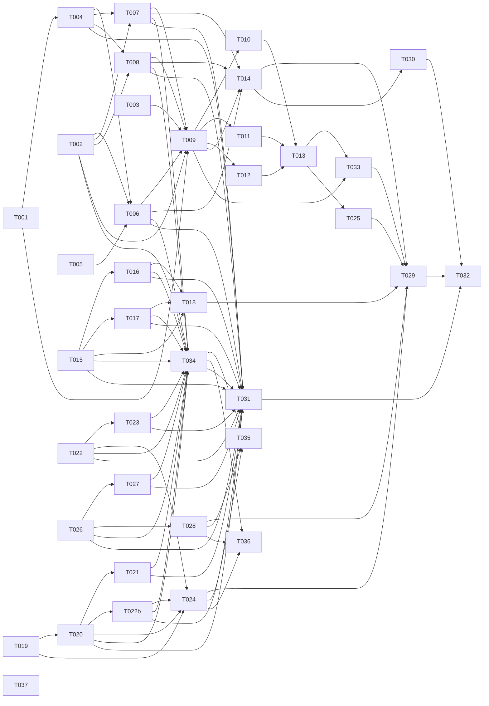

# Tasks: User-Level Knowledge Adaptation

**Input**: Design documents from `/specs/011-user-level-adaptation/`
**Prerequisites**: plan.md (required), spec.md (required), research.md, data-model.md, contracts/

**Organization**: Tasks are grouped by user story to enable independent implementation and testing of each story. Each task is assigned to a specialist agent for domain-aware execution.

## Format: `[ID] [AGENT] [Story?] Description`

- **[AGENT]**: Specialist agent responsible for the task (see Agent Tags below)
- **[Story]**: Which user story this task belongs to (e.g., US1, US2, US3)
- Include exact file paths in descriptions
- Parallelism is derived from the Dependency Graph — tasks with no dependencies can run in parallel

## Agent Tags

| Tag | Agent | Domain |
|-----|-------|--------|
| `[SETUP]` | — (orchestrator) | Project init, shared config, scaffolding, shared dependency installs |
| `[BE]` | backend-specialist | MCP server code: services, tools, utilities + unit tests |
| `[DOC]` | documentation-writer | Agent skill files in `.claude/skills/` |
| `[E2E]` | test-engineer | Cross-boundary integration/E2E tests |

## Phase 1: Setup (Shared Infrastructure)

**Purpose**: Migration file, tool barrel, test directory structure

- [ ] T001 [SETUP] Create migration 004_knowledge_profiles.sql with 5 tables (knowledge_profiles, knowledge_sub_domains, knowledge_signals, knowledge_sync_metadata, knowledge_exports) in packages/underboard/src/storage/migrations/
- [ ] T002 [SETUP] Create knowledge tool barrel index in packages/underboard/src/tools/knowledge/index.ts exporting all tool implementations
- [ ] T003 [SETUP] Create test directories tests/knowledge/ and tests/integration/ in packages/underboard/

---

## Phase 2: Foundational (Blocking Prerequisites)

**Purpose**: Core profile service, level utilities, MCP get/set/config tools, unit tests

**⚠️ CRITICAL**: No user story work can begin until this phase is complete (phase = sync barrier)

- [ ] T004 [BE] Implement KnowledgeProfile service with typed inputs/outputs in packages/underboard/src/knowledge/profile-service.ts (CRUD for knowledge_profiles table, sub-domain expansion, level projection, parameterized queries)
- [ ] T005 [BE] Implement level projection utilities in packages/underboard/src/knowledge/level-utils.ts (continuous 0.0-1.0 ↔ 3-step / 5-step / continuous scale)
- [ ] T006 [BE] Implement knowledge_profile_get MCP tool in packages/underboard/src/tools/knowledge/profile-get.ts (delegates to profile-service, returns level in active display scale)
- [ ] T007 [BE] Implement knowledge_profile_set MCP tool in packages/underboard/src/tools/knowledge/profile-set.ts (set self-declared level, creates profile if none exists)
- [ ] T008 [BE] Implement knowledge_profile_config MCP tool in packages/underboard/src/tools/knowledge/profile-config.ts (configure assessment mode, display scale, sync enable/transport selection, retention, threshold, expand/collapse sub-domain with canonical-vocabulary validation per FR-020, accept/reject hybrid proposal per FR-019)
- [ ] T009 [BE] Write unit tests for foundational tools and profile-service with typed assertions in tests/knowledge/ (profile-service.test.ts, profile-get.test.ts, profile-set.test.ts, profile-config.test.ts, level-utils.test.ts)

**Checkpoint**: Foundation ready — user story implementation can now begin

---

## Phase 3: User Story 1 - Adaptive Explanation at My Level (Priority: P1) 🎯 MVP

**Goal**: AI agents can read per-project knowledge level via MCP and adapt explanation depth, vocabulary, and assumed prior knowledge to match.

**Independent Test**: Set a known level on a fresh project, ask the assistant to explain a concept — explanation depth must visibly match the configured level and must differ when level is changed.

### Implementation for User Story 1

- [ ] T010 [DOC] [US1] Create level-scale.md reference in .claude/skills/knowledge-adaptation/level-scale.md (3-step, 5-step, continuous scale definitions with projection mapping)
- [ ] T011 [DOC] [US1] Create assessment-modes.md reference in .claude/skills/knowledge-adaptation/assessment-modes.md (self-declared, inferred, hybrid, quiz behavior for agents)
- [ ] T012 [DOC] [US1] Create explanation-patterns.md reference in .claude/skills/knowledge-adaptation/explanation-patterns.md (beginner/intermediate/expert explanation templates)
- [ ] T013 [DOC] [US1] Create knowledge-adaptation skill SKILL.md in .claude/skills/knowledge-adaptation/SKILL.md (main skill: teaches agents to query profile via MCP, adapt depth, respect mode, offer calibration)
- [ ] T014 [E2E] [US1] Write integration test for adaptive explanation flow in tests/integration/knowledge-profile.test.ts (create profile, get profile, verify level projection correctness)
- [ ] T033 [SETUP] [US1] Register the knowledge-adaptation skill so agents actually load it (FR-022, review F1): (a) add a one-line directive to CLAUDE.md instructing the assistant to call knowledge_profile_get and consult the knowledge-adaptation skill at session start, AND (b) add `knowledge-adaptation` to the `skills:` frontmatter of the domain agent files that produce explanations (at minimum the orchestrator and the specialist agents designated as explainers). Without this task the skill is inert markdown and US1 silently no-ops.

**Checkpoint**: Adaptive explanation should be functional and testable independently

---

## Phase 4: User Story 2 - Private Storage I Control (Priority: P2)

**Goal**: Profiles stored locally in ~/.underboard/ (never committed to git), with anonymized export and forget/remove actions.

**Independent Test**: Initialize a profile, run git workflow — profile file is never staged; invoke export → anonymized artifact; invoke forget → no recoverable data.

### Implementation for User Story 2

- [ ] T015 [BE] [US2] Implement export-service with typed inputs/outputs in packages/underboard/src/knowledge/export-service.ts (anonymized snapshot with hash tracking)
- [ ] T016 [BE] [US2] Implement knowledge_profile_export MCP tool in packages/underboard/src/tools/knowledge/profile-export.ts (point-in-time anonymized level export, no signal data)
- [ ] T017 [BE] [US2] Implement knowledge_profile_forget MCP tool in packages/underboard/src/tools/knowledge/profile-forget.ts (CASCADE delete all profile data, revoke exports)
- [ ] T018 [BE] [US2] Write unit tests for export and forget services with typed assertions in tests/knowledge/export-service.test.ts. **SC-007 assertion (analyze E2)**: after `forget`, assert (a) `knowledge_profiles`, `knowledge_sub_domains`, `knowledge_signals`, `knowledge_sync_metadata`, `knowledge_exports` rows for the profile all read 0 (CASCADE verified), and (b) no orphaned files remain under the profile's sync/export paths. Without this, SC-007 ("no recoverable profile data") is aspirational.

**Checkpoint**: User Stories 1 AND 2 should both work independently

---

## Phase 5: User Story 3 - Choose How My Level Is Assessed (Priority: P3)

**Goal**: Four assessment modes (self-declared, AI-inferred, hybrid, calibration quiz) switchable at any time without data loss.

**Independent Test**: Set each of the four modes in sequence on the same project — level source, transparency output, and update behavior differ per mode.

### Implementation for User Story 3

- [ ] T019 [BE] [US3] Implement signal-retention service in packages/underboard/src/knowledge/signal-retention.ts (configurable off/30d/90d/forever, automatic pruning, parameterized queries; **per analyze F2: the default `30` is enforced at the DB layer by migration 004 (`retention_days INTEGER DEFAULT 30`, FR-015). The service MUST NOT override the column to NULL on insert unless the user explicitly selects "forever"; rely on the schema default for the privacy-protective non-zero floor**)
- [ ] T020 [BE] [US3] Implement inference engine in packages/underboard/src/knowledge/inference-engine.ts (signal accumulation, N-threshold re-evaluation with lazy write-path tick per plan.md §Performance Goals, level derivation with confidence; in hybrid mode writes proposed_level_internal + proposed_at instead of mutating level_internal directly per FR-019; checks proposal staleness window on read; **manages the lazy-tick state columns `last_inference_at` (TEXT, ISO-8601) and `signals_since_last_eval` (INTEGER, per analyze F1)**: on evaluation fire, stamp `last_inference_at = now()` and reset `signals_since_last_eval = 0`; never bump these on config/scale/sync writes — only on an actual eval run, so `updated_at` drift cannot starve inference)
- [ ] T021 [BE] [US3] Implement knowledge_profile_signals MCP tool in packages/underboard/src/tools/knowledge/profile-signals.ts (expose auditable signal summary and recent raw signals)
- [ ] T022b [BE] [US3] Implement knowledge_profile_record_signal MCP tool in packages/underboard/src/tools/knowledge/profile-record-signal.ts (FR-021, review F2 — the capture path: agents call this after each interaction in inferred/hybrid modes to append a structured signal; applies retention at write time; **increments `signals_since_last_eval` by 1 on each write and fires the lazy re-evaluation tick (delegates to T020's inference engine) when `signals_since_last_eval ≥ inference_threshold_n` (analyze F1)**; without this task the signal set stays empty and inference never produces a level)
- [ ] T022 [BE] [US3] Implement quiz engine in packages/underboard/src/knowledge/quiz-engine.ts (leveled question generation, answer scoring, level derivation)
- [ ] T023 [BE] [US3] Implement knowledge_profile_quiz MCP tool in packages/underboard/src/tools/knowledge/profile-quiz.ts (start/answer/status lifecycle)
- [ ] T024 [BE] [US3] Write unit tests for inference and quiz engines with typed assertions in tests/knowledge/inference-engine.test.ts and tests/knowledge/quiz-engine.test.ts

**Checkpoint**: User Stories 1, 2, AND 3 should all work independently

---

## Phase 6: User Story 4 - Per-Project Context (Priority: P4)

**Goal**: Knowledge level scoped per project with optional per-sub-domain expansion.

**Independent Test**: Configure two projects with different levels — assistant's explanation depth differs per project context.

### Implementation for User Story 4

- [ ] T025 [DOC] [US4] Update knowledge-adaptation SKILL.md with sub-domain handling patterns in .claude/skills/knowledge-adaptation/SKILL.md (agents use domain-specific level when conversation context matches an expanded sub-domain)

**Checkpoint**: User Stories 1-4 should all work independently

---

## Phase 7: User Story 5 - Sync Between My Machines (Priority: P5)

**Goal**: Multi-machine profile sync via encrypted file transport with conflict resolution.

**Independent Test**: Create a profile on Machine 1, invoke sync, verify profile appears on Machine 2 without committing to git.

### Implementation for User Story 5

- [ ] T026 [BE] [US5] Implement sync-service with typed inputs/outputs in packages/underboard/src/knowledge/sync-service.ts (AES-256-GCM encrypted JSON file transport, conflict detection, PBKDF2 key derivation)
- [ ] T027 [BE] [US5] Implement knowledge_profile_sync MCP tool in packages/underboard/src/tools/knowledge/profile-sync.ts (push/pull/status/resolve actions)
- [ ] T028 [BE] [US5] Write unit tests for sync service with typed assertions in tests/knowledge/sync-service.test.ts (push, pull, conflict detection, resolution). **SC-006 assertion (analyze coverage gap)**: assert a one-way push→pull propagation completes in wall-clock time that leaves the user < 1 minute of effort (SC-006) — measure the round-trip in-test and assert it is sub-minute on the test host (treat the threshold as a soft bound: log a warning rather than fail if the CI host is slow, but the assertion documents the SC).

**Checkpoint**: All 5 user stories functional and independently testable

---

## Phase 8: Polish & Cross-Cutting Concerns

**Purpose**: Full E2E tests, evaluation probe set, CLI commands, documentation

- [ ] T029 [E2E] Write full end-to-end integration test covering all 5 user stories in tests/integration/knowledge-profile.test.ts (extends the file created in T014 — append new test cases, do not overwrite existing ones). **Required SC assertions (analyze E2 + SC-005/FR-014 gaps)**: (a) **SC-003** — after initializing a profile in a real git repo fixture, assert `git status --porcelain` is empty (no profile file ever appears in the working tree; the underboard store at `~/.underboard/` is structurally outside the repo); (b) **SC-005** — configure two projects (different `stable_key`s) with different levels, assert the same MCP `profile_get` call returns project-specific levels and a level change in Project A does not leak into Project B; (c) **FR-014** — corrupt a profile row (drop a required column value) and assert `profile_get` degrades to `{ exists: false, level: null }` (neutral default) rather than throwing or returning a stale level.
- [ ] T034 [E2E] Register all knowledge_profile_* MCP tools (9 per contracts/index.md) in packages/underboard/src/server/mcp-server.ts via server.tool(...) importing from the T002 barrel (review H1, analyze H1: unlisted tools are unreachable; this is the exact 009 defect). Add an integration assertion that tools/list returns the full set. Was wrongly listed under "existing files unchanged" in plan.md — corrected.
- [ ] T035 [E2E] Write mode-switch data preservation test (review L1, FR-007): set inferred → accumulate N signals → switch to self-declared → switch back to inferred → assert signal set intact and still drives inference. Extends tests/knowledge/inference-engine.test.ts. **SC-004 assertion (analyze coverage gap)**: assert that the mode switch takes effect on the very next `profile_get` call after the config write — i.e., the second call returns the new mode's `level_source`, with no more than one interaction of latency (SC-004 threshold: ≥90% of switches).
- [ ] T036 [E2E] Write sync security tests (review F3/F4): (a) PBKDF2 iteration count ≥600000, per-profile random salt for encryption key; (a.1) assert NO `sync_passphrase_hash` / `sync_passphrase_salt` column exists in the schema (FR-023: GCM tag is the sole passphrase verifier, no offline brute-force oracle); (b) interrupted push leaves no partial encrypted file (atomic temp+rename); (c) pull validates GCM tag before touching local state; (d) distinct error codes TRANSPORT_UNAVAILABLE vs WRONG_PASSPHRASE vs CORRUPT_SYNC_FILE; (e) derived AES key zeroed after use. Extends tests/knowledge/sync-service.test.ts.
- [ ] T030 [E2E] Create evaluation probe set and eval runner in tests/knowledge/eval-probes.ts (curated concept × target-level pairs for SC-001/SC-002). **Scoring rubric (analyze L1)**: each probe rendering is rated on a 3-point Likert — *too shallow* / *just right* / *too deep* — against its assigned target level. "Just right" = explanation depth, vocabulary, and assumed prior-knowledge visibly match the target level (beginner = plain-language analogies + jargon defined on first use; expert = precise terminology + introductory definitions omitted + advanced patterns referenced directly). A probe passes iff rated "just right"; SC-001 threshold (≥80%) and SC-002 threshold (≥75% + beginner/expert renderings distinguishable) are computed from these per-probe verdicts.
- [ ] T031 [BE] Add profile management CLI commands (profile status, export, forget, sync push/pull) in packages/underboard/src/cli/
- [ ] T032 [DOC] Update README.md and package docs for knowledge adaptation feature
- [ ] T037 [SETUP] Distribute `.specify/` to consumer projects via the clai-helpers CLI (FR-024, analyze H2 — the gap the user flagged twice). **Step 0 (preflight, analyze E1):** before touching any file, assert the `speckit` target exists in `helpers.config.ts` with `transformer: "identity"` and `match: ".specify/**/*"` (verified 2026-06-27 at helpers.config.ts:82-90 — if this drifts, T037 silently no-ops). Then three concrete changes in `packages/cli/`: (a) add `speckit` to the default `targets` string in `packages/cli/src/cli/init.ts` (currently `"claude,copilot,gemini"` → `"claude,copilot,gemini,speckit"`) so `npx clai-helpers init` produces `.specify/` without `--targets`; (b) add `".specify"` to the `files` array in `packages/cli/package.json` (currently `["dist","bin"]`) so `npm publish` ships the directory; (c) add an integration test asserting `clai-helpers init` in a temp consumer repo produces `.specify/` with `memory/constitution.md` and `templates/` present. This task has NO dependency on the underboard knowledge work; it is bundled here because FR-024 shares the release window.

---

## Dependency Graph

### Legend

- `→` means "unlocks" (left must complete before right can start)
- `+` means "all of these" (join point — ALL listed tasks must complete)
- Tasks not listed here have no dependencies and can start immediately within their phase

### Format Rules (STRICT)

```
T001 → T002                    # single unlock
T001 → T002, T003              # fan-out (one unlocks many)
T002 + T003 → T004             # fan-in (many unlock one)
```

### Dependencies

```
# Phase 1: Setup
T001 → T004                    # migration before profile-service
T002 → T006, T007, T008        # barrel before tool implementations
T001 + T002 + T003 → T009      # setup complete before unit tests

# Phase 2: Foundational
T004 + T005 → T006             # service + level-utils before get tool
T004 → T007, T008              # service before set/config tools
T006 + T007 + T008 → T009      # all tools before unit tests

# Phase 3 to Phase 8: Sequential phases (sync barriers)
T009 → T010, T011, T012, T014, T033   # Phase 2 complete before Phase 3 (M4: encode the barrier as real edges, not comments)
# Phase 3: US1
T010 + T011 + T012 → T013      # reference files before SKILL.md
T013 → T033                    # SKILL.md written before it is registered (F1)
T006 + T007 + T008 → T014      # MCP tools before integration test

# Phase 4: US2
T015 → T016, T017              # export-service before tools
T015 + T016 + T017 → T018      # all before unit tests

# Phase 5: US3
T019 → T020                    # signal retention before inference
T020 → T021                    # inference engine before signals tool
T020 → T022b                   # inference engine before record-signal tool (F2: record triggers re-eval tick)
T022 → T023                    # quiz engine before quiz tool
T019 + T020 + T022b + T022 → T024      # engines before unit tests

# Phase 7: US5
T026 → T027, T028              # sync-service before tool + tests

# Phase 8: Polish
T014 + T018 + T024 + T025 + T028 → T029   # all story tests + T025 (H2: T025 must be in the fan-in; it writes the same SKILL.md as T013) before full E2E
T014 → T030                         # US1 working before eval probes
T033 → T029                         # skill registration before E2E can assert it loads
T002 + T006 + T007 + T008 + T015 + T016 + T017 + T020 + T021 + T022b + T022 + T023 + T026 + T027 → T034   # all BE tools before MCP registration (H1)
T034 → T035, T036                   # MCP registered before security/preservation tests can exercise the real transport
T024 + T028 → T035, T036            # inference + sync unit tests exist before the extended preservation/security cases append to them
T004 + T006 + T007 + T008 + T015 + T016 + T017 + T020 + T021 + T022b + T022 + T023 + T026 + T027 + T034 → T031   # all BE tools + registration before CLI
T029 + T030 + T031 → T032      # everything before docs

# Phase 6: US4 (H2: T025 wired into the graph, not just prose)
T013 → T025                    # US1 SKILL.md before the US4 sub-domain update to the same file

# Phase 8: CLI distribution (FR-024, analyze H2)
# T037 has NO dependencies — it touches packages/cli, not packages/underboard.
# It can start immediately and runs in parallel with every other lane.
# It does not block T032 (knowledge-adaptation docs are unrelated to .specify distribution).
```

### Self-Validation Checklist

*Re-verified 2026-06-27 after adding T037 (.specify/ sync, FR-024). Final task count: 38 (T001–T037 + T022b).*

- [X] Every task ID in Dependencies exists in the task list above (T001–T037 + T022b)
- [X] No circular dependencies (A→B→A)
- [X] No orphan task IDs referenced that don't exist
- [X] Fan-in uses `+` only, fan-out uses `,` only
- [X] No chained arrows on a single line
- [X] T037 appears in the mermaid graph (standalone node, no edges — independent), in Parallel Lanes (lane 14), and in Agent Summary ([SETUP] = 5)
- [X] Tool count unified at 9 across contracts/index.md, T034, and the mermaid fan-in (M1/H1 resolved)
- [X] Agent Summary counts sum to 38: [SETUP]=5 + [BE]=21 + [DOC]=6 + [E2E]=6

---

## Dependency Visualization



---

## Parallel Lanes

| Lane | Agent Flow | Tasks | Blocked By |
|------|-----------|-------|------------|
| 1 | [SETUP] | T001, T002, T003 | — |
| 2 | [BE] Phase 2 | T004, T005 → T006, T007, T008 → T009 | T001, T002 |
| 3 | [DOC] US1 | T010, T011, T012 → T013 | T009 |
| 4 | [E2E] US1 | T014 | T006, T007, T008 |
| 5 | [BE] US2 | T015 → T016, T017 → T018 | T009 |
| 6 | [BE] US3 | T019 → T020 → T021, T022b, T022 → T023 → T024 | T009 |
| 7 | [DOC] US4 | T025 | T013 |
| 8 | [BE] US5 | T026 → T027, T028 | T009 |
| 9 | [SETUP] US1 | T033 (skill registration: CLAUDE.md + agent frontmatter) | T013 |
| 10 | [E2E] Polish | T029, T030 | T014, T018, T024, T025, T028, T033 |
| 11 | [E2E] Polish | T034 (MCP registration), T035 (preservation), T036 (sync security) | T002, T006-T008, T015-T017, T020-T023, T022b, T026-T028 |
| 12 | [BE] Polish | T031 | T004, T006-T008, T015-T017, T020-T023, T022b, T026-T027, T034 |
| 13 | [DOC] Polish | T032 | T029, T030, T031 |
| 14 | [SETUP] CLI distribution | T037 (.specify/ → packages/cli) | — (independent, starts immediately) |

---

## Agent Summary

| Agent | Task Count | Can Start After |
|-------|-----------|-----------------|
| [SETUP] | 5 | immediately (T001-T003, T037), T013 (T033) |
| [BE] | 21 | T001, T002 |
| [DOC] | 6 | T009 (Phase 2 complete) |
| [E2E] | 6 | T006, T007, T008 (Phase 3) |

**Critical Path**: T001 → T004 → T006 → T009 → T010 → T011 → T012 → T013 → T033 → T025 → T029 → T034 → T031 → T032 (longest chain; corrected per analyze F5 — the prior printed path `… → T034 → T035 → T032` skipped T031, but the Dependency Graph lines 209-210 require `T034 → T031 → T032`. T035 runs parallel off T034+T024+T028 and does not gate T032, so it is not on the critical path.)

---

## Agent Dispatch Plan

> For each agent that has tasks, provide the context needed to spawn a subagent (Claude Code) or switch role context (Gemini/Copilot). The orchestrator or human uses this table to dispatch without re-reading plan.md.

| Agent | Subagent | Skills | Input Context | Tasks | Files |
|-------|----------|--------|---------------|-------|-------|
| `[SETUP]` | orchestrator | — | plan.md §Project Structure + §CLI Distribution (FR-024), data-model.md (migration 004_knowledge_profiles.sql), contracts/index.md, helpers.config.ts (speckit target) | T001, T002, T003, T037 | `packages/underboard/src/storage/migrations/`, `packages/underboard/src/tools/knowledge/`, `packages/underboard/tests/`, `packages/cli/src/cli/init.ts`, `packages/cli/package.json` |
| `[BE]` | backend-specialist | clean-code, nodejs-best-practices, api-patterns, database-design, system-design-patterns, mcp-builder, lint-and-validate | plan.md §Tech Context + §Project Structure, data-model.md (all entities incl. single `sync_encryption_salt` + `sync_pbkdf2_iterations` + proposal fields; **FR-023 revised** — GCM tag is the sole passphrase verifier, NO `sync_passphrase_hash`/`sync_passphrase_salt` columns exist, do not re-introduce the offline brute-force oracle), contracts/ (all 9 tools incl. profile-record-signal.md), research.md (decisions D001-D010; D009 superseded 2026-06-27), coding-standards §8 (typed services, parameterized queries) | T004-T009, T015-T018, T019-T024, T022b, T026-T028, T031 | `packages/underboard/src/knowledge/`, `packages/underboard/src/tools/knowledge/`, `packages/underboard/src/cli/`, `packages/underboard/tests/knowledge/`, `packages/underboard/src/storage/migrations/` |
| `[DOC]` | documentation-writer | clean-code, documentation-templates | plan.md §Tech Context, contracts/profile-get.md §Agent Behavior, contracts/profile-record-signal.md (F2: skill must teach record-signal), research.md D006 (skill architecture), spec.md §US1 acceptance scenarios, spec.md FR-022 (registration requirement) | T010-T013, T025, T032 | `.claude/skills/knowledge-adaptation/`, `README.md`, `packages/cli/README.md` |
| `[E2E]` | test-engineer | clean-code, testing-patterns, tdd-workflow, lint-and-validate | plan.md §Project Structure (tests/), quickstart.md (all test scenarios), contracts/ (all 9 tool contracts incl. sync atomicity/error-codes, record-signal capture), spec.md FR-023 (sync security params) | T014, T029, T030, T034, T035, T036 | `packages/underboard/tests/integration/`, `packages/underboard/tests/knowledge/`, `packages/underboard/src/server/mcp-server.ts` |

---

## Implementation Strategy

### MVP First (User Story 1 Only)

1. Complete Phase 1: Setup (migration, barrel, test dirs)
2. Complete Phase 2: Foundational (profile-service, level-utils, get/set/config tools, unit tests)
3. Complete Phase 3: User Story 1 (skill files, integration test)
4. **STOP and VALIDATE**: Test adaptive explanation independently — set a level, verify agent explains at that depth
5. Deploy/demo if ready

### Incremental Delivery

1. Complete Setup + Foundational → Foundation ready (MCP tools deployed)
2. Add US1 (skill + integration) → Adaptive explanation works → **MVP!**
3. Add US2 (export/forget) → Private storage verified
4. Add US3 (inference/quiz) → Full assessment mode range
5. Add US4 (skill update) → Per-sub-domain adaptation
6. Add US5 (sync) → Multi-machine support
7. Polish (E2E, eval probes, CLI, docs) → Production readiness

### Parallel Agent Strategy (Claude Code)

1. Orchestrator completes Setup phase (T001-T003) directly
2. Once Setup complete → dispatch [BE] backend-specialist for Phase 2 (T004-T009)
3. After Phase 2 complete (sync barrier) → dispatch parallel:
   - [BE] for US2, US3, US5 (independent lanes — can run in parallel sessions)
   - [DOC] for US1 skill files (T010-T013)
   - [E2E] for US1 integration test (T014) after tools ready
4. As phases complete → unblock dependent lanes:
   - US4 (T025) after US1 skill files done
   - Polish phase (T029-T032) after all stories complete

### Multi-Session Strategy (Gemini / Copilot)

1. Complete Setup + Foundational sequentially
2. Use Agent Summary to decide role context switching
3. Optionally launch parallel sessions per [BE] lane manually for US2/US3/US5
4. Follow Dependency Graph for correct execution order
5. Each user story is independently testable — deploy incrementally

---

## Notes

- `[AGENT]` tag assigns responsibility — domain agent writes both code and unit tests
- `[E2E]` only for cross-boundary integration tests — unit tests stay with [BE]
- Phases are sync barriers — all tasks in a phase must complete/fail/block before next phase
- Each user story should be independently completable and testable
- Commit after each task or logical group
- Stop at any checkpoint to validate story independently
- Avoid: vague tasks, same file conflicts, cross-story dependencies that break independence
- All BE services must use typed inputs/outputs with Zod or interface schemas (per coding-standards §8)
- All DB queries must use parameterized queries via better-sqlite3 prepared statements
- No `as any`, `console.log`, or raw SQL string interpolation
- Tests use TDD-Lite approach (write test before or immediately after implementation)
